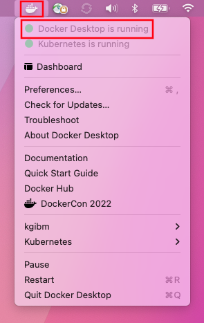

# Liberty Performance Lab

- Author: [Kevin Grigorenko](mailto:kevin.grigorenko@us.ibm.com)
- Version: V18 (March 20, 2022)
- Source: [https://github.com/kgibm/dockerdebug/tree/master/fedorawasdebug](https://github.com/kgibm/dockerdebug/tree/master/fedorawasdebug)

# Table of Contents

-   [Introduction](#introduction)
-   [Core Concepts](#core-concepts)
-   [Installation](#installation)
    -   [With podman](#installing-podman)
    -   [With Docker Desktop](#installing-docker-desktop)
-   [Starting the lab](#start-the-container)
    -   [Start with podman](#start-with-podman)
    -   [Start with Docker Desktop](#start-with-docker-desktop)
-   [IBM Java and OpenJ9 Thread Dumps](#ibm-java-and-openj9-thread-dumps)
    -   [Thread Dumps Theory](#thread-dumps-theory)
    -   [Thread Dumps Lab](#thread-dumps-lab)
-   [Garbage Collection](#garbage-collection)
    -   [Garbage Collection Theory](#garbage-collection-theory)
    -   [Garbage Collection Lab](#garbage-collection-lab)
-   [Health Center](#health-center)
    -   [Health Center Theory](#health-center-theory)
    -   [Health Center Lab](#health-center-lab)
-   [WebSphere Liberty](#was-liberty)
    -   [Request Timing](#request-timing)
    -   [HTTP NCSA Access Log](#http-ncsa-access-log)
-   [Appendix](#appendix)
    -   [Windows Remote Desktop Client](#windows-remote-desktop-client)
    -   [Manually accessing/testing Liberty and tWAS](#manually-accessingtesting-liberty-and-twas)

# Introduction

IBM® [WebSphere® Application Server](https://www.ibm.com/cloud/websphere-application-platform) (WAS) is a platform for serving Java™-based applications. WAS comes in two major product forms:

1. [WAS traditional](https://www.ibm.com/docs/en/was-nd/9.0.5?topic=network-deployment-all-operating-systems-version-90) (colloquially, tWAS): Released in 1998 and still fully supported and used by many.

2. [WebSphere Liberty](https://www.ibm.com/docs/en/was-liberty/nd): Released in 2012 and designed for fast startup, composability, and the cloud. The commercial WebSphere Liberty product is built on top of the open source [OpenLiberty](https://github.com/OpenLiberty/open-liberty). The colloquial term 'Liberty' may refer to WebSphere Liberty, OpenLiberty, or both.

WAS traditional and Liberty share some source code but [differ in significant ways](http://public.dhe.ibm.com/ibmdl/export/pub/software/websphere/wasdev/documentation/ChoosingTraditionalWASorLiberty-16.0.0.4.pdf).

## Lab Screenshots


## Lab

### What's in the lab?

This lab covers the major tools and techniques for performance tuning WebSphere Liberty. This is a subset of the [WebSphere Performance and Troubleshooting Lab](https://github.com/kgibm/dockerdebug/blob/master/fedorawasdebug/WAS_Troubleshooting_Perf_Lab.md) which also covers WAS traditional, and troubleshooting labs.

This lab container image comes with WebSphere Liberty pre-installed so installation and configuration steps are skipped.

The way we are using these container images is to run multiple services in the same container (e.g. VNC, Remote Desktop, WebSphere Liberty, a full GUI server, etc.) and although this approach is [valid and supported](https://docs.docker.com/config/containers/multi-service_container/), it is generally not recommended for real-world application deployment usage. For labs that demonstrate how to use WebSphere in containers in production, see [WebSphere Application Server and Docker Tutorials](https://github.com/WASdev/ci.docker.tutorials).

## Operating System

This lab is built on top of Linux (specifically, Fedora Linux, which is the open source foundation of RHEL/CentOS). The concepts and techniques apply generally to other supported operating systems although [details of other operating systems](https://publib.boulder.ibm.com/httpserv/cookbook/Operating_Systems.html) may vary significantly and are covered elsewhere.

## Java

WebSphere Liberty supports any [Java 8, 11, or 17 edition](https://openliberty.io/docs/latest/java-se.html).

This lab uses IBM Java 8. The concepts and techniques apply generally to other Java runtimes although details of other Java runtimes (e.g. [HotSpot](https://publib.boulder.ibm.com/httpserv/cookbook/Java-Java_Virtual_Machines_JVMs-HotSpot_JVM.html)) vary significantly and are covered elsewhere.

The IBM Java virtual machine (named J9) has become largely open sourced into the [OpenJ9 project](https://github.com/eclipse/openj9). OpenJ9 ships with OpenJDK through the [IBM Semeru offering](https://developer.ibm.com/languages/java/semeru-runtimes/downloads). OpenJDK is somewhat different than the JDK that IBM Java uses. WebSphere Liberty supports running with newer versions of OpenJDK+OpenJ9, although some IBM Java tooling such as HealthCenter is not yet available in OpenJ9, so the focus of this lab continues to be IBM Java 8.

# Core Concepts

Performance tuning is best done with all layers of the stack in mind. This lab will focus on the layers in bold below:


# Lab environment

## Installation

This lab assumes the installation and use of `podman` or Docker Desktop to run the lab. Choose one or the other.

The image is about 20GB. If you plan to run this in a classroom setting, perform the installation steps beforehand which includes downloading the image.

### Installing podman

If you are using `podman` instead of Docker Desktop, perform the following steps to install `podman` and then perform the [podman post-installation steps](#podman-post-installation-steps). If you are using Docker Desktop, [skip down to Installing Docker Desktop](#installing-docker-desktop).

`podman` installation instructions:

* Windows: <https://podman.io/getting-started/installation#windows>
* macOS: <https://podman.io/getting-started/installation#macos>
* For a Linux host, simply [install](https://publib.boulder.ibm.com/httpserv/cookbook/Operating_Systems-Linux.html#Operating_Systems-Linux-Installing_Programs) `podman`

#### podman post-installation steps

1. On macOS and Windows:
    1. Create the `podman` virtual machine with sufficient memory (at least 4GB and, ideally, at least 8GB), CPU, and disk. For example (memory is in MB):
       ```
       podman machine init --memory 10240 --cpus 4 --disk-size 100
       ```
       If you already have a podman machine and you'd like to resize it to make it bigger, it's usually simplest to just delete it using `podman machine rm` and then re-create it using the above command.
    1. Start the `podman` virtual machine:
       ```
       podman machine start
       ```
    1. Switch to a "root" podman:
       ```
       podman system connection default podman-machine-default-root
       ```
    1. Run the following commands to allow producing core dumps within the container:
       ```
       podman machine ssh ln -sf /dev/null /etc/sysctl.d/50-coredump.conf
       podman machine ssh sysctl -w kernel.core_pattern=core
       ```
1. Download the image:
   ```
   podman pull quay.io/kgibm/fedorawasdebug
   ```
   This command may not show any output for a long time while the download completes.

The following section on Docker Desktop should be skipped since you are using `podman`. The next section for `podman` is [Start with podman](#start-with-podman).

### Installing Docker Desktop

If you are using Docker Desktop instead of `podman`, perform the following steps to install Docker Desktop and then perform the [Docker Desktop post-installation steps](#docker-desktop-post-installation-steps):

* Windows ("Requires Microsoft Windows 10 Professional or Enterprise 64-bit.")
    * Download: <https://hub.docker.com/editions/community/docker-ce-desktop-windows>
    * For details, see <https://docs.docker.com/desktop/windows/install/>
* macOS ("must be version 10.15 or newer")
    * Download: <https://hub.docker.com/editions/community/docker-ce-desktop-mac>
    * For details, see <https://docs.docker.com/desktop/mac/install/>
* For a Linux host, simply install and start Docker (e.g. `sudo systemctl start docker`):
    * For an example, see <https://docs.docker.com/engine/install/fedora/>

#### Docker Desktop post-installation steps

1.  Ensure that Docker is started. For example, start Docker Desktop and ensure it is running:\
    \
    macOS:\
    \
    \
    Windows:\
    

3.  Ensure that Docker receives sufficient resources, particularly memory:

    1.  Click the Docker Desktop icon and select **Dashboard** (on macOS) or **Settings** (on Windows)

    1.  Click the **Settings** gear icon in the top right, then click **Resources** on the left.

    1.  Configure sufficient memory (at least 4GB and, ideally, at least 8GB), CPU, and disk.

    1.  Click **Apply & Restart**\
        \
        macOS:\
        \
        \
        Windows:\
        

4.  Open a terminal or command prompt and download the image:
    ```
    docker pull quay.io/kgibm/fedorawasdebug
    ```

The following section on `podman` should be skipped since you are using Docker Desktop. The next section for Docker Desktop is [Start with Docker Desktop](#start-with-docker-desktop).

## Start the container

### Start with podman

The following section is the start of the lab. If you were only preparing for the lab by installing and downloading the lab before the lab begins, then you may stop at this point until the instructor provides further direction.

If you are using `podman` for this lab instead of Docker Desktop, then perform the following steps. If you are using Docker Desktop, [skip down to Start with Docker Desktop](#start-with-docker-desktop).

1.  Open a terminal or command prompt:\
    \
    macOS:\
    \
    \
    Windows:\
    

1.  Start the lab:

    `podman run --cap-add SYS_PTRACE --cap-add NET_ADMIN --ulimit core=-1 --ulimit memlock=-1 --ulimit stack=-1 --shm-size="256m" --rm -p 9080:9080 -p 9443:9443 -p 9043:9043 -p 9081:9081 -p 9444:9444 -p 5901:5901 -p 5902:5902 -p 3390:3389 -p 9082:9082 -p 9083:9083 -p 9445:9445 -p 8080:8080 -p 8081:8081 -p 8082:8082 -p 12000:12000 -p 12005:12005 -it quay.io/kgibm/fedorawasdebug`

2.  Wait about 2 minutes until you see the following in the output (if not seen, review any errors):
    
        =========
        = READY =
        =========

3.  VNC or Remote Desktop into the container:

    1.  macOS built-in VNC client:

        1.  Open another tab in the terminal and run:

            1.  **open vnc://localhost:5902**

            2.  Password: **websphere**

    1.  Linux VNC client:

        1.  Open another tab in the terminal and run:

            1.  **vncviewer localhost:5902**
                * You may need to [install](https://publib.boulder.ibm.com/httpserv/cookbook/Operating_Systems-Linux.html#Operating_Systems-Linux-Installing_Programs) `vncviewer` first.
            2.  Password: **websphere**

    1.  Windows 3<sup>rd</sup> party VNC client:

        i.  If you are able to install and use a 3<sup>rd</sup> party VNC client (there are a few free options online), then connect to **localhost** on port **5902** with password **websphere**.

    1.  Windows Remote Desktop client:

        i.  Windows requires a few steps to make Remote Desktop work with a Docker container. See [Appendix: Windows Remote Desktop Client](#windows-remote-desktop-client) for instructions.

    1.  SSH:

        1.  If you want to simulate production-like access, you can SSH into the container (e.g. using terminal ssh or PuTTY) although you'll need one of the GUI methods above to run most of this lab:

            1.  **ssh was\@localhost**

            2.  Password: **websphere**

4.  When using VNC, you may change the display resolution from within the container and the VNC client will automatically adapt. For example:\
    \
    

The following section on Docker Desktop should be skipped since you are using `podman`. The next section for `podman` is [Apache JMeter](#apache-jmeter).

### Start with Docker Desktop

The following section is the start of the lab. If you were only preparing for the lab by installing and downloading the lab before the lab begins, then you may stop at this point until the instructor provides further direction.

If you are using Docker Desktop for this lab instead of `podman`:

1.  Open a terminal or command prompt:\
    \
    macOS:\
    \
    \
    Windows:\
    

2.  Start the lab by starting the Docker container from the command line:

    `docker run --cap-add SYS_PTRACE --cap-add NET_ADMIN --ulimit core=-1 --ulimit memlock=-1 --ulimit stack=-1 --shm-size="256m" --rm -p 9080:9080 -p 9443:9443 -p 9043:9043 -p 9081:9081 -p 9444:9444 -p 5901:5901 -p 5902:5902 -p 3390:3389 -p 22:22 -p 9082:9082 -p 9083:9083 -p 9445:9445 -p 8080:8080 -p 8081:8081 -p 8082:8082 -p 12000:12000 -p 12005:12005 -it quay.io/kgibm/fedorawasdebug`

3.  Wait about 2 minutes until you see the following in the output (if not seen, review any errors):
    
        =========
        = READY =
        =========

4.  VNC or Remote Desktop into the container:

    1.  macOS built-in VNC client:

        1.  Open another tab in the terminal and run:

            1.  **open vnc://localhost:5902**

            2.  Password: **websphere**

    1.  Linux VNC client:

        1.  Open another tab in the terminal and run:

            1.  **vncviewer localhost:5902**
                * You may need to [install](https://publib.boulder.ibm.com/httpserv/cookbook/Operating_Systems-Linux.html#Operating_Systems-Linux-Installing_Programs) `vncviewer` first.
            2.  Password: **websphere**

    1.  Windows 3<sup>rd</sup> party VNC client:

        i.  If you are able to install and use a 3<sup>rd</sup> party VNC client (there are a few free options online), then connect to **localhost** on port **5902** with password **websphere**.

    1.  Windows Remote Desktop client:

        i.  Windows requires a few steps to make Remote Desktop work with a Docker container. See [Appendix: Windows Remote Desktop Client](#windows-remote-desktop-client) for instructions.

    1.  SSH:

        1.  If you want to simulate production-like access, you can SSH into the container (e.g. using terminal ssh or PuTTY) although you'll need one of the GUI methods above to run most of this lab:

            1.  **ssh was\@localhost**

            2.  Password: **websphere**

6.  When using VNC, you may change the display resolution from within the container and the VNC client will automatically adapt. For example:\
    \
    

## Apache Jmeter

[Apache JMeter](https://jmeter.apache.org/) is a free tool that drives artificial, concurrent user load on a website. The tool is pre-installed in the lab image and we\'ll be using it to simulate website traffic to the [DayTrader7 sample application](https://github.com/WASdev/sample.daytrader7) pre-installed in the lab image.

### Start JMeter

1.  Double click on JMeter on the desktop:\
    \
    

2.  Click **File** → **Open** and select:

    1.  **/opt/daytrader7/jmeter\_files/daytrader7\_liberty.jmx**

3.  By default, the script will execute 4 concurrent users. You may change this if you want (e.g. based on the number of CPUs available):\
    \
    

4.  Click the green run button to start the stress test and click the **Aggregate Report** item to see the real-time results.\
    \
    

5.  It will take some time for the responses to start coming back and for all of the pages to be exercised.

6.  Ensure that the **Error %** value for the **TOTAL** row at the bottom is always 0%.\
    \
    

    1.  If there are any errors, review the WAS logs:

        1.  **/logs/messages.log**

### Stop JMeter

1.  You may stop a JMeter test by clicking the STOP button:

    

2.  You may click the broom button to clear the results in preparation for the next test:

    

3.  If it asks what to do with the JMeter log files from the previous test, you may just click **Overwrite existing file**:

    

# IBM Java and OpenJ9 Thread Dumps

Thread dumps are snapshots of process activity, including the thread stacks that show what each thread is doing. Thread dumps are one of the best places to start to investigate problems. If a lot of threads are in similar stacks, then that behavior might be an issue or a symptom of an issue.

For IBM Java or OpenJ9, a thread dump is also called a javacore or javadump. [HotSpot-based thread dumps](https://publib.boulder.ibm.com/httpserv/cookbook/Troubleshooting-Troubleshooting_Java-Troubleshooting_HotSpot_JVM.html#Troubleshooting-Troubleshooting_HotSpot_JVM-Thread_Dump) are covered elsewhere.

This exercise will demonstrate how to review thread dumps in the free [IBM Thread and Monitor Dump Analyzer (TMDA) tool](https://www.ibm.com/support/pages/ibm-thread-and-monitor-dump-analyzer-java-tmda).

## Thread Dumps Theory

An IBM Java or OpenJ9 thread dump is generated in a **javacore\*.txt** in the working directory of the process with a snapshot of process activity, including:

-   Each Java thread and its stack.

-   A list of all Java synchronization monitors, which thread owns each monitor, and which threads are waiting for the lock on a monitor.

-   Environment information, including Java command line arguments and operating system ulimits.

-   Java heap usage and information about the last few garbage collections.

-   Detailed native memory and classloader information.

Thread dumps generally do not contain sensitive information about user requests, but they may contain sensitive information about the application or environment, so they should be treated sensitively.

## linperf.sh

IBM WebSphere Support provides a script called **linperf.sh** as part of the document, ["MustGather: Performance, hang, or high CPU issues with WebSphere Application Server on Linux"](https://www-01.ibm.com/support/docview.wss?uid=swg21115785) (similar scripts exist for other operating systems). This script will be used to gather thread dumps in this lab. Such a script should be pre-installed on all machines where you run Liberty and it should be run when you have performance or hang issues and the resulting files should be uploaded if you open such a support case with IBM.

The linperf.sh script is pre-installed in the lab image at **/opt/linperf/linperf.sh**.

## Thread Dumps Lab

We will gather and review thread dumps:

> Note: You may skip the data collection steps and use example data packaged at /opt/dockerdebug/fedorawasdebug/supplemental/exampledata/liberty/linperf/

1.  [Start JMeter](#start-jmeter)

2.  Open a terminal on the lab image.

3.  First, we'll need to find the PID(s) of Liberty. There are a few ways to do this, and you only need to choose one method:

    1.  Show all processes (**ps -elf**), search for the process using something unique in its command line (**grep defaultServer**), exclude the search command itself (**grep -v grep**), and then select the fourth column (in bold below):

        <pre>
        $ ps -elf | grep defaultServer | grep -v grep
        4 S was       <b>1567</b>     1 99  80   0 - 802601 -     19:26 pts/1    00:03:35 java -javaagent:/opt/ibm/wlp/bin/tools/ws-javaagent.jar -Djava.awt.headless=true -Xshareclasses:name=liberty,nonfatal,cacheDir=/output/.classCache/ -jar /opt/ibm/wlp/bin/tools/ws-server.jar defaultServer
        </pre>
        
    1.  Search for the process using something unique in its command line using **pgrep -f**:

        <pre>
        $ pgrep -f defaultServer
        <b>1567</b>
        </pre>

4.  Execute the **linperf.sh** command and pass the PID gathered above (replace 1567 with your PID from the output above):

        $ /opt/linperf/linperf.sh 1567
        Tue Apr 23 19:29:26 UTC 2019 MustGather>> linperf.sh script starting [...]

5.  Wait for 4 minutes for the script to finish:

    <pre>
    [...]
    Tue Apr 23 19:33:33 UTC 2019 MustGather&gt;&gt; <b>linperf.sh script complete</b>.
    Tue Apr 23 19:33:33 UTC 2019 MustGather&gt;&gt; Output files are contained within ----&gt;   linperf_RESULTS.tar.gz.   &lt;----
    Tue Apr 23 19:33:33 UTC 2019 MustGather&gt;&gt; <b>The javacores that were created are NOT included in the linperf_RESULTS.tar.gz.</b>
    Tue Apr 23 19:33:33 UTC 2019 MustGather&gt;&gt; Check the &lt;profile_root&gt; for the javacores.
    Tue Apr 23 19:33:33 UTC 2019 MustGather&gt;&gt; Be sure to submit linperf_RESULTS.tar.gz, the javacores, and the server logs as noted in the MustGather.
    </pre>

6.  As mentioned at the end of the script output above, the resulting **linperf_RESULTS.tar.gz** does not include the thread dumps. Move them over to the current directory:

        mv /opt/ibm/wlp/output/defaultServer/javacore.* .

7.  [Stop JMeter](#stop-jmeter)

8.  At this point, if you were creating a support case, you would upload **linperf_RESULTS.tar.gz**, **javacore\***, and all the Liberty logs; however, instead, we will analyze the results.

9.  From the desktop, double click on **TMDA**.

10.  Click Open Thread Dumps and select all of the **javacore\*.txt** files using the Shift key. These will be in your home directory (**/home/was**) if you moved them above; otherwise, they're in the default working directory (**/opt/ibm/wlp/output/defaultServer**):\
    \
    \
    \
    \
    

4.  Select a thread dump and click the **Thread Detail** button:\
    \
    

5.  Click on the **Stack Depth** column to sort by thread stack depth in ascending order.

6.  Click on the **Stack Depth** column again to sort again in descending order:\
    \
    

7.  Generally, the threads of interest are those with stack depths greater than \~20. Select any such rows and review the stack on the right (if you don't see any, then close this thread dump and select another from the list):\
    \
    

    1.  Generally, to understand which code is driving the thread, skip any non-application stack frames. In the above example, the first application stack frame is TradeAction.getQuote.

    2.  Thread dumps are simply snapshots of activity, so just because you capture threads in some stack does not mean there is necessarily a problem. However, if you have a large number of thread dumps, and an application stack frame appears with high frequency, then this may be a problem or an area of optimization. You may send the stack to the developer of that component for further research.

8.  In some cases, you may see that one thread is blocked on another thread. For example:\
    \
    

    1.  The **Monitor** line shows which monitor this thread is waiting for, and the stack shows the path to the request for the monitor. In this example, the application is trying to commit a database transaction. This lab uses the Apache Derby database engine which is not a very scalable database. In this example, optimizing this bottleneck may not be easy and may require deep Apache Derby expertise.

    2.  You may click on the thread name in the **Blocked by** view to quickly see the thread stack of the other thread that owns the monitor.

    3.  Lock contention is a common cause of performance issues and may manifest with poor performance and low CPU usage.

9.  An alternative way to review lock contention is by selecting a thread dump and clicking **Monitor Detail**:\
    \
    \
    \
    

    1.  This shows a tree view of the monitor contention which makes it easier to explore the relationships and number of threads contending on monitors. In the above example, **Default Executor-thread-153** owns the monitor and **Default Executor-thread-202** is waiting for the monitor.

10. You may also select multiple thread dumps and click the **Compare Threads** button to see thread movement over time:\
    \
    \
    \
    

    1.  Each column is a thread dump and shows the state of each thread (if it exists in that thread dump) over time. Generally, you're interested in threads that are runnable (Green Arrow) or blocked or otherwise in the same concerning top stack frame. Click on each cell in that row and review the thread dump on the right. If the thread dump is always in the same stack, this is a potential issue. If the thread stack is changing a lot, then this is usually normal behavior.

    2.  In general, focus on the main application thread pools such as DefaultExecutor, WebContainer, etc.

Next, let's simulate a hung thread situation and analyze the problem with thread dumps:

> Note: You may skip the data collection steps and use example data packaged at /opt/dockerdebug/fedorawasdebug/supplemental/exampledata/liberty/threaddump\_deadlock/

1.  Open a browser to: <http://localhost:9080/swat/>

2.  Scroll down and click on Deadlocker:\
    \
    

3.  Wait until the continuous browser output stops writing new lines of \"Socrates \[\...\]\" which signifies that the threads have become deadlocked and then gather a thread dump of the WAS process by sending it the **SIGQUIT** **(3)** signal. Although the name of the signal includes the word "QUIT", the signal is captured by the JVM, the JVM pauses for a few hundred milliseconds to produce the thread dump, and then the JVM continues. This same command is performed by **linperf.sh**. It is a quick and cheap way to quickly understand what your JVM is doing:

        kill -3 $(pgrep -f defaultServer)

    1.  Note that here we are using a sub-shell to send the output of the pgrep command (which finds the PID of WAS) as the argument for the kill command.

    1.  This can be simplified even further with the **pkill** command which combines **pgrep** functionality:
    
            pkill -3 -f defaultServer

4.  In the TMDA tool, clear the previous list of thread dumps:\
    \
    

5.  Click **File** \> **Open Thread Dumps** and navigate to **/opt/ibm/wlp/output/defaultServer** and select both new thread dumps and click **Open**:\
    \
    

6.  When you select the first thread dump, TMDA will warn you that a deadlock has been detected:\
    \
    

    1.  Deadlocks are not common and mean that there is a bug in the application or product.

7.  Use the same procedure as above to review the **Monitor Details** and **Compare Threads** to find the thread that is stuck. In this example, the **DefaultExecutor** application thread actually spawns threads and waits for them to finish, so the application thread is just in a Thread.join:\
    \
    

8.  The actual spawned threads are named differently and show the blocking:\
    \
    

Next, let's simulate a thread that is using a lot of CPU:

> Note: You may skip the data collection steps and use example data packaged at /opt/dockerdebug/fedorawasdebug/supplemental/exampledata/liberty/threaddump\_infiniteloop/

1.  Go to: <http://localhost:9080/swat/>

2.  Scroll down and click on InfiniteLoop:\
    \
    

3.  Go to the container terminal and start **top -H** with a 10 second interval:

        top -H -d 10

    

4.  Notice that a single thread is consistently consuming \~100% of a single CPU thread.

5.  Convert the PID to hexadecimal. In the example above, **22129** = **0x5671**.

    1.  In the container, open Galculator:\
        \
        

    1.  Click View \> Scientific Mode:\
        \
        

    1.  Enter the decimal number (in this example, **22129**), and then click on **HEX**:\
        \
        

    1.  The result is **0x5671**:

        

6.  Take a thread dump of the parent process:

        pkill -3 -f defaultServer

7.  Open the most recent thread dump from **/opt/ibm/wlp/output/defaultServer/** in a text editor such as **mousepad**:\
    \
    

8.  Search for the native thread ID in hex (in this example, 0x5671) to find the stack trace consuming the CPU (if captured during the thread dump):\
    \
    

9.  Finally, kill the server destructively (**kill -9**) because trying to stop it gracefully will not work due to the infinitely looping request:

        pkill -9 -f defaultServer

# Garbage Collection

Garbage collection (GC) automatically frees unused objects. Healthy garbage collection is one of the most important aspects of Java programs. The proportion of time spent in garbage collection versus application time should be [less than 10% and ideally less than 1%](https://publib.boulder.ibm.com/httpserv/cookbook/Major_Tools-Garbage_Collection_and_Memory_Visualizer_GCMV.html#Major_Tools-Garbage_Collection_and_Memory_Visualizer_GCMV-Analysis).

This lab will demonstrate how to enable verbose garbage collection in WAS for the sample DayTrader application, exercise the application using Apache JMeter, and review verbose garbage collection data in the free [IBM Garbage Collection and Memory Visualizer (GCMV)](https://publib.boulder.ibm.com/httpserv/cookbook/Major_Tools-Garbage_Collection_and_Memory_Visualizer_GCMV.html) tool.

## Garbage Collection Theory

All major Java Virtual Machines (JVMs) are designed to work with a maximum Java heap size. When the Java heap is full (or various sub-heaps), an allocation failure occurs and the garbage collector will run to try to find space. Verbose garbage collection (verbosegc) prints detailed information about each one of these allocation failures.

Always enable verbose garbage collection, including in production (benchmarks show an overhead of \~0.13% for [IBM Java](https://publib.boulder.ibm.com/httpserv/cookbook/Java-Java_Virtual_Machines_JVMs-OpenJ9_and_IBM_J9_JVMs.html#Java-Java_Virtual_Machines_JVMs-OpenJ9_and_IBM_J9_JVMs-Garbage_Collection-Verbose_garbage_collection_verbosegc)), using the options to rotate the verbosegc logs. For [IBM Java](http://www.ibm.com/support/knowledgecenter/SSYKE2_8.0.0/com.ibm.java.lnx.80.doc/diag/appendixes/cmdline/xverbosegclog.html) - 5 historical files of roughly 20MB each:

    -Xverbosegclog:verbosegc.%seq.log,5,50000

## Garbage Collection Lab

Add the verbosegc option to the jvm.options file:

> Note: You may skip the data collection steps and use example data packaged at /opt/dockerdebug/fedorawasdebug/supplemental/exampledata/liberty/verbosegc\_and\_oom/

1.  [Stop JMeter](#stop-jmeter) if it is started.

1.  WebSphere Liberty:

    1.  Stop the Liberty server.

            /opt/ibm/wlp/bin/server stop defaultServer

    1.  Open a text editor such as mousepad and add the following line to it:

            -Xverbosegclog:logs/verbosegc.%seq.log,5,50000

    1.  Save the file to **/opt/ibm/wlp/usr/servers/defaultServer/jvm.options**\
        \
        

    1.  Start the Liberty server

            /opt/ibm/wlp/bin/server start defaultServer

1.  [Start JMeter](#start-jmeter)

2.  Run the test for about 5 minutes.

3.  [Stop JMeter](#stop-jmeter)

4.  From the desktop, double click on **GCMV**:

5.  Click **File** \> **Load File\...** and select the **verbosegc.001.log** file. For example:\
    \
    

6.  Select **/opt/ibm/wlp/output/defaultServer/logs/verbosegc.001.log**\
    \
    

7.  Once the file is loaded, you will see the default line plot view. It is common to change the **X-axis** to **date** to see absolute timestamps:\
    \
    

8.  Click the **Data Selector** tab in the top left, choose **VGC Pause** and check **Total pause time** to add the total garbage collection pause time plot to the graph:\
    \
    

9.  Do the same as above using **VGC Heap** and check **Used heap (after global collection)**:\
    \
    \
    

10. Observe the heap usage and pause time magnitude and frequency over time. For example:\
    \
    

    1.  This shows that the heap size reaches 145MB and the heap usage (after global collection) reached \~80MB.

11. More importantly, we want to know the proportion of time spent in GC. Click the **Report** tab and review the **Proportion of time spent in garbage collection pauses (%)**:\
    \
    

    1.  If this number is less than 1%, then this is very healthy. If it's less than 5% then it's okay. If it's less than 10%, then there is significant room for improvement. If it's greater than 10%, then this is concerning.

Next, let's simulate a memory issue.

> Note: You may skip the data collection steps and use example data packaged at /opt/dockerdebug/fedorawasdebug/supplemental/exampledata/liberty/verbosegc\_and\_oom/

1.  [Stop JMeter](#stop-jmeter) if it is started.

1.  Liberty:

    1.  Stop Liberty:

        /opt/ibm/wlp/bin/server stop defaultServer

    1.  Edit **/opt/ibm/wlp/usr/servers/defaultServer/jvm.options**, add an explicit maximum heap size of 256MB on a new line and save the file:

        `-Xmx256m`

        

    1.  Start Liberty

        /opt/ibm/wlp/bin/server start defaultServer

1.  [Start JMeter](#start-jmeter)

1.  Let the JMeter test run for about 5 minutes.

1.  Do not stop the JMeter test but leave it running as you continue to the next step.

1.  Open your browser to the following page: <http://localhost:9080/swat/AllocateObject?size=1048576&iterations=300&waittime=1000&retainData=true>

    1.  This will allocate three hundred 1MB objects with a delay of 1 second between each allocation, and hold on to all of them to simulate a leak.

    1.  This will take about 5 minutes to run and you can watch your browser output for progress.

    1.  You can run **top -H** while this is running. As memory pressure builds, you'll start to see **GC Slave** threads consuming most of the CPUs instead of application threads (garbage collection also happens on the thread where the allocation failure occurs, so you may also see a single application thread consuming a similar amount of CPU as the GC Slave threads):

        `top -H -p $(pgrep -f defaultServer) -d 5`

        

    1.  At some point, browser output will stop because the JVM has thrown an OutOfMemoryError.

1.  [Stop JMeter](#stop-jmeter)

1.  Forcefully kill the JVM because an OutOfMemoryError does not stop the JVM; it will continue garbage collection thrashing and consume all of your CPU.

            pkill -9 -f defaultServer

1.  Close and re-open the **verbosegc\*log** file in GCMV:\
    \
    

    1.  We can quickly see how the heap usage reaches 256MB and the pause time magnitude and durations increase significantly.

1. Click on the **Report** tab and review the **Proportion of time spent in garbage collection pauses (%)**:\
    \
    

1. 24% seems pretty bad but not terrible and doesn't line up with what we know about what happened. This is because, by default, the GCMV Report tab shows statistics for the entire duration of the verbosegc log file. Since we had run the JMeter test for 5 minutes and it was healthy, the average proportion of time in GC is lower for the whole duration.

1. Click on the **Line plot** tab and zoom in to the area of high pause times by using your mouse button to draw a box around those times:\
    \
    

1. This will zoom the view to that bounding box:\
    \
    

1. However, zooming in is just a visual aid. To change the report statistics, we need to match the X-axis to the period of interest.

1. Hover your mouse over the approximate start and end points of the section of concern (frequent pause time spikes) and note the times of those points (in terms of your selected X Axis type):\
    \
    

1. Enter each of the values in the minimum and maximum input boxes and press **Enter** on your keyboard in each one to apply the value. The tool will show vertical lines with triangles showing the area of the graph that you\'ve cropped to.\
    \
    

1. Click on the **Report** tab at the bottom and observe the proportion of time spent in garbage collection for this period is very high (in this example, \~87%).\
    \
    

1. This means that the application is doing very little work and is very unhealthy. In general, there are a few, non-exclusive ways to resolve this problem:

    1.  Increase the maximum heap size.

    1.  Decrease the object allocation rate of the application.

    1.  Resolve memory leaks through heapdump analysis.

    1.  Decrease the maximum thread pool size.

# Health Center

[IBM Monitoring and Diagnostics for Java - Health Center](https://publib.boulder.ibm.com/httpserv/cookbook/Major_Tools-IBM_Java_Health_Center.html) is free and shipped with IBM Java 8. Among other things, Health Center includes a statistical CPU profiler that samples Java stacks that are using CPU at a very high rate to determine what Java methods are using CPU. Health Center generally has an overhead of less than 1% and is suitable for production use. In recent versions, it may also be enabled dynamically without restarting the JVM.

This lab will demonstrate how to enable Java Health Center, exercise the sample DayTrader application using Apache JMeter, and review the Health Center file in the IBM Java Health Center Client Tool.

##  Health Center Theory

The Health Center agent gathers sampled CPU profiling data, along with other information:

-   Classes: Information about classes being loaded

-   Environment: Details of the configuration and system of the monitored application

-   Garbage collection: Information about the Java heap and pause times

-   I/O: Information about I/O activities that take place.

-   Locking: Information about contention on inflated locks

-   Memory: Information about the native memory usage

-   Profiling: Provides a sampling profile of Java methods including call paths

The Health Center agent can be enabled in two ways:

1.  At startup by adding **-Xhealthcenter:level=headless** to the JVM arguments

2.  At runtime, by running **\${IBM\_JAVA}/bin/java -jar \${IBM\_JAVA}/jre/lib/ext/healthcenter.jar ID=\${PID} level=headless**

Note: For both items, you may add the following arguments to limit and roll the total file usage of Health Center data:

<pre>
<b>-Dcom.ibm.java.diagnostics.healthcenter.headless.files.max.size=BYTES</b>
<b>-Dcom.ibm.java.diagnostics.healthcenter.headless.files.to.keep=N</b> (N=0 for unlimited)
</pre>

The key to produce the final Health Center HCD file is that the JVM should be gracefully stopped (there are alternatives to this by packaging the temporary files but this isn't generally recommended).

Consider always enabling [HealthCenter in headless mode](https://publib.boulder.ibm.com/httpserv/cookbook/Major_Tools-IBM_Java_Health_Center.html#Major_Tools-IBM_Java_Health_Center-Gathering_Data) for post-mortem debugging of issues.

##  Health Center Lab

> Note: You may skip the data collection steps and use example data packaged at /opt/dockerdebug/fedorawasdebug/supplemental/exampledata/liberty/healthcenter/

1.  [Stop JMeter](#stop-jmeter) if it is started.

2.  Add Health Center arguments to the JVM:

    1.  Add the following line to **/opt/ibm/wlp/usr/servers/defaultServer/jvm.options**:

        `-Xhealthcenter:level=headless`

3.  Stop the server:

        /opt/ibm/wlp/bin/server stop defaultServer

4.  Start the server

        /opt/ibm/wlp/bin/server start defaultServer

5.  [Start JMeter](#start-jmeter) and run it for 5 minutes.

6.  [Stop JMeter](#stop-jmeter)

7.  Stop WAS as in step 3 above.

8.  From the desktop, double click on **HealthCenter**.

9.  Click **File \> Load Data\...** (note that it\'s towards the bottom of the **File** menu; **Open File** does not work):\
    \
    

10. Select the **healthcenter\*.hcd** file from **/opt/ibm/wlp/output/defaultServer**:\
    

11. Wait for the data to complete loading:\
    \
    

12. Click on CPU:\
    

13. Review the overall system and Java application CPU usage:\
    

14. Right click anywhere in the graph and change the **X-axis** to **date** (which changes all other views to **date** as well):\
    

    1.  For large Health Center captures, this may take significant time to change and there is no obvious indication when it's complete. The best way to know is when the CPU usage of Health Center drops to a low amount.

15. Click **Data \> Crop data\...**\
    \
    

16. Change the **Start time** and **End time** to match the period of interest. For example, usually you want to exclude the start-up time of the process and only focus on user activity:\
    

17. Click **Window \> Preferences**:\
    

18. Check the **Show package names** box under **Health Center \> Profiling** and press **OK** so that we can see more details in the profiling view:\
    

19. Click on **Method profiling** to review the CPU sampling data:\
    

20. The **Method profiling** view will show CPU samples by method:\
    

21. The **Self (%)** column reports the percent of samples where a method was at the top of the stack. The **Tree (%)** column reports the percent of samples where a method was somewhere else in the stack. Make sure to check that the **Samples** column is at least in the hundreds or thousands; otherwise, the CPU usage is likely not that high or a problem did not occur. The **Self** and **Tree** percentages are a percent of samples, not of total CPU.

22. Any methods over \~1% are worthy of considering how to optimize or to avoid. For example, \~2% of samples were in method 0x2273c68 (for various reasons, some methods may not resolve but you can usually figure things out from the invocation paths). Selecting that row and switching to the **Invocation Paths** view shows the percent of samples leading to those calls:\
    

    1.  In the above example, 63.11% of samples (i.e. of 2.9% of total samples) were invoked by org.apache.derby.impl.sql.conn.GenericLanguageConnectionContext.doCommit.

23. If you sort by **Tree %**, skip the framework methods from Java and WAS, and find the first application method. In this example, about 32% of total samples was consumed by com.ibm.websphere.samples.daytrader.web.TradeAppServlet.performTask and all of the methods it called. The **Called Methods** view may be further reviewed to investigate the details of this usage; in this example, doPortfolio drove most of the CPU samples.\
    \
    

#  Methodology

##  The Scientific Method

Troubleshooting is the act of understanding problems and then changing systems to resolve those problems. The best approach to troubleshooting is the scientific method which is basically as follows:

1.  Observe and measure evidence of the problem. For example: \"Users are receiving HTTP 500 errors when visiting the website.\"

2.  Create prioritized hypotheses about the causes of the problem. For example: \"I found exceptions in the logs. I hypothesize that the exceptions are creating the HTTP 500 errors.\"

3.  Research ways to test the hypotheses using experiments. For example: \"I searched the documentation and previous problem reports and the exceptions may be caused by a default setting configuration. I predict that changing this setting will resolve the problem if this hypothesis is true.\"

4.  Run experiments to test hypotheses. For example: \"Please change this setting and see if the user errors are resolved.\"

5.  Observe and measure experimental evidence. If the problem is not resolved, repeat the steps above; otherwise, create a theory about the cause of the problem.

##  Organizing an Investigation

Keep track of a summary of the situation, a list of problems, hypotheses, and experiments/tests. Use numbered items so that people can easily reference things in phone calls or emails. The summary should be restricted to a single sentence for problems, resolution criteria, statuses, and next steps. Any details are in the subsequent tables. The summary is a difficult skill to learn, so try to constrain yourself to a single (short!) sentence. For example:

### Summary

1.  Problems: 1) Average website response time of 5000ms and 2) website error rate \> 10%.

2.  Resolution criteria: 1) Average response time of 300ms and 2) error rate of \<= 1%.

3.  Statuses: 1) Reduced average response time to 2000ms and 2) error rate to 5%.

4.  Next steps: 1) Investigate database response times and 2) gather diagnostic trace.

### Problems

| \#  | Problem                                  | Case \#     | Status                                                          | Next Steps                                         |
| :-: | ---------------------------------------- | ----------- | --------------------------------------------------------------- | ------------------------------------- |
| 1   | Average response time greater than 300ms | TS001234567 | Reduced average response time to 2000ms by increasing heap size | Investigate database response times               |
| 2   | Website error rate greater than 1%       | TS001234568 | Reduced website error rate to 5% by fixing an application bug.  | Run diagnostic trace for remaining errors |

### Hypotheses for Problem 1

| \#  | Hypothesis                                                                   | Evidence                                                       | Status                                                                                     |
| :-: | ---------------------------------------------------------------------------- | ---------------------------------------------------------- | ------------------------------------------------------------------------------------------ |
| 1   | High proportion of time in garbage collection leading to reduced performance | Verbosegc showed proportion of time in GC of 20%                  | Increased Java maximum heap size to -Xmx1g and proportion of time in GC went down to 5% |
| 2   | Slow database response times                                                 | Thread stacks showed many threads waiting on the database | Gather database re-sponse times                                                         |

### Hypotheses for Problem 2

| \#  | Hypothesis                                                            | Evidence                                                                       | Status                                                                 |
| :-: | --------------------------------------------------------------------- | ---------------------------------------------------------------- | --------------------------------------------------------------------------------- |
| 1 | NullPointerException in com.application.foo is causing errors           | NullPointerExceptions in the logs correlate with HTTP 500 response codes | Application fixed the NullPointerException and error rates were halved |
| 2 | ConcurrentModificationException in com.websphere.bar is causing errors  | ConcurrentModificationExceptions correlate with HTTP 500 response codes | Gather WAS diagnostic trace capturing some exceptions                  |

### Experiments/Tests

| \#  | Experiment/Test               | Start                   | End                     | Environment        | Changes                       | Results                                              |
| :-: | ----------------------------- | ----------------------- | ----------------------- | ------------------ | ----------------------------- | ---------------------------------------------------- |
| 1 | Baseline                        | 2019-01-01 09:00:00 UTC | 2019-01-01 17:00:00 UTC | Production server1 | None                          | Average response time 5000ms; Website error rate 10% |
| 2 | Reproduce in a test environment | 2019-01-02 11:00:00 UTC | 2019-01-01 12:00:00 UTC | Test server1       | None                          | Average response time 8000ms; Website error rate 15% |
| 3 | Test problem 1 - hypothesis 1   | 2019-01-03 12:30:00 UTC | 2019-01-01 14:00:00 UTC | Test server1       | Increase Java heap size to 1g | Average response time 4000ms; Website error rate 15% |
| 4 | Test problem 1 - hypothesis 1   | 2019-01-04 09:00:00 UTC | 2019-01-01 17:00:00 UTC | Production server1 | Increase Java heap size to 1g | Average response time 2000ms; Website error rate 10% |

##  Performance Tuning Tips

1.  Performance tuning is usually about focusing on a few key variables. We will highlight the most common tuning knobs that can often improve the speed of the average application by 200% or more relative to the default configuration. The first step, however, should be to use and be guided by the tools and methodologies. Gather data, analyze it and create hypotheses: then test your hypotheses. Rinse and repeat. As Donald Knuth says: \"Programmers waste enormous amounts of time thinking about, or worrying about, the speed of noncritical parts of their programs, and these attempts at efficiency actually have a strong negative impact when debugging and maintenance are considered. We should forget about small efficiencies, say about 97% of the time \[...\]. Yet we should not pass up our opportunities in that critical 3%. A good programmer will not be lulled into complacency by such reasoning, he will be wise to look carefully at the critical code; but only after that code has been identified. It is often a mistake to make a priori judgments about what parts of a program are really critical, since the universal experience of programmers who have been using measurement tools has been that their intuitive guesses fail.\" (Donald Knuth, Structured Programming with go to Statements, Stanford University, 1974, Association for Computing Machinery)

2.  There is a seemingly daunting number of tuning knobs. Unless you are trying to squeeze out every last drop of performance, we do not recommend a close study of every tuning option.

3.  In general, we advocate a bottom-up approach. For example, with a typical WebSphere Application Server application, start with the operating system, then Java, then WAS, then the application, etc. Ideally, investigate these at the same time. The main goal of a performance tuning exercise is to iteratively determine the bottleneck restricting response times and throughput. For example, investigate operating system CPU and memory usage, followed by Java garbage collection usage and/or thread dumps/sampling profilers, followed by WAS PMI, etc.

4.  One of the most difficult aspects of performance tuning is understanding whether or not the architecture of the system, or even the test itself, is valid and/or optimal.

5.  Meticulously describe and track the problem, each test and its results.

6.  Use basic statistics (minimums, maximums, averages, medians, and standard deviations) instead of spot observations.

7.  When benchmarking, use a repeatable test that accurately models production behavior, and avoid short term benchmarks which may not have time to warm up.

8.  Take the time to automate as much as possible: not just the testing itself, but also data gathering and analysis. This will help you iterate and test more hypotheses.

9.  Make sure you are using the latest version of every product because there are often performance or tooling improvements available.

10. When researching problems, you can either analyze or isolate them. Analyzing means taking particular symptoms and generating hypotheses on how to change those symptoms. Isolating means eliminating issues singly until you\'ve discovered important facts. In general, we have found through experience that analysis is preferable to isolation.

11. Review the full end-to-end architecture. Certain internal or external products, devices, content delivery networks, etc. may artificially limit throughput (e.g. Denial of Service protection), periodically mark services down (e.g. network load balancers, WAS plugin, etc.), or become saturated themselves (e.g. CPU on load balancers, etc.).

### Liberty Performance Tuning Recipe

The IBM WebSphere Application Server Performance Cookbook provides a [recipe for common tuning of Liberty and underlying components](https://publib.boulder.ibm.com/httpserv/cookbook/Recipes-WAS_Liberty_Recipes.html).

# WebSphere Liberty

WebSphere Liberty has many built-in troubleshooting and performance features, including:

- Request Timing
- HTTP NCSA access log
- Admin Center
- MXBean Monitoring
- Server Dumps
- Event Logging
- Diagnostic trace
- Binary logging
- Timed operations

## Request Timing

WebSphere Liberty's Slow and Hung Request Detection is optionally enabled with the [requestTiming-1.0](https://openliberty.io/docs/latest/slow-hung-request-detection.html) feature.

The slow request detection part of the feature monitors for HTTP requests that exceed a configured threshold and prints a tree of events breaking down the components of the slow request. The hung request detection part of the feature additionally gathers thread dumps after its threshold is exceeded.

### requestTiming Lab

1. Modify `/config/server.xml` to add the following before `</server>`:
   ```
   <featureManager><feature>requestTiming-1.0</feature></featureManager>
   <requestTiming slowRequestThreshold="60s" hungRequestThreshold="180s" sampleRate="1" />
   ```
2. Execute a request that takes more than one minute by opening a browser to http://localhost:9080/swat/Sleep?duration=65000
3. After about a minute and the request completes, review the requestTiming warning in `/logs/messages.log` -- for example:
   ```
   [3/20/22 16:16:52:250 UTC] 0000007b com.ibm.ws.request.timing.manager.SlowRequestManager         W TRAS0112W: Request AAAAPOsEvAG_AAAAAAAAAAA has been running on thread 00000079 for at least 60003.299ms. The following stack trace shows what this thread is currently running.
   
     at java.lang.Thread.sleep(Native Method)
     at java.lang.Thread.sleep(Thread.java:956)
     at com.ibm.Sleep.doSleep(Sleep.java:35)
     at com.ibm.Sleep.doWork(Sleep.java:18)
     at com.ibm.BaseServlet.service(BaseServlet.java:73)
     at javax.servlet.http.HttpServlet.service(HttpServlet.java:790)
     [...]
   
   The following table shows the events that have run during this request.
   
   Duration      Operation
   60008.080ms + websphere.servlet.service | swat | Sleep?duration=65000 
   ```
    1. The warning shows a stack at the time `requestTiming` notices the threshold is breached and it's followed be a tree of components of the request. The plus sign (+) indicates that an operation is still in progress. The indentation level indicates which events requested which other events.
4. Execute a request that takes about three minutes by opening a browser to http://localhost:9080/swat/Sleep?duration=200000
5. After about five minutes, review the requestTiming warning in `/logs/messages.log` -- in addition to the previous warning, multiple thread dumps are produced:
   ```
   [3/20/22 16:22:23:565 UTC] 0000007d com.ibm.ws.kernel.launch.internal.FrameworkManager           A CWWKE0067I: Java dump request received.
   [3/20/22 16:22:23:662 UTC] 0000007d com.ibm.ws.kernel.launch.internal.FrameworkManager           A CWWKE0068I: Java dump created: /opt/ibm/wlp/output/defaultServer/javacore.20220320.162223.17.0001.txt
   ```
    1. Thread dumps [will be captured](https://openliberty.io/docs/latest/slow-hung-request-detection.html#_hung_request_detection), one minute apart, after the threshold is breached.
1. Review the thread dumps using the TMDA tool and see if you can find the captured long-running request.

In general, it is a good practice to use `requestTiming`, even in production. Configure the thresholds to values that are at the upper end of acceptable times for the users and the business. Configure and test the `sampleRate` to ensure the overhead of `requestTiming` is acceptable in production.

When the requestTiming feature is enabled, the server dump command will include a snapshot of all the event trees for all requests thus giving a very nice and lightweight way to see active requests in the system at a detailed level (including URI, etc.), in a similar way that thread dumps do the same for thread stacks.

## HTTP NCSA Access Log

The Liberty HTTP access log is optionally enabled with the [httpEndpoint accessLogging element](https://openliberty.io/docs/latest/access-logging.html). When enabled, a separate `access.log` file is produced with an NCSA standardized (i.e. httpd-style) line for each HTTP request, including [items such as the URI and response time](https://openliberty.io/docs/latest/access-logging.html#_http_access_log_format), useful for post-mortem corelation and performance analysis. For example,

### HTTP NCSA Access Log Lab

1. Modify `/config/server.xml` to change the following element:
   ```
   <httpEndpoint id="defaultHttpEndpoint"
              host="*"
              httpPort="9080"
              httpsPort="9443" />
   ```
2. To the following (note that the `<httpEndpoint>` element must no longer be self-closing):
   ```
   <httpEndpoint id="defaultHttpEndpoint"
              host="*"
              httpPort="9080"
              httpsPort="9443">
     <accessLogging filepath="${server.output.dir}/logs/access.log" maxFileSize="250" maxFiles="2" logFormat="%h %i %u %t &quot;%r&quot; %s %b %D %{R}W" />
   </httpEndpoint>
   ```
3. [Start JMeter](#start-jmeter)
4. Run the test for a couple of minutes.
5. [Stop JMeter](#stop-jmeter)
6. Review `/opt/ibm/wlp/output/defaultServer/logs/access.log` to see HTTP responses. For example:
   ```
   127.0.0.1 - Admin1 [20/Mar/2022:16:28:23 +0000] "GET /daytrader/app?action=portfolio HTTP/1.1" 200 12927 397114 390825
   127.0.0.1 - Admin1 [20/Mar/2022:16:28:23 +0000] "GET /daytrader/app?action=quotes&symbol=s%3A6651 HTTP/1.1" 200 7849 528280 526508
   127.0.0.1 - Admin1 [20/Mar/2022:16:28:23 +0000] "GET /daytrader/app?action=quotes&symbol=s%3A9206 HTTP/1.1" 200 7849 528556 526676
   ```
6. The second-to-last number is the response time in microseconds. In the example above, the first response time was 397.114 milliseconds. The last number is the time until the first byte of the response was sent back which may help investigate network slowdowns in front of WebSphere.

There are various scripts and tools available publicly ([example](https://raw.githubusercontent.com/kgibm/problemdetermination/master/scripts/general/ncsa_response_times.awk)) to post-process NCSA-style access logs to create statistics and graphs.

In general, it is a good practice to use `accessLogging`, even in production, if the performance overhead is acceptable.

## Additional Liberty Labs

For additional labs on Liberty, review the main lab sections on [WebSphere Liberty starting with Liberty Bikes](https://github.com/kgibm/dockerdebug/blob/master/fedorawasdebug/WAS_Troubleshooting_Perf_Lab.md#liberty-bikes).

# Appendix

## Stopping the container

The `podman run` or `docker run` command in this lab does not use the `-d` (daemon) flag which means that it runs in the foreground. To stop such a container, use one of the following methods:

1. Hold down the `Control/Ctrl` key on your keyboard and press `C` in the terminal window where the `run` command is running.
1. In a separate terminal window, find the container ID with `podman ps` or `docker ps` command and then run `podman stop $ID` or `docker stop $ID`.

If you add `-d` to `podman run` or `docker run`, then to view the standard out logs, find the container ID with `podman ps` or `docker ps` and then run `podman logs $ID` or `docker logs $ID`. To stop, use `podman stop $ID` or `docker stop $ID`.

## Remote terminal into the container

In a separate command prompt or terminal window, execute one of the following commands depending on whether you're using `podman` or Docker Desktop:

* `podman exec -u was -it $(podman ps -q) bash`
* `docker exec -u was -it $(podman ps -q) bash`

##  Windows Remote Desktop Client

Windows requires [extra steps to configure remote desktop to connect to a container](https://social.msdn.microsoft.com/Forums/en-US/872129e4-07a5-48c3-86f7-996854e7a920/how-to-connect-via-rdp-to-container?forum=windowscontainers):

1.  Open **PowerShell** as Administrator:\
    \
    

2.  Run **ipconfig** and copy the **IPv4** address of the **DockerNAT** adapter. For example:\
    \
    

3.  Run the following command in **PowerShell**:

    `New-NetFirewallRule -Name \"myRDP\" -DisplayName \"Remote Desktop Protocol\" -Protocol TCP -LocalPort @(3389) -Action Allow`

4.  Run the following command in **PowerShell**:

    `New-NetFirewallRule -Name \"myContainerRDP\" -DisplayName \"RDP Port for connecting to Container\" -Protocol TCP -LocalPort @(3390) -Action Allow`

5.  Run **Remote Desktop**\
    \
    

6.  Enter the DockerNAT IP address (for example, 10.0.75.1) followed by :3390 as **Computer** and click **Connect**:\
    \
    

7.  You\'ll see a certificate warning because of the name mismatch. Click **Yes** to connect:\
    \
    

8.  Type username = **was** and password = **websphere**\
    \
    

9.  You should now be remote desktop'ed into the container:\
    \
    

10. Note: In some cases, only the **Remote Desktop Connection** application worked, and [**not** **Remote Desktop**](https://docs.microsoft.com/en-us/windows-server/remote/remote-desktop-services/clients/remote-desktop-app-compare):\
    \
    

11. Also note: Microsoft [requires](https://social.msdn.microsoft.com/Forums/en-US/872129e4-07a5-48c3-86f7-996854e7a920/how-to-connect-via-rdp-to-container?forum=windowscontainers) the above steps and the use of port 3390 instead of directly connecting to 3389.

##  Manually accessing/testing Liberty and tWAS

1.  Test Liberty by going to http://localhost:9080/daytrader/ in your host browser or the remote desktop/VNC browser.

    User = wsadmin, Password = websphere

##  Sharing Files Between Host and Container

By default, the Docker container does not have access to the host filesystem and vice versa. To share files between the two:

* Linux: Add `-v /:/host/` to the `docker run` command. For example:
  ```
  docker run ... -v /:/host/ -it quay.io/kgibm/fedorawasdebug
  ```
* Windows: Add `-v //c/:/host/` to the docker run command. For example:
  ```
  docker run ... -v //c/:/host/ -it quay.io/kgibm/fedorawasdebug
  ```
* macOS: Add `-v /tmp/:/hosttmp/` to the `docker run` command. Enable non-standard folders with [File Sharing](https://docs.docker.com/docker-for-mac/#preferences). For example:
  ```
  docker run ... -v /tmp/:/hosttmp/ -it quay.io/kgibm/fedorawasdebug
  ```

##  Saving State

Saving state of a Docker container would be useful for situations such as multi-day labs that cannot leave computers running overnight. Unfortunately, Docker does not currently have an easy way to do this. Here are a few ideas:

1.  Hibernate the computer. This should save and restore the full in-memory state of everything.

2.  Sleep the computer. This should only be done if the computers are plugged into power sources.

3.  Use Docker to commit the filesystem state to a new image and then launch a new container with that state (note that no processes will be running in the new container so everything will need to be re-launched, including Liberty, tWAS, etc.):

    1.  Find the container ID with **docker ps**:

            $ docker ps -a
            CONTAINER ID   IMAGE                          COMMAND             CREATED             STATUS              PORTS           NAMES
            0a041815fbc2   quay.io/kgibm/fedorawasdebug   "/entrypoint.sh"    9 seconds ago       Up 7 seconds        0.0.0.0:22...   nostalgic_zhukovsky

    1.  Commit the container:

            $ docker commit 0a041815fbc2 fedorawasdebug:saved
            sha256:c8ff7d9946cca20531f70c89b99f9148841dc4bdf074413f810eeb82e2bd6f77

    1.  Then, when you want to \"restore\" the container, perform the same **docker run** but with the new image you created above:

        `docker run --cap-add SYS_PTRACE --cap-add NET_ADMIN --ulimit core=-1 --ulimit memlock=-1 --ulimit stack=-1 --shm-size="256m" --rm -p 9080:9080 -p 9443:9443 -p 9043:9043 -p 9081:9081 -p 9444:9444 -p 5901:5901 -p 5902:5902 -p 3390:3389 -p 22:22 -p 9082:9082 -p 9083:9083 -p 9445:9445 -p 8080:8080 -p 8081:8081 -p 8082:8082 -p 12000:12000 -p 12005:12005 -it fedorawasdebug:saved`

    1.  The VNC server will need to be manually restarted. Find the running container ID:

            $ docker ps -a
            CONTAINER ID        IMAGE                     COMMAND             CREATED             STATUS              PORTS                     NAMES
            b54e4412f98b        fedorawasdebug:20190819   "/entrypoint.sh"    2 minutes ago       Up 2 minutes        0.0.0.0:22...             inspiring_kirch

    1.  Shell into the container, replacing **b54e4412f98b** below with the container ID from the output of your command above:

            $ docker exec -it b54e4412f98b bash

    1.  Remove temporary X-related files:

            $ rm -rf /tmp/.X*

    1.  Restart the VNC servers (use password **websphere**):

            # supervisorctl 
            Server requires authentication
            Username:root
            Password:

            debugsupervisord                 EXITED    Aug 19 03:44 PM
            finished                         EXITED    Aug 19 03:46 PM
            liberty                          RUNNING   pid 20, uptime 0:04:54
            liberty2                         EXITED    Aug 19 03:44 PM
            mysql                            RUNNING   pid 16, uptime 0:04:54
            rsyslog                          FATAL     Exited too quickly (process log may have details)
            ssh                              RUNNING   pid 19, uptime 0:04:54
            twas                             RUNNING   pid 21, uptime 0:04:54
            vncserver1                       FATAL     Exited too quickly (process log may have details)
            vncserver2                       FATAL     Exited too quickly (process log may have details)
            xrdp                             RUNNING   pid 15, uptime 0:04:54
            xrdp-sesman                      RUNNING   pid 17, uptime 0:04:54
            supervisor> start vncserver1
            vncserver1: started
            supervisor> start vncserver2
            vncserver2: started
            supervisor> exit

    1.  Use the image as normal.

##  Changing Java

There are many different versions and types of Java in the image. To list them, run:

    $ alternatives --display java | grep "^/"
    /usr/lib/jvm/java-1.8.0-openjdk-1.8.0.222.b10-0.fc30.x86_64/jre/bin/java - family java-1.8.0-openjdk.x86_64 priority 1800222
    /opt/ibm/java/bin/java - family ibmjava priority 99999999
    /opt/openjdk8_openj9/jdk/bin/java - family openjdk priority 89999999
    /opt/openjdk8_hotspot/jdk/bin/java - family openjdk priority 89999999
    /opt/openjdk11_openj9/jdk/bin/java - family openjdk priority 89999999
    /opt/openjdk11_hotspot/jdk/bin/java - family openjdk priority 89999999
    /opt/openjdk14_openj9/jdk/bin/java - family openjdk priority 89999999
    /opt/openjdk14_hotspot/jdk/bin/java - family openjdk priority 89999999

To change the Java that is on the path, run the following command and enter the number of the Java that you wish to change to and press Enter. The directory name tells you the type of Java; for example, OpenJ9 or HotSpot. The directory name also tells you the version of Java (for example, openjdk13 is Java 13).

    $ sudo alternatives --config java

    There are 10 programs which provide 'java'.

      Selection    Command
    -----------------------------------------------
      1           java-1.8.0-openjdk.x86_64 (/usr/lib/jvm/java-1.8.0-openjdk-1.8.0.222.b10-0.fc30.x86_64/jre/bin/java)
    *+2           ibmjava (/opt/ibm/java/bin/java)
      3           openjdk (/opt/openjdk8_openj9/jdk/bin/java)
      4           openjdk (/opt/openjdk8_hotspot/jdk/bin/java)
      5           openjdk (/opt/openjdk11_openj9/jdk/bin/java)
      6           openjdk (/opt/openjdk11_hotspot/jdk/bin/java)
      7           openjdk (/opt/openjdk14_openj9/jdk/bin/java)
      8           openjdk (/opt/openjdk14_hotspot/jdk/bin/java)

    Enter to keep the current selection[+], or type selection number:

The alternatives command has the concept of groups of commands so when you change Java using the method above, other commands like **jar**, **javac**, etc. also change.

Show the Java version to verify the change (in this case, I chose option 7 and this confirms that Java 13 on OpenJ9 is being used):

    $ java -version
    openjdk version "13.0.1" 2019-10-15
    OpenJDK Runtime Environment AdoptOpenJDK (build 13.0.1+9)
    Eclipse OpenJ9 VM AdoptOpenJDK (build openj9-0.17.0, JRE 13 Linux amd64-64-Bit Compressed References 20191021_96 (JIT enabled, AOT enabled)
    OpenJ9   - 77c1cf708
    OMR      - 20db4fbc
    JCL      - 74a8738189 based on jdk-13.0.1+9)

Any currently running Java programs will need to be restarted if you want them to use the different version of Java (WAS traditional is an exception because it uses a bundled version of Java).

## Common Issues

### VNC and the clipboard

The clipboard may not be shared when using VNC. There are two workarounds:

1. From within the VNC session, open the PDF of the lab from the desktop and use that instead. Then you can copy/paste within the lab.
2. For command line steps, start a new command prompt or terminal and execute one of the following commands depending on whether you're using `podman` or Docker Desktop:
    * `podman exec -u was -it $(podman ps -q) bash`
    * `docker exec -u was -it $(podman ps -q) bash`

### Cannot login after screen locked

This is a known issue that will be fixed on the next build of the lab. Until then, the workaround is:

1. Start a new command prompt or terminal and execute one of the following commands depending on whether you're using `podman` or Docker Desktop:
    * `podman exec -u was -it $(podman ps -q) bash`
    * `docker exec -u was -it $(podman ps -q) bash`
2. Then execute the following command:
   ```
   sed -i '1 i\auth sufficient pam_succeed_if.so user = was' /etc/pam.d/xfce4-screensaver
   ```
3. Try unlocking the screen again.

## Version History

* V18 (March 14, 2022):
    * Add workaround for [Liberty Issue 20082](https://github.com/OpenLiberty/open-liberty/issues/20082)
    * Add Eclipse Mission Control 8.1
* V17 (February 21, 2022):
    * Add podman instructions in addition to Docker Desktop
    * Upgrade to tWAS 9.0.5.10
    * Upgrade to Liberty 22.0.0.1
    * Add IBM Semeru runtimes
    * Update MAT, GCMV, and HealthCenter
    * Update Request Metrics Analyzer Next
    * Update to Eclipse 2021-12
    * Update WAS Configuration Visualizer
    * Switch to IBM HTTP Server archive install
    * Update Performance Tuning Toolkit
    * Add IBM Service Integration Bus Destination Handler
* V16 (April 13, 2021):
    * Upgrade to Liberty 21.0.0.3
    * Update to TMDA 4.6.9
    * Add AdoptOpenJDK Java 16 (J9 and HotSpot)
    * Change Health Center to use Eclipse 2020-03 because Luna is no longer available. The known StackOverflowError on 2020-03 doesn't always happen.
    * Upgrade Request Metrics Analyzer to 2.0.20210111
    * Increase Eclipse 2020-03 max heap to 4g
* V15 (February 15, 2021):
    * Fix [issue 2](https://github.com/kgibm/dockerdebug/issues/2) by upgrading to Liberty 21.0.0.1
    * Upgrade to tWAS 9.0.5.6
* V14 (January 12, 2021): Fix issue tailing tWAS logs
* V13 (January 11, 2021): Refresh software:
    * Upgrade to Fedora 33
    * Upgrade to Liberty 20.0.0.12
    * Upgrade PTT to V1.0.20200908
    * Update to TMDA 4.6.8
* V12 (August 3, 2020): Refresh software:
    * Upgrade to Fedora 32
    * Upgrade to Liberty 20.0.0.8
    * Upgrade to tWAS 9.0.5.3
    * Upgrade to Eclipse 2020-03
    * Add OpenJDK 14
    * Upgrade to PTT V1.0.20200728
    * Upgrade Apache Ant
    * Upgrade Apache JMeter
    * Upgrade Gradle
    * Upgrade Eclipse MAT
    * Upgrade to TMDA 4.6.7
    * Increase HealthCenter -Xmx
    * Upgrade Eclipse SWT
    * Add libertymon
    * Upgrade Request Analyzer Next
    * Upgrade WebSphere Application Server Configuration Comparison Tool
    * Add PostgreSQL
    * Add -Xnoloa to tWAS as temporary workaround for crash issue
* V11 (December 16, 2019): Add Performance Tuning Toolkit and required 32-bit libraries and XULRunner. Fix intermittent issue where screen lock gets wrong timeout value. Upgrade Request Metrics Analyzer.
* V10 (November 27, 2019): Add tWAS SIBExplorer and SIBPerf tools. Disable Xfce desktop tooltips. Resolve rare VNC deadlock issue. Upgrade TMDA. Add IBM Channel Framework Analyzer. Add IBM Web Server Plug-in Analyzer for WebSphere Application Server (WSPA). Add Connection and Configuration Verification Tool for SSL/TLS. Add WebSphere Application Server Configuration Visualizer. Add Problem Diagnostics Lab Toolkit. Add Eclipse SWT.
* V9 (November 12, 2019): Fix being unable to unlock screensaver after idling 10 minutes. Change screensaver lock time to 30 minutes. Add Totem video player and VP9/webm codec.
* V8 (November 6, 2019): Fix errors re-launching Eclipse. Add example lab data.
* V7 (November 6, 2019): Minor fix for the crash lab test if the server is restarted in an unexpected way.
* V6 (November 5, 2019): Enable tWAS and Liberty Application Security for DayTrader to use local OpenLDAP. Increase recommended Docker disk space to \>100GB. Enable OpenLDAP logging. Change DayTrader7 to runtimeMode=1 to avoid WebSocket security issues calling EJBs with application security enabled. Remove OpenJDK12. Upgrade to Fedora 31. Send tWAS traffic through IHS.
* V5 (October 23, 2019): Add OpenLDAP and integrate it into tWAS. Update the lab instructions to include tWAS. Add VS Code. Add JDKs to alternatives. Update Eclipse to 2019-06. Add OpenJ9 source. Add IHS connected to tWAS.
* V4 (August 14, 2019): Add tWAS DayTrader7.
* V3 (July 2, 2019): Updates based on customer feedback.
* V2 (May 20, 2019): Convert to Docker and modernize.
* V1 (December 14, 2016): First version on VMWare.

Tip: to compare between tags; for example: [https://github.com/kgibm/dockerdebug/compare/V11...V12](https://github.com/kgibm/dockerdebug/compare/V11...V12)

##  Acknowledgments

Thank you to those that helped build and test this lab:

-   Hiroko Takamiya
-   Andrea Pichler
-   Kazuma Tanabe
-   Shinichi Kako
