# WebSphere Application Server Troubleshooting and Performance Lab on Docker

- Author: [Kevin Grigorenko](mailto:kevin.grigorenko@us.ibm.com)
- Version: V17 (February 16, 2022)
- Source: [https://github.com/kgibm/dockerdebug/tree/master/fedorawasdebug](https://github.com/kgibm/dockerdebug/tree/master/fedorawasdebug)

# Table of Contents

-   [Introduction](#introduction)
-   [Core Concepts](#core-concepts)
-   [Docker Basics](#docker-basics)
    -   [Apache Jmeter](#apache-jmeter)
-   [Linux CPU and Memory Usage](#linux-cpu-and-memory-usage)
    -   [linperf Theory](#linperf-theory)
    -   [linperf Lab](#linperf-lab)
-   [IBM Java and OpenJ9 Thread Dumps](#ibm-java-and-openj9-thread-dumps)
    -   [Thread Dumps Theory](#thread-dumps-theory)
    -   [Thread Dumps Lab](#thread-dumps-lab)
-   [Garbage Collection](#garbage-collection)
    -   [Garbage Collection Theory](#garbage-collection-theory)
    -   [Garbage Collection Lab](#garbage-collection-lab)
-   [Methodology](#methodology)
    -   [The Scientific Method](#the-scientific-method)
    -   [Organizing an Investigation](#organizing-an-investigation)
    -   [Performance Tuning Tips](#performance-tuning-tips)
-   [Heap Dumps](#heap-dumps)
    -   [Heap Dump Theory](#heap-dump-theory)
    -   [Heap Dump Lab](#heap-dump-lab)
-   [Health Center](#health-center)
    -   [Health Center Theory](#health-center-theory)
    -   [Health Center Lab](#health-center-lab)
-   [Crashes](#crashes)
    -   [Crashes Theory](#crashes-theory)
    -   [Crash Lab](#crash-lab)
-   [Native Memory Leaks](#native-memory-leaks)
    -   [Native Memory Theory](#native-memory-theory)
    -   [Native Memory Leak Lab](#native-memory-leak-lab)
-   [WebSphere Liberty](#was-liberty)
    -   [Liberty Bikes](#liberty-bikes)
    -   [Server Configuration (server.xml)](#server-configuration-serverxml)
    -   [Java Arguments](#java-arguments)
    -   [Liberty Log Files](#liberty-log-files)
    -   [Admin Center](#admin-center)
    -   [Request Timing](#request-timing)
    -   [HTTP NCSA Access Log](#http-ncsa-access-log)
    -   [MXBean Monitoring](#mxbean-monitoring)
    -   [Server Dumps](#server-dumps)
    -   [Event Logging](#event-logging)
    -   [Diagnostic Trace](#diagnostic-trace)
    -   [Binary Logging](#binary-logging)
    -   [Liberty Timed Operations](#liberty-timed-operations)
    -   [MicroServices](#microservices)
-   [WAS traditional](#was-traditional)
    -   [Diagnostic Plans](#diagnostic-plans)
-   [IBM HTTP Server](#ibm-http-server)
-   [Appendix](#appendix)
    -   [Windows Remote Desktop Client](#windows-remote-desktop-client)
    -   [Manually accessing/testing Liberty and tWAS](#manually-accessingtesting-liberty-and-twas)

# Introduction

[WebSphere Application Server](https://www.ibm.com/cloud/websphere-application-platform) (WAS) is a platform for serving Java-based applications. WAS comes in two major product forms:

1.  [WAS traditional](https://www.ibm.com/support/knowledgecenter/en/SSAW57_9.0.5/com.ibm.websphere.nd.multiplatform.doc/ae/welcome_ndmp.html) (colloquially: tWAS or WAS Classic): Released in 1998 and still fully supported and used by many.

2.  [WebSphere Liberty](https://www.ibm.com/support/knowledgecenter/en/SSAW57_liberty/as_ditamaps/was900_welcome_liberty_ndmp.html) (or WebSphere Liberty): Released in 2012 and designed for fast startup, composability, and the cloud. The commercial WebSphere Liberty product is built on top of the open source [OpenLiberty](https://github.com/OpenLiberty/open-liberty). The colloquial term \'Liberty\' may refer to WebSphere Liberty, OpenLiberty, or both.

WAS traditional and Liberty share some source code but [differ in significant ways](http://public.dhe.ibm.com/ibmdl/export/pub/software/websphere/wasdev/documentation/ChoosingTraditionalWASorLiberty-16.0.0.4.pdf).

Both WAS traditional and WebSphere Liberty come in different flavors including *Base* and *Network Deployment (ND)* in which ND layers additional features such as advanced high availability on top of Base, although ND capabilities are generally not used in orchestrated cloud environments like Kubernetes as such capabilities are built-in.

## Lab Screenshots


## Lab

### What's in the lab?

This lab covers the major tools and techniques for troubleshooting and performance tuning for both WAS traditional and WebSphere Liberty, in addition to specific tools for each. There is significant overlap because a lot of troubleshooting and tuning occurs at the operating system and Java levels, largely independent of WAS.

This lab Docker image come with WAS traditional and WebSphere Liberty pre-installed so installation and configuration steps are skipped.

The way we are using Docker in these [lab](https://github.com/kgibm/dockerdebug/blob/master/fedorawasdebug/Dockerfile) [Docker](https://github.com/kgibm/dockerdebug/blob/master/fedorajavadebug/Dockerfile) [images](https://github.com/kgibm/dockerdebug/blob/master/fedoradebug/Dockerfile) is to run multiple services in the same container (e.g. VNC, Remote Desktop, WAS traditional, WebSphere Liberty, a full GUI server, etc.) and although this approach is [valid and supported](https://docs.docker.com/config/containers/multi-service_container/), it is not generally recommended for real-world application deployment usage. In this case, Docker is used primarily for easy distribution and building of this lab. For labs that demonstrate how to use WAS in production, see [WebSphere Application Server and Docker Tutorials](https://github.com/WASdev/ci.docker.tutorials).

## Operating System

This lab is built on top of Linux (specifically, Fedora Linux, which is the open source foundation of RHEL/CentOS). The concepts and techniques apply generally to other supported operating systems although [details of other operating systems](https://publib.boulder.ibm.com/httpserv/cookbook/Operating_Systems.html) may vary significantly and are covered elsewhere.

## Java

WAS traditional ships with a packaged IBM Java 8 on Linux, AIX, Windows, z/OS, and IBM i.

WebSphere Liberty supports any Java 8 or Java 11 compliant Java (with some [minimum requirements](https://www.ibm.com/support/knowledgecenter/SSAW57_liberty/com.ibm.websphere.wlp.nd.multiplatform.doc/ae/rwlp_restrict.html?view=kc#rwlp_restrict__rest13)).

This lab uses IBM Java 8 for both WAS traditional and WebSphere Liberty. The concepts and techniques apply generally to other Java runtimes although details of other Java runtimes (e.g. [HotSpot](https://publib.boulder.ibm.com/httpserv/cookbook/Java.html)) vary significantly and are covered elsewhere.

The IBM Java virtual machine (named J9) has become largely open sourced into the [OpenJ9 project](https://github.com/eclipse/openj9). OpenJ9 ships with OpenJDK through the [IBM Semeru offering](https://developer.ibm.com/languages/java/semeru-runtimes/downloads). OpenJDK is somewhat different than the JDK that IBM Java uses. WebSphere Liberty supports running with newer versions of OpenJDK+OpenJ9, although some IBM Java tooling such as HealthCenter is not yet available in OpenJ9, so the focus of this lab continues to be IBM Java 8.

# Core Concepts

Problem determination and performance tuning are best done with all layers of the stack in mind. This lab will focus on the layers in bold below:


# Lab environment

## Installation

This lab assumes the installation and use of `podman` or Docker Desktop to run the lab:

* `podman`: 
    * Windows: <https://podman.io/getting-started/installation#windows>
    * macOS: <https://podman.io/getting-started/installation#macos>
    * For a Linux host, simply install `podman`
* Docker Desktop:
    * Windows ("Requires Microsoft Windows 10 Professional or Enterprise 64-bit.")
        * Download: <https://hub.docker.com/editions/community/docker-ce-desktop-windows>
        * For details, see <https://docs.docker.com/desktop/windows/install/>
    * macOS ("must be version 10.15 or newer")
        * Download: <https://hub.docker.com/editions/community/docker-ce-desktop-mac>
        * For details, see <https://docs.docker.com/desktop/mac/install/>
    * For a Linux host, simply install and start Docker (e.g. `sudo systemctl start docker`):
        * For an example, see <https://docs.docker.com/engine/install/fedora/>

## Start with podman

If you are using `podman` for this lab, perform the following prerequisite steps:

1. On macOS and Windows:
    1. Create the `podman` virtual machine with sufficient memory (at least 4GB and, ideally, at least 8GB), CPU, and disk. For example:
       ```
       podman machine init --memory 10240 --cpus 4 --disk-size 50
       ```
    1. Start the `podman` virtual machine:
       ```
       podman machine start
       ```
2.  Download the images:

    `podman pull kgibm/fedorawasdebug`

    1.  Note that these images are \>20GB. If you plan to run this in a classroom setting, consider performing all the steps up to and including this item before arriving at the classroom.

3.  Start the lab:

    `podman run --cap-add SYS_PTRACE --cap-add NET_ADMIN --ulimit core=-1 --ulimit memlock=-1 --ulimit stack=-1 --shm-size="256m" --rm -p 9080:9080 -p 9443:9443 -p 9043:9043 -p 9081:9081 -p 9444:9444 -p 5901:5901 -p 5902:5902 -p 3390:3389 -p 9082:9082 -p 9083:9083 -p 9445:9445 -p 8080:8080 -p 8081:8081 -p 8082:8082 -p 12000:12000 -p 12005:12005 -it kgibm/fedorawasdebug`

4.  Wait about 2 minutes until you see the following in the output (if not seen, review any errors):
    
        =========
        = READY =
        =========

5.  VNC or Remote Desktop into the container:

    1.  macOS built-in VNC client:

        1.  Open another tab in the terminal and run:

            1.  **open vnc://localhost:5902**

            2.  Password: **websphere**

    1.  Linux VNC client:

        1.  Open another tab in the terminal and run:

            1.  **vncviewer localhost:5902**

            2.  Password: **websphere**

    1.  Windows 3<sup>rd</sup> party VNC client:

        i.  If you are able to install and use a 3<sup>rd</sup> party VNC client (there are a few free options online), then connect to **localhost** on port **5902** with password **websphere**.

    1.  Windows Remote Desktop client:

        i.  Windows requires a few steps to make Remote Desktop work with a Docker container. See [Appendix: Windows Remote Desktop Client](#windows-remote-desktop-client) for instructions.

    1.  SSH:

        1.  If you want to simulate production-like access, you can SSH into the container (e.g. using terminal ssh or PuTTY) although you'll need one of the GUI methods above to run most of this lab:

            1.  **ssh was\@localhost**

            2.  Password: **websphere**

6.  When using VNC, you may change the display resolution from within the container and the VNC client will automatically adapt. For example:\
    \
    

## Start with Docker Desktop

If you are using Docker Desktop for this lab, perform the following prerequisite steps:

1.  Ensure that Docker is started. For example, start Docker Desktop and ensure it is running:\
    \
    macOS:\
    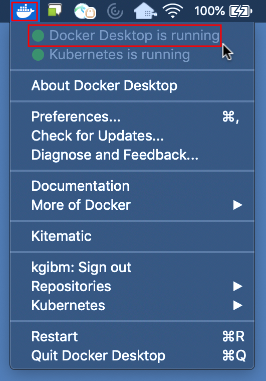

2.  Windows:\
    

3.  Ensure that Docker receives sufficient resources, particularly memory:

    1.  Click the Docker Desktop icon and select **Preferences...** (on macOS) or **Settings** (on Windows)

    1.  Select the **Advanced** tab.

    1.  Ensure **Memory** is at least 4GB and, ideally, at least 8GB. The lab may work with less memory although this has not been tested.

    1.  Click **Apply**\
        \
        macOS:\
        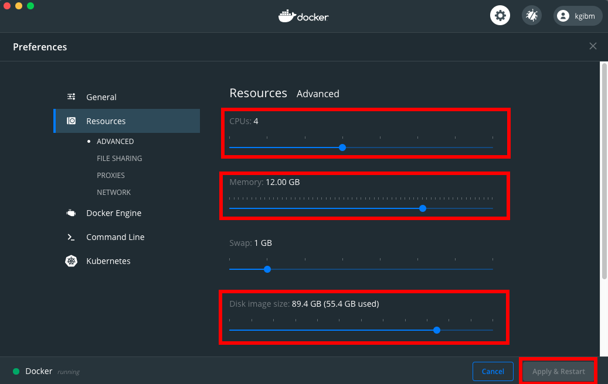\
        \
        Windows:\
        \
        

    1.  Select the **Disk** tab.

    1.  Increase the **Disk image size** to at least **100GB** and click **Apply**:\
        \
        macOS:\
        \
        \
        Windows:\
        

4.  Open a terminal or command prompt:\
    \
    macOS:\
    \
    \
    Windows:\
    

5.  Download the images:

    `docker pull kgibm/fedorawasdebug`

    1.  Note that these images are \>20GB. If you plan to run this in a classroom setting, consider performing all the steps up to and including this item before arriving at the classroom.

6.  Start the lab by starting the Docker container from the command line:

    `docker run --cap-add SYS_PTRACE --cap-add NET_ADMIN --ulimit core=-1 --ulimit memlock=-1 --ulimit stack=-1 --shm-size="256m" --rm -p 9080:9080 -p 9443:9443 -p 9043:9043 -p 9081:9081 -p 9444:9444 -p 5901:5901 -p 5902:5902 -p 3390:3389 -p 22:22 -p 9082:9082 -p 9083:9083 -p 9445:9445 -p 8080:8080 -p 8081:8081 -p 8082:8082 -p 12000:12000 -p 12005:12005 -it kgibm/fedorawasdebug`

7.  Wait about 2 minutes until you see the following in the output (if not seen, review any errors):
    
        =========
        = READY =
        =========

8.  VNC or Remote Desktop into the container:

    1.  macOS built-in VNC client:

        1.  Open another tab in the terminal and run:

            1.  **open vnc://localhost:5902**

            2.  Password: **websphere**

    1.  Linux VNC client:

        1.  Open another tab in the terminal and run:

            1.  **vncviewer localhost:5902**

            2.  Password: **websphere**

    1.  Windows 3<sup>rd</sup> party VNC client:

        i.  If you are able to install and use a 3<sup>rd</sup> party VNC client (there are a few free options online), then connect to **localhost** on port **5902** with password **websphere**.

    1.  Windows Remote Desktop client:

        i.  Windows requires a few steps to make Remote Desktop work with a Docker container. See [Appendix: Windows Remote Desktop Client](#windows-remote-desktop-client) for instructions.

    1.  SSH:

        1.  If you want to simulate production-like access, you can SSH into the container (e.g. using terminal ssh or PuTTY) although you'll need one of the GUI methods above to run most of this lab:

            1.  **ssh was\@localhost**

            2.  Password: **websphere**

9.  When using VNC, you may change the display resolution from within the container and the VNC client will automatically adapt. For example:\
    \
    

## Apache Jmeter

[Apache JMeter](https://jmeter.apache.org/) is a free tool that drives artificial, concurrent user load on a website. The tool is pre-installed in the lab image and we\'ll be using it to simulate website traffic to the [DayTrader7 sample application](https://github.com/WASdev/sample.daytrader7) pre-installed in the lab image.

### Start JMeter

1.  Double click on JMeter on the desktop:\
    \
    

2.  Click **File** → **Open** and select:

    1.  If learning Liberty: **/opt/daytrader7/jmeter\_files/daytrader7\_liberty.jmx**

    2.  If learning WAS traditional: **/opt/daytrader7/jmeter\_files/daytrader7\_twas.jmx**

3.  By default, the script will execute 4 concurrent users. You may change this if you want (e.g. based on the number of CPUs available):\
    \
    

4.  Click the green run button to start the stress test and click the **Aggregate Report** item to see the real-time results.\
    \
    

5.  It will take some time for the responses to start coming back and for all of the pages to be exercised.

6.  Ensure that the **Error %** value for the **TOTAL** row at the bottom is always 0%.\
    \
    

    1.  If there are any errors, review the WAS logs:

        1.  If learning Liberty: **/logs/messages.log**

        2.  If learning WAS traditional: **/opt/IBM/WebSphere/AppServer/profiles/AppSrv01/logs/server1/SystemOut.log**

### Stop JMeter

1.  You may stop a JMeter test by clicking the STOP button:

    

2.  You may click the broom button to clear the results in preparation for the next test:

    

3.  If it asks what to do with the JMeter log files from the previous test, you may just click **Overwrite existing file**:

    

# Basics

First, we'll start with the three basics that should be checked for most problems and performance issues:

1.  Operating system CPU and memory usage

2.  Thread dumps

3.  Garbage Collection

# Linux CPU and Memory Usage

IBM WebSphere Support provides a script called **linperf.sh** as part of the document, ["MustGather: Performance, hang, or high CPU issues with WebSphere Application Server on Linux"](https://www-01.ibm.com/support/docview.wss?uid=swg21115785) (similar scripts exist for other operating systems). This script should be pre-installed on all machines where you run WAS and it should be run when you have performance or hang issues and the resulting files should be uploaded if you open such a support case with IBM.

The linperf.sh script is pre-installed in the lab image at **/opt/linperf/linperf.sh**. In this exercise, you will run this script and analyze the output. The script demonstrates key Linux performance tools that are generally useful whether you decide to run this tool or use the commands individually.

## linperf Theory

First, let's discuss what this script does at a high level:

1.  The script is executed with a set of process IDs (PIDs) of the suspect WAS processes.

2.  The script gathers the output of the **netstat** command. This produces a snapshot of all active TCP and UDP network sockets.

3.  The script gathers the output of the **top** command for the duration of the script (default 4 minutes). This produces periodic snapshots of a summary of system resources (CPU, memory, etc.) and the CPU usage details of the top *processes* using CPU.

4.  The script gathers the output of the **top -H** command for each specified PID for the duration of the script. This produces periodic snapshots of a summary of system resources and the CPU usage details of the top *threads* using CPU in each PID.

5.  The script gathers the output of the **vmstat** command for the duration of the script. This produces periodic snapshots of a summary of system resources. This is similar to the top command.

6.  The script periodically requests a thread dump for each specified PID (default every 30 seconds). This produces detailed information on the Java process such as the threads and what they're doing.

7.  The script gathers the output of the **ps** command for each specified PID on the same interval as the thread dumps. This produces detailed information on the command line of each PID and other resource utilization details. This is similar to the top command.

## linperf Lab

Now, let's run the script:

> Note: You may skip the data collection steps and use example data packaged at /opt/dockerdebug/fedorawasdebug/supplemental/exampledata/liberty/linperf/

1.  [Start JMeter](#start-jmeter)

2.  Open a terminal on the lab image.

3.  First, we'll need to find the PID(s) of WAS. There are a few ways to do this, and you only need to choose one method:

    1.  Show all processes (**ps -elf**), search for the process using something unique in its command line (**grep defaultServer**), exclude the search command itself (**grep -v grep**), and then select the fourth column (in bold below):

        If learning Liberty (the name is **defaultServer**):

        <pre>
        $ ps -elf | grep defaultServer | grep -v grep
        4 S was       <b>1567</b>     1 99  80   0 - 802601 -     19:26 pts/1    00:03:35 java -javaagent:/opt/ibm/wlp/bin/tools/ws-javaagent.jar -Djava.awt.headless=true -Xshareclasses:name=liberty,nonfatal,cacheDir=/output/.classCache/ -jar /opt/ibm/wlp/bin/tools/ws-server.jar defaultServer
        </pre>
        
        If learning WAS traditional (the name is server1 and we search for DefaultNode01 as well because there are some tail commands in the background that have **server1** in them):

        <pre>
        $ ps -elf | grep "DefaultNode01 server1" | grep -v grep
        4 S was       <b>1150</b>     1 99  80   0 - 1471462 -    15:29 pts/0    00:36:06 /opt/IBM/WebSphere/AppServer/java/8.0/bin/java [...] -application com.ibm.ws.bootstrap.WSLauncher com.ibm.ws.runtime.WsServer /opt/IBM/WebSphere/AppServer/profiles/AppSrv01/config DefaultCell01 DefaultNode01 server1
        </pre>

    1.  Search for the process using something unique in its command line using **pgrep -f**:

        If learning Liberty:

        <pre>
        $ pgrep -f defaultServer
        <b>1567</b>
        </pre>

        If learning WAS traditional:

        <pre>
        $ pgrep -f "DefaultNode01 server1"
        <b>1150</b>
        </pre>

4.  Execute the **linperf.sh** command and pass the PID gathered above (replace 1567 with your PID from the output above):

        $ /opt/linperf/linperf.sh 1567
        Tue Apr 23 19:29:26 UTC 2019 MustGather>> linperf.sh script starting [...]

5.  Wait for 4 minutes for the script to finish:

    <pre>
    [...]
    Tue Apr 23 19:33:33 UTC 2019 MustGather&gt;&gt; <b>linperf.sh script complete</b>.
    Tue Apr 23 19:33:33 UTC 2019 MustGather&gt;&gt; Output files are contained within ----&gt;   linperf_RESULTS.tar.gz.   &lt;----
    Tue Apr 23 19:33:33 UTC 2019 MustGather&gt;&gt; <b>The javacores that were created are NOT included in the linperf_RESULTS.tar.gz.</b>
    Tue Apr 23 19:33:33 UTC 2019 MustGather&gt;&gt; Check the &lt;profile_root&gt; for the javacores.
    Tue Apr 23 19:33:33 UTC 2019 MustGather&gt;&gt; Be sure to submit linperf_RESULTS.tar.gz, the javacores, and the server logs as noted in the MustGather.
    </pre>

6.  As mentioned at the end of the script output above, the resulting **linperf_RESULTS.tar.gz** does not include the thread dumps from WAS. Move them over to the current directory:

    If learning Liberty:

        mv /opt/ibm/wlp/output/defaultServer/javacore.* .

    If learning WAS traditional:

        mv /opt/IBM/WebSphere/AppServer/profiles/AppSrv01/javacore.* .

7.  At this point, if you were creating a support case, you would upload **linperf_RESULTS.tar.gz**, **javacore\***, and all the WAS logs; however, instead, we will analyze the results to learn about these basic Linux performance tools.

8.  Extract **linperf_RESULTS.tar.gz**:

        tar xzf linperf_RESULTS.tar.gz

9.  This will produce various **\*.out** files from the various Linux utilities.

10.  [Stop JMeter](#stop-jmeter)

### Linux top

**top** is one of the most basic Linux performance tools. Open **top.out** to review the output.

If you would like to open text files in the Linux container using a GUI tool, you may use a program such as **mousepad**:

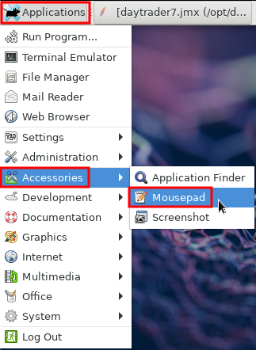

Then click **File** \> **Open**, and find the file where you ran **linperf.sh** such as in the Home directory:

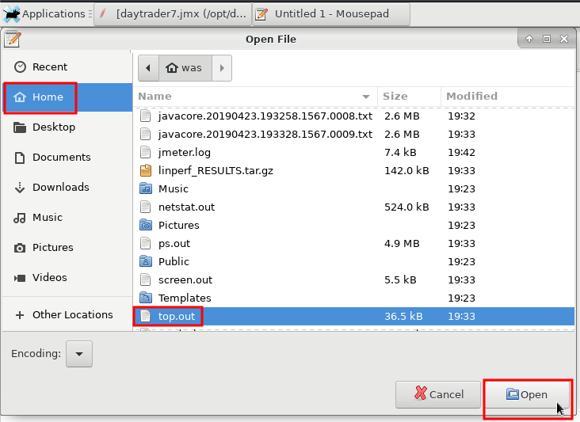

There will be multiple sections of output, each prefixed with a timestamp which represents the previous interval (**linperf.sh** uses a default interval of 60 seconds). In the following example, the data represents CPU usage between 19:28:27 - 19:29:27. Review all intervals to understand CPU usage over time. For example, here is one interval:

<pre>
<b>Tue Apr 23 19:29:27 UTC 2019</b>
top - 19:29:27 up  2:49,  1 user,  load average: 5.59, 2.41, 1.16
Tasks:  87 total,   1 running,  86 sleeping,   0 stopped,   0 zombie
%Cpu(s): 53.7 us, 23.9 sy,  0.0 ni, 20.9 id,  1.5 wa,  0.0 hi,  0.0 si,  0.0 st
MiB Mem :  11993.4 total,    395.9 free,   1777.5 used,   9820.0 buff/cache
MiB Swap:   1024.0 total,   1024.0 free,      0.0 used.   9896.8 avail Mem 

  PID USER      PR  NI    VIRT    RES    SHR S  %CPU  %MEM     TIME+ COMMAND
 1567 was       20   0 3216340 374372  36356 S 181.2   3.0   5:34.40 java -jav+
 1854 was       20   0 3701404 417256  24580 S  37.5   3.4   1:21.23 /usr/bin/+
  414 was       20   0  187948  19652  14296 S   6.2   0.2   0:00.22 xfsetting+
 2631 was       20   0   10676   4380   3820 R   6.2   0.0   0:00.02 top -bc -+
 2640 was       20   0   10676   4316   3756 S   6.2   0.0   0:00.01 top -bH -+
    1 root      20   0    3784   2956   2696 S   0.0   0.0   0:00.05 /bin/sh /+
    9 root      20   0   23916  21112   7532 S   0.0   0.2   0:00.31 /usr/bin/+
   13 root      20   0  151676   4188   3684 S   0.0   0.0   0:00.01 /usr/sbin+
   14 root      20   0    9264   5852   5184 S   0.0   0.0   0:00.01 /usr/sbin+
   15 root      20   0    6960   3636   3148 S   0.0   0.0   0:00.00 /usr/sbin+
</pre>

One place to start is to check the server's RAM:

<pre>
MiB Mem :  <b>11993.4 total</b>,    <em>395.9 free</em>,   1777.5 used,   9820.0 buff/cache
MiB Swap:   1024.0 total,   1024.0 free,      0.0 used.   <b>9896.8 avail Mem</b>
</pre>

The values may be in bytes, KB, MB, or other formats depending on various settings.

The two values in bold are the important values:

1.  The first bold value on the first line shows the total amount of RAM; in this example, about 11.9GB.

2.  The second bold value on the second line shows the approximate amount of RAM that is available for applications if they need it (including readily reclaimable page cache and memory slabs); in this example, about 9.8GB. Notice that the actual amount of free RAM (first line, second column, in *italics*) is only about 395MB. Linux, like most other modern operating systems, is aggressive in using RAM for various caches, primarily the file cache, to improve disk I/O speeds; however, most of this memory is reclaimable if applications demand it. Note that Linux is particularly aggressive with its default [**swappiness**](https://publib.boulder.ibm.com/httpserv/cookbook/Operating_Systems-Linux.html#Swappiness) value and in some cases it will prefer to page out application pages instead of reclaiming file cache pages. Consider setting vm.swappiness=0 for production workloads that perform little file I/O and require most of the RAM.

Next, review the server's overall CPU usage:

<pre>
Tasks:  87 total,   1 running,  86 sleeping,   0 stopped,   0 zombie
%Cpu(s): 53.7 us, 23.9 sy,  0.0 ni, <b>20.9 id</b>,  1.5 wa,  0.0 hi,  0.0 si,  0.0 st
</pre>

The value in bold is the important value. **id** represents the percent of time during the interval that all CPUs were idle. It is better to look at **idle%** instead of **user%**, **system%**, etc. because this ensures that you quickly capture all potential users of CPU (including I/O wait, **nice**d processes [**nice** and **renice** are commands to change the relative scheduling priorities of processes. nice% reflects non-default, positively niced processes' CPU utilization], and hypervisor stealing [In a virtualized environment, the percent of time this host wanted CPU but waited for the hypervisor. This may mean CPU overcommit and should be reviewed]). Subtract the **id** number from 100 to get the approximate total CPU usage; in this example, (100 - 20.9) \~= 79.1%.

Next, top prints a sorted list of the highest CPU-using processes:

<pre>
<b>  PID</b> USER      PR  NI    VIRT    RES    SHR S <b> %CPU</b>  %MEM     TIME+ COMMAND
<b> 1567</b> was       20   0 3216340 374372  36356 S <b>181.2</b>   3.0   5:34.40 java -jav+
<b> 1854</b> was       20   0 3701404 417256  24580 S <b> 37.5</b>   3.4   1:21.23 /usr/bin/+
<b>  414</b> was       20   0  187948  19652  14296 S <b>  6.2</b>   0.2   0:00.22 xfsetting+ …
</pre>

The two columns in bold are the important values:

1.  The first bold column is the PID of each process which is useful for running more detailed commands.

2.  The second bold column is the percent of CPU used by that PID for the interval as a percentage of one CPU. For example, PID 1567 consumed about 181.2% of one CPU which means that approximately the equivalent of 1.8 CPU threads were used. In this example, the container had 4 CPU threads available (see **/proc/cpuinfo** on your system), so PID 1567 consumed about (1.812 / 4) \* 100 \~= 45.3% of total CPU.

The **top** command may be run in interactive mode by simply running the **top** command. This is a useful place to start when you begin investigating a system. The command will dynamically update every few seconds (this interval may be specified with the **-d S** options where **S** is in fractional seconds). Press **q** to quit top.

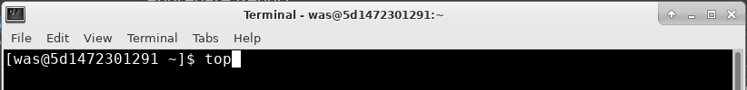

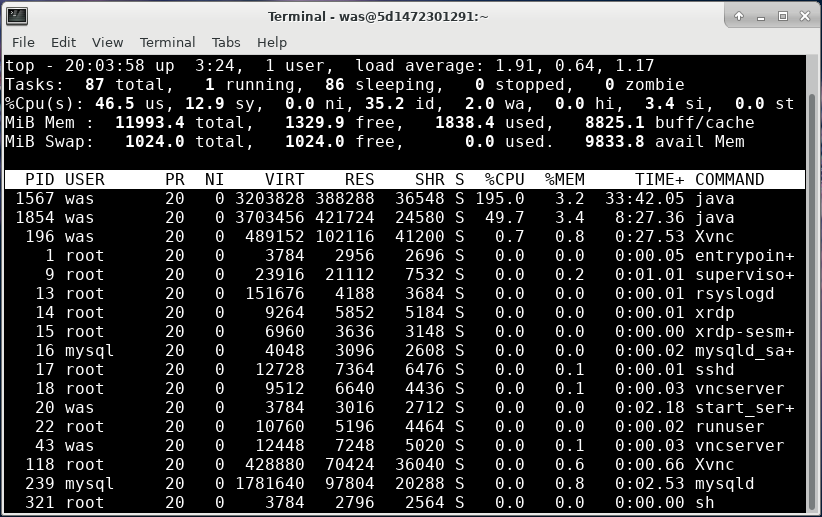

### Linux top -H

**top -H** is similar to top except that the **-H** flag shows the top CPU usage by thread instead of by PID. Open **topdashH\*.out** to review the output. Again, this file shows multiple intervals, so it's important to review all intervals to understand CPU usage over time. Here is an example interval from Liberty (on WAS traditional, the main difference will be **WebContai+** threads instead of **Default E+**):

<pre>
Tue Apr 23 19:29:27 UTC 2019

Collected against PID 1567.

top - 19:29:27 up  2:49,  1 user,  load average: 5.59, 2.41, 1.16
Threads:  88 total,  12 running,  76 sleeping,   0 stopped,   0 zombie
%Cpu(s): 54.8 us, 19.4 sy,  0.0 ni, 24.2 id,  1.6 wa,  0.0 hi,  0.0 si,  0.0 st
MiB Mem :  11993.4 total,    395.8 free,   1777.5 used,   9820.1 buff/cache
MiB Swap:   1024.0 total,   1024.0 free,      0.0 used.   9896.8 avail Mem 

<b>  PID</b> USER      PR  NI    VIRT    RES    SHR S  <b>%CPU</b>  %MEM     TIME+ <b>COMMAND</b>
<b> 1571</b> was       20   0 3216340 374372  36356 S  <b>12.5</b>   3.0   0:00.02 <b>Signal Re+</b>
<b> 1638</b> was       20   0 3216340 374372  36356 S  <b>12.5</b>   3.0   0:08.09 <b>Inbound R+</b>
<b> 2347</b> was       20   0 3216340 374372  36356 S  <b>12.5</b>   3.0   0:06.54 <b>Default E+</b>
<b> 2386</b> was       20   0 3216340 374372  36356 S  <b>12.5</b>   3.0   0:04.94 <b>Default E+</b>
<b> 2406</b> was       20   0 3216340 374372  36356 S  <b>12.5</b>   3.0   0:04.59 <b>Default E+</b>
<b> 2439</b> was       20   0 3216340 374372  36356 S  <b>12.5</b>   3.0   0:03.52 <b>Default E+</b>
<b> 2514</b> was       20   0 3216340 374372  36356 S  <b>12.5</b>   3.0   0:01.58 <b>Default E+</b>
<b> 2539</b> was       20   0 3216340 374372  36356 S  <b>12.5</b>   3.0   0:00.80 <b>Default E+</b> …
</pre>

The three columns in bold are the important values:

1.  The first bold column is the thread ID (TID) of each thread (the column is still called "PID" because Linux treats threads as "lightweight processes") which is useful for running more detailed commands. This value may be converted to hexadecimal and searched for in a matching thread dump.

2.  The second bold column is the percent of CPU used by that TID for the interval as a percentage of one CPU (similar to the previous top output, except it's for the TID instead of the PID).

3.  On recent versions of Linux, the third bold column is the name of the thread. This is incredibly useful to get a quick understanding of what threads in the Java process are consuming most of the CPU. For example:

    1.  **Default Executor** threads are generally application threads processing HTTP and other user work on Liberty,

    1.  **WebContainer** threads are application threads processing HTTP work on WAS traditional,

    1.  **Inbound...** threads are Liberty threads processing new inbound user requests,

    1.  **GC Slave** threads are JVM threads processing garbage collection,

    1.  **JIT Comp...** threads are JVM threads processing Just-in-Time (JIT) compilation,

    1.  etc.

In the above example, the top threads are mostly **Default Executor** threads, each using about (0.125 / 4) \* 100 \~= 3.125% of total CPU which means that most of the CPU usage is application threads handling user work, spread about evenly across threads.

As in the case of top, the **top -H** command may be run in interactive mode and could be considered an even better place to start when you begin investigating a system; however, note that **top -H** is much more expensive than top (especially if you don't provide a particular PID with **-p**) because it must traverse the data for all PIDs and all TIDs. Therefore, if you want to use **top -H** in interactive mode, consider using a large interval such as 10 seconds or more:

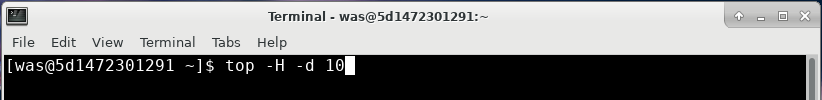

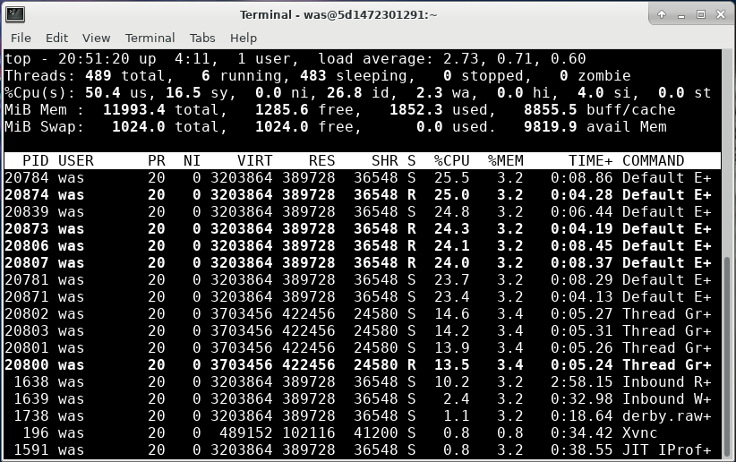

# IBM Java and OpenJ9 Thread Dumps

Thread dumps are snapshots of process activity, including the thread stacks that show what each thread is doing. Thread dumps are one of the best places to start to investigate problems. If a lot of threads are in similar stacks, then that behavior might be an issue or a symptom of an issue.

For IBM Java or OpenJ9, a thread dump is also called a javacore or javadump. [HotSpot-based thread dumps](https://publib.boulder.ibm.com/httpserv/cookbook/Troubleshooting-Troubleshooting_Java-Troubleshooting_HotSpot_JVM.html#Troubleshooting-Troubleshooting_HotSpot_JVM-Thread_Dump) are covered elsewhere.

This exercise will demonstrate how to review thread dumps in the free [IBM Thread and Monitor Dump Analyzer (TMDA) tool](https://www.ibm.com/support/pages/ibm-thread-and-monitor-dump-analyzer-java-tmda).

## Thread Dumps Theory

An IBM Java or OpenJ9 thread dump is generated in a **javacore\*.txt** in the working directory of the process with a snapshot of process activity, including:

-   Each Java thread and its stack.

-   A list of all Java synchronization monitors, which thread owns each monitor, and which threads are waiting for the lock on a monitor.

-   Environment information, including Java command line arguments and operating system ulimits.

-   Java heap usage and information about the last few garbage collections.

-   Detailed native memory and classloader information.

Thread dumps generally do not contain sensitive information about user requests, but they may contain sensitive information about the application or environment, so they should be treated sensitively.

## Thread Dumps Lab

We will review the thread dumps gathered by linperf.sh above:

> Note: You may skip the data collection steps and use example data packaged at /opt/dockerdebug/fedorawasdebug/supplemental/exampledata/liberty/linperf/

1.  Complete the *linperf.sh Lab* above which includes producing thread dumps.

2.  Open **/opt/programs/** in the file browser and double click on **TMDA**:

3.  Click Open Thread Dumps and select all of the **javacore\*.txt** files using the Shift key. These may be in your home directory (**/home/was**) if you moved them in the previous exercise; otherwise, they're in the default working directory (Liberty: **/opt/ibm/wlp/output/defaultServer** ; WAS traditional: **/opt/IBM/WebSphere/AppServer/profiles/AppSrv01/**):\
    \
    \
    \
    \
    

4.  Select a thread dump and click the **Thread Detail** button:\
    \
    

5.  Click on the **Stack Depth** column to sort by thread stack depth in ascending order.

6.  Click on the **Stack Depth** column again to sort again in descending order:\
    \
    

7.  Generally, the threads of interest are those with stack depths greater than \~20. Select any such rows and review the stack on the right (if you don't see any, then close this thread dump and select another from the list):\
    \
    

    1.  Generally, to understand which code is driving the thread, skip any non-application stack frames. In the above example, the first application stack frame is TradeAction.getQuote.

    2.  Thread dumps are simply snapshots of activity, so just because you capture threads in some stack does not mean there is necessarily a problem. However, if you have a large number of thread dumps, and an application stack frame appears with high frequency, then this may be a problem or an area of optimization. You may send the stack to the developer of that component for further research.

8.  In some cases, you may see that one thread is blocked on another thread. For example:\
    \
    

    1.  The **Monitor** line shows which monitor this thread is waiting for, and the stack shows the path to the request for the monitor. In this example, the application is trying to commit a database transaction. This lab uses the Apache Derby database engine which is not a very scalable database. In this example, optimizing this bottleneck may not be easy and may require deep Apache Derby expertise.

    2.  You may click on the thread name in the **Blocked by** view to quickly see the thread stack of the other thread that owns the monitor.

    3.  Lock contention is a common cause of performance issues and may manifest with poor performance and low CPU usage.

9.  An alternative way to review lock contention is by selecting a thread dump and clicking **Monitor Detail**:\
    \
    \
    \
    

    1.  This shows a tree view of the monitor contention which makes it easier to explore the relationships and number of threads contending on monitors. In the above example, **Default Executor-thread-153** owns the monitor and **Default Executor-thread-202** is waiting for the monitor.

10. You may also select multiple thread dumps and click the **Compare Threads** button to see thread movement over time:\
    \
    \
    \
    

    1.  Each column is a thread dump and shows the state of each thread (if it exists in that thread dump) over time. Generally, you're interested in threads that are runnable (Green Arrow) or blocked or otherwise in the same concerning top stack frame. Click on each cell in that row and review the thread dump on the right. If the thread dump is always in the same stack, this is a potential issue. If the thread stack is changing a lot, then this is usually normal behavior.

    2.  In general, focus on the main application thread pools such as DefaultExecutor, WebContainer, etc.

Next, let's simulate a hung thread situation and analyze the problem with thread dumps:

> Note: You may skip the data collection steps and use example data packaged at /opt/dockerdebug/fedorawasdebug/supplemental/exampledata/liberty/threaddump\_deadlock/

1.  Open a browser to:

    1.  If learning Liberty: <http://localhost:9080/swat/>

    1.  If learning WAS traditional: <http://localhost:9081/swat/>

2.  Scroll down and click on Deadlocker:\
    \
    

3.  Wait until the continuous browser output stops writing new lines of \"Socrates \[\...\]\" which signifies that the threads have become deadlocked and then gather a thread dump of the WAS process by sending it the **SIGQUIT** **(3)** signal. Although the name of the signal includes the word "QUIT", the signal is captured by the JVM, the JVM pauses for a few hundred milliseconds to produce the thread dump, and then the JVM continues. This same command is performed by **linperf.sh**. It is a quick and cheap way to quickly understand what your JVM is doing:\
    \
    If learning Liberty:

        kill -3 $(pgrep -f defaultServer)

    If learning WAS traditional:

        kill -3 $(pgrep -f "DefaultNode01 server1")

    1.  Note that here we are using a sub-shell to send the output of the pgrep command (which finds the PID of WAS) as the argument for the kill command.

    1.  This can be simplified even further with the **pkill** command which combines **pgrep** functionality:
    
        If learning Liberty:

            pkill -3 -f defaultServer

        If learning WAS traditional:

            pkill -3 -f "DefaultNode01 server1"

4.  In the TMDA tool, clear the previous list of thread dumps:\
    \
    

5.  Click **File** \> **Open Thread Dumps** and navigate to (Liberty: **/opt/ibm/wlp/output/defaultServer** ; WAS traditional: **/opt/IBM/WebSphere/AppServer/profiles/AppSrv01/**) and select both new thread dumps and click **Open**:\
    \
    

6.  When you select the first thread dump, TMDA will warn you that a deadlock has been detected:\
    \
    

    1.  Deadlocks are not common and mean that there is a bug in the application or product.

7.  Use the same procedure as above to review the **Monitor Details** and **Compare Threads** to find the thread that is stuck. In this example, the **DefaultExecutor** application thread actually spawns threads and waits for them to finish, so the application thread is just in a Thread.join:\
    \
    

8.  The actual spawned threads are named differently and show the blocking:\
    \
    

Next, let's combine what we've learned about the **top -H** command and thread dumps to simulate a thread that is using a lot of CPU:

> Note: You may skip the data collection steps and use example data packaged at /opt/dockerdebug/fedorawasdebug/supplemental/exampledata/liberty/threaddump\_infiniteloop/

1.  Go to:

    1.  If learning Liberty: <http://localhost:9080/swat/>

    1.  If learning WAS traditional: <http://localhost:9081/swat/>

2.  Scroll down and click on InfiniteLoop:\
    \
    

3.  Go to the container terminal and start **top -H** with a 10 second interval:

        top -H -d 10

    

4.  Notice that a single thread is consistently consuming \~100% of a single CPU thread.

5.  Convert the PID to hexadecimal. In the example above, **22129** = **0x5671**.

    1.  In the container, open Galculator:\
        \
        

    1.  Click View \> Scientific Mode:\
        \
        

    1.  Enter the decimal number (in this example, **22129**), and then click on **HEX**:\
        \
        

    1.  The result is **0x5671**:

        

6.  Take a thread dump of the parent process:\
    \
    If learning Liberty:

        pkill -3 -f defaultServer

    If learning WAS traditional:

        pkill -3 -f "DefaultNode01 server1"

7.  Open the most recent thread dump from **/opt/ibm/wlp/output/defaultServer/** in a text editor such as **mousepad**:\
    \
    

8.  Search for the native thread ID in hex (in this example, 0x5671) to find the stack trace consuming the CPU (if captured during the thread dump):\
    \
    

9.  Finally, kill the server destructively (**kill -9**) because trying to stop it gracefully will not work due to the infinitely looping request:

    If learning Liberty:

        pkill -9 -f defaultServer

    If learning WAS traditional:

        pkill -9 -f "DefaultNode01 server1"

# Garbage Collection

Garbage collection (GC) automatically frees unused objects. Healthy garbage collection is one of the most important aspects of Java programs. The proportion of time spent in garbage collection versus application time should be [less than 10% and ideally less than 1%](https://publib.boulder.ibm.com/httpserv/cookbook/Major_Tools-Garbage_Collection_and_Memory_Visualizer_GCMV.html#Major_Tools-Garbage_Collection_and_Memory_Visualizer_GCMV-Analysis).

This lab will demonstrate how to enable verbose garbage collection in WAS for the sample DayTrader application, exercise the application using Apache JMeter, and review verbose garbage collection data in the free [IBM Garbage Collection and Memory Visualizer (GCMV)](https://publib.boulder.ibm.com/httpserv/cookbook/Major_Tools-Garbage_Collection_and_Memory_Visualizer_GCMV.html) tool.

## Garbage Collection Theory

All major Java Virtual Machines (JVMs) are designed to work with a maximum Java heap size. When the Java heap is full (or various sub-heaps), an allocation failure occurs and the garbage collector will run to try to find space. Verbose garbage collection (verbosegc) prints detailed information about each one of these allocation failures.

Always enable verbose garbage collection, including in production (benchmarks show an overhead of \~0.13% for [IBM Java](https://publib.boulder.ibm.com/httpserv/cookbook/Java-Java_Virtual_Machines_JVMs-OpenJ9_and_IBM_J9_JVMs.html#Java-Java_Virtual_Machines_JVMs-OpenJ9_and_IBM_J9_JVMs-Garbage_Collection-Verbose_garbage_collection_verbosegc)), using the options to rotate the verbosegc logs. For [IBM Java](http://www.ibm.com/support/knowledgecenter/SSYKE2_8.0.0/com.ibm.java.lnx.80.doc/diag/appendixes/cmdline/xverbosegclog.html) - 5 historical files of roughly 20MB each:

    -Xverbosegclog:verbosegc.%seq.log,5,50000

## Garbage Collection Lab

Add the verbosegc option to the jvm.options file:

> Note: You may skip the data collection steps and use example data packaged at /opt/dockerdebug/fedorawasdebug/supplemental/exampledata/liberty/verbosegc\_and\_oom/

1.  [Stop JMeter](#stop-jmeter) if it is started.

1.  If learning Liberty:

    1.  Stop the Liberty server.

            /opt/ibm/wlp/bin/server stop defaultServer

    1.  Open a text editor such as mousepad and add the following line to it:

            -Xverbosegclog:logs/verbosegc.%seq.log,5,50000

    1.  Save the file to **/opt/ibm/wlp/usr/servers/defaultServer/jvm.options**\
        \
        

    1.  Start the Liberty server

            /opt/ibm/wlp/bin/server start defaultServer

3.  If learning WAS traditional, verbosegc is enabled by default so you don\'t need to do anything.

1.  [Start JMeter](#start-jmeter)

2.  Run the test for about 5 minutes.

3.  [Stop JMeter](#stop-jmeter)

4.  Open **/opt/programs/** in the file browser and double click on **GCMV**:

5.  Click **File** \> **Load File\...** and select the **verbosegc.001.log** file. For example:\
    \
    

6.  Select **/opt/ibm/wlp/output/defaultServer/logs/verbosegc.001.log**\
    \
    

7.  Once the file is loaded, you will see the default line plot view. It is common to change the **X-axis** to **date** to see absolute timestamps:\
    \
    

8.  Click the **Data Selector** tab in the top left, choose **VGC Pause** and check **Total pause time** to add the total garbage collection pause time plot to the graph:\
    \
    

9.  Do the same as above using **VGC Heap** and check **Used heap (after global collection)**:\
    \
    \
    

10. Observe the heap usage and pause time magnitude and frequency over time. For example:\
    \
    

    1.  This shows that the heap size reaches 145MB and the heap usage (after global collection) reached \~80MB.

11. More importantly, we want to know the proportion of time spent in GC. Click the **Report** tab and review the **Proportion of time spent in garbage collection pauses (%)**:\
    \
    

    1.  If this number is less than 1%, then this is very healthy. If it's less than 5% then it's okay. If it's less than 10%, then there is significant room for improvement. If it's greater than 10%, then this is concerning.

Next, let's simulate a memory issue.

> Note: You may skip the data collection steps and use example data packaged at /opt/dockerdebug/fedorawasdebug/supplemental/exampledata/liberty/verbosegc\_and\_oom/

1.  [Stop JMeter](#stop-jmeter) if it is started.

1.  If learning Liberty:

    1.  Stop Liberty:

        `/opt/ibm/wlp/bin/server stop defaultServer`

    1.  Edit **/opt/ibm/wlp/usr/servers/defaultServer/jvm.options**, add an explicit maximum heap size of 256MB on a new line and save the file:

        `-Xmx256m`

        

    1.  Start Liberty

        `/opt/ibm/wlp/bin/server start defaultServer`

1.  If learning WAS traditional:

    1.  Open the Administrative Console at <https://localhost:9043/ibm/console>

    1.  Login with user **wsadmin** and password **websphere**

    1.  Click **Servers** \> **Server Types** \> **WebSphere application server** \> **server1**\
        \
        

    1.  Click **Java and Process Management** \> **Process Definition**:\
        \
        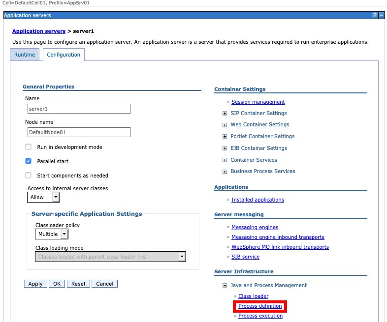

    1.  Click **Java Virtual Machine**:\
        \
        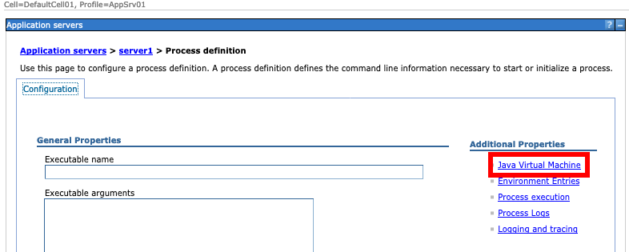

    1.  Set **-Xmx** to **256MB**:\
        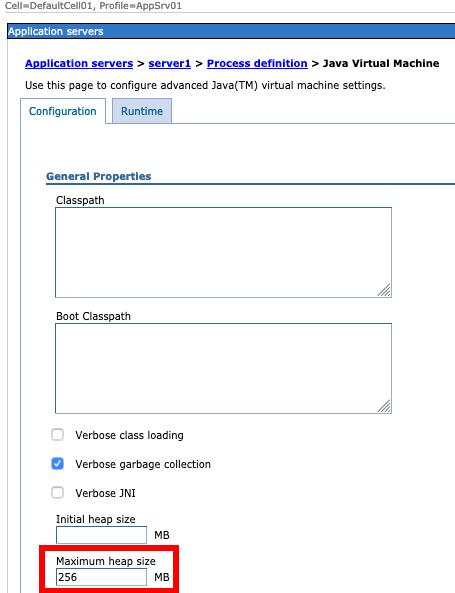

    1.  Scroll down and click OK:\
        

    1.  Click Save:\
        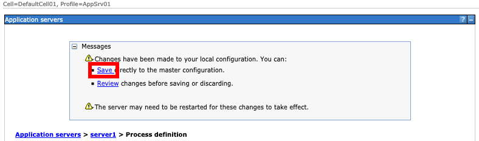

    1.  Stop the server.

        `/opt/IBM/WebSphere/AppServer/profiles/AppSrv01/bin/stopServer.sh server1 -username wsadmin -password websphere`

    1.  Start the server

        `/opt/IBM/WebSphere/AppServer/profiles/AppSrv01/bin/startServer.sh server1`

1.  [Start JMeter](#start-jmeter)

1.  Let the JMeter test run for about 5 minutes.

1.  Do not stop the JMeter test but leave it running as you continue to the next step.

1.  Open your browser to the following page:

    1.  If learning Liberty: <http://localhost:9080/swat/AllocateObject?size=1048576&iterations=300&waittime=1000&retainData=true>

    1.  If learning WAS traditional: <http://localhost:9081/swat/AllocateObject?size=1048576&iterations=300&waittime=1000&retainData=true>

    1.  This will allocate three hundred 1MB objects with a delay of 1 second between each allocation, and hold on to all of them to simulate a leak.

    1.  This will take about 5 minutes to run and you can watch your browser output for progress.

    1.  You can run **top -H** while this is running. As memory pressure builds, you'll start to see **GC Slave** threads consuming most of the CPUs instead of application threads (garbage collection also happens on the thread where the allocation failure occurs, so you may also see a single application thread consuming a similar amount of CPU as the GC Slave threads):

        `top -H -p $(pgrep -f defaultServer) -d 5`

        

    1.  At some point, browser output will stop because the JVM has thrown an OutOfMemoryError.

1.  [Stop JMeter](#stop-jmeter)

1.  Forcefully kill the JVM because an OutOfMemoryError does not stop the JVM; it will continue garbage collection thrashing and consume all of your CPU.

    1.  If learning Liberty:

            pkill -9 -f defaultServer

    1.  If learning WAS traditional:

            pkill -9 -f "DefaultNode01 server1"

1.  Close and re-open the **verbosegc\*log** file in GCMV:\
    \
    

    1.  We can quickly see how the heap usage reaches 256MB and the pause time magnitude and durations increase significantly.

1. Click on the **Report** tab and review the **Proportion of time spent in garbage collection pauses (%)**:\
    \
    

1. 24% seems pretty bad but not terrible and doesn't line up with what we know about what happened. This is because, by default, the GCMV Report tab shows statistics for the entire duration of the verbosegc log file. Since we had run the JMeter test for 5 minutes and it was healthy, the average proportion of time in GC is lower for the whole duration.

1. Click on the **Line plot** tab and zoom in to the area of high pause times by using your mouse button to draw a box around those times:\
    \
    

1. This will zoom the view to that bounding box:\
    \
    

1. However, zooming in is just a visual aid. To change the report statistics, we need to match the X-axis to the period of interest.

1. Hover your mouse over the approximate start and end points of the section of concern (frequent pause time spikes) and note the times of those points (in terms of your selected X Axis type):\
    \
    

1. Enter each of the values in the minimum and maximum input boxes and press **Enter** on your keyboard in each one to apply the value. The tool will show vertical lines with triangles showing the area of the graph that you\'ve cropped to.\
    \
    

1. Click on the **Report** tab at the bottom and observe the proportion of time spent in garbage collection for this period is very high (in this example, \~87%).\
    \
    

1. This means that the application is doing very little work and is very unhealthy. In general, there are a few, non-exclusive ways to resolve this problem:

    1.  Increase the maximum heap size.

    1.  Decrease the object allocation rate of the application.

    1.  Resolve memory leaks through heapdump analysis.

    1.  Decrease the maximum thread pool size.

# Other Topics

The above three sections -- operating system CPU and memory, thread dumps, and garbage collection -- are the three key elements that should be reviewed for all problems and performance issues. The rest of the lab will review other problem types and performance tuning and other types of tools.

#  Methodology

First, let's review some general tips about problem determination and performance methodology:

##  The Scientific Method

Troubleshooting is the act of understanding problems and then changing systems to resolve those problems. The best approach to troubleshooting is the scientific method which is basically as follows:

1.  Observe and measure evidence of the problem. For example: \"Users are receiving HTTP 500 errors when visiting the website.\"

2.  Create prioritized hypotheses about the causes of the problem. For example: \"I found exceptions in the logs. I hypothesize that the exceptions are creating the HTTP 500 errors.\"

3.  Research ways to test the hypotheses using experiments. For example: \"I searched the documentation and previous problem reports and the exceptions may be caused by a default setting configuration. I predict that changing this setting will resolve the problem if this hypothesis is true.\"

4.  Run experiments to test hypotheses. For example: \"Please change this setting and see if the user errors are resolved.\"

5.  Observe and measure experimental evidence. If the problem is not resolved, repeat the steps above; otherwise, create a theory about the cause of the problem.

##  Organizing an Investigation

Keep track of a summary of the situation, a list of problems, hypotheses, and experiments/tests. Use numbered items so that people can easily reference things in phone calls or emails. The summary should be restricted to a single sentence for problems, resolution criteria, statuses, and next steps. Any details are in the subsequent tables. The summary is a difficult skill to learn, so try to constrain yourself to a single (short!) sentence. For example:

### Summary

1.  Problems: 1) Average website response time of 5000ms and 2) website error rate \> 10%.

2.  Resolution criteria: 1) Average response time of 300ms and 2) error rate of \<= 1%.

3.  Statuses: 1) Reduced average response time to 2000ms and 2) error rate to 5%.

4.  Next steps: 1) Investigate database response times and 2) gather diagnostic trace.

### Problems

| \#  | Problem                                  | Case \#     | Status                                                          | Next Steps                                         |
| :-: | ---------------------------------------- | ----------- | --------------------------------------------------------------- | ------------------------------------- |
| 1   | Average response time greater than 300ms | TS001234567 | Reduced average response time to 2000ms by increasing heap size | Investigate database response times               |
| 2   | Website error rate greater than 1%       | TS001234568 | Reduced website error rate to 5% by fixing an application bug.  | Run diagnostic trace for remaining errors |

### Hypotheses for Problem \#1

| \#  | Hypothesis                                                                   | Evidence                                                       | Status                                                                                     |
| :-: | ---------------------------------------------------------------------------- | ---------------------------------------------------------- | ------------------------------------------------------------------------------------------ |
| 1   | High proportion of time in garbage collection leading to reduced performance | Verbosegc showed proportion of time in GC of 20%                  | Increased Java maximum heap size to -Xmx1g and proportion of time in GC went down to 5% |
| 2   | Slow database response times                                                 | Thread stacks showed many threads waiting on the database | Gather database re-sponse times                                                         |

### Hypotheses for Problem \#2

| \#  | Hypothesis                                                            | Evidence                                                                       | Status                                                                 |
| :-: | --------------------------------------------------------------------- | ---------------------------------------------------------------- | --------------------------------------------------------------------------------- |
| 1 | NullPointerException in com.application.foo is causing errors           | NullPointerExceptions in the logs correlate with HTTP 500 response codes | Application fixed the NullPointerException and error rates were halved |
| 2 | ConcurrentModificationException in com.websphere.bar is causing errors  | ConcurrentModificationExceptions correlate with HTTP 500 response codes | Gather WAS diagnostic trace capturing some exceptions                  |

### Experiments/Tests

| \#  | Experiment/Test               | Start                   | End                     | Environment        | Changes                       | Results                                              |
| :-: | ----------------------------- | ----------------------- | ----------------------- | ------------------ | ----------------------------- | ---------------------------------------------------- |
| 1 | Baseline                        | 2019-01-01 09:00:00 UTC | 2019-01-01 17:00:00 UTC | Production server1 | None                          | Average response time 5000ms; Website error rate 10% |
| 2 | Reproduce in a test environment | 2019-01-02 11:00:00 UTC | 2019-01-01 12:00:00 UTC | Test server1       | None                          | Average response time 8000ms; Website error rate 15% |
| 3 | Test problem #1 - hypothesis #1 | 2019-01-03 12:30:00 UTC | 2019-01-01 14:00:00 UTC | Test server1       | Increase Java heap size to 1g | Average response time 4000ms; Website error rate 15% |
| 4 | Test problem #1 - hypothesis #1 | 2019-01-04 09:00:00 UTC | 2019-01-01 17:00:00 UTC | Production server1 | Increase Java heap size to 1g | Average response time 2000ms; Website error rate 10% |

##  Performance Tuning Tips

1.  Performance tuning is usually about focusing on a few key variables. We will highlight the most common tuning knobs that can often improve the speed of the average application by 200% or more relative to the default configuration. The first step, however, should be to use and be guided by the tools and methodologies. Gather data, analyze it and create hypotheses: then test your hypotheses. Rinse and repeat. As Donald Knuth says: \"Programmers waste enormous amounts of time thinking about, or worrying about, the speed of noncritical parts of their programs, and these attempts at efficiency actually have a strong negative impact when debugging and maintenance are considered. We should forget about small efficiencies, say about 97% of the time \[...\]. Yet we should not pass up our opportunities in that critical 3%. A good programmer will not be lulled into complacency by such reasoning, he will be wise to look carefully at the critical code; but only after that code has been identified. It is often a mistake to make a priori judgments about what parts of a program are really critical, since the universal experience of programmers who have been using measurement tools has been that their intuitive guesses fail.\" (Donald Knuth, Structured Programming with go to Statements, Stanford University, 1974, Association for Computing Machinery)

2.  There is a seemingly daunting number of tuning knobs. Unless you are trying to squeeze out every last drop of performance, we do not recommend a close study of every tuning option.

3.  In general, we advocate a bottom-up approach. For example, with a typical WebSphere Application Server application, start with the operating system, then Java, then WAS, then the application, etc. Ideally, investigate these at the same time. The main goal of a performance tuning exercise is to iteratively determine the bottleneck restricting response times and throughput. For example, investigate operating system CPU and memory usage, followed by Java garbage collection usage and/or thread dumps/sampling profilers, followed by WAS PMI, etc.

4.  One of the most difficult aspects of performance tuning is understanding whether or not the architecture of the system, or even the test itself, is valid and/or optimal.

5.  Meticulously describe and track the problem, each test and its results.

6.  Use basic statistics (minimums, maximums, averages, medians, and standard deviations) instead of spot observations.

7.  When benchmarking, use a repeatable test that accurately models production behavior, and avoid short term benchmarks which may not have time to warm up.

8.  Take the time to automate as much as possible: not just the testing itself, but also data gathering and analysis. This will help you iterate and test more hypotheses.

9.  Make sure you are using the latest version of every product because there are often performance or tooling improvements available.

10. When researching problems, you can either analyze or isolate them. Analyzing means taking particular symptoms and generating hypotheses on how to change those symptoms. Isolating means eliminating issues singly until you\'ve discovered important facts. In general, we have found through experience that analysis is preferable to isolation.

11. Review the full end-to-end architecture. Certain internal or external products, devices, content delivery networks, etc. may artificially limit throughput (e.g. Denial of Service protection), periodically mark services down (e.g. network load balancers, WAS plugin, etc.), or become saturated themselves (e.g. CPU on load balancers, etc.).

#  Heap Dumps

Heap dumps are snapshots of Java objects in a process. On IBM Java and OpenJ9, the two heapdump formats are [Portable Heapdump](https://www.ibm.com/support/knowledgecenter/en/SSYKE2_8.0.0/openj9/dump_heapdump/index.html) (\*.phd) and [System Dump](https://www.ibm.com/support/knowledgecenter/en/SSYKE2_8.0.0/openj9/dump_systemdump/index.html) (core\*.dmp).

This lab will demonstrate how to exercise the sample DayTrader application using Apache JMeter, request a heap dump of WebSphere Application Server, and review the heapdump file in the free [IBM Memory Analyzer Tool (MAT)](https://publib.boulder.ibm.com/httpserv/cookbook/Major_Tools-IBM_Memory_Analyzer_Tool.html#Major_Tools-IBM_Memory_Analyzer_Tool_MAT-Standalone_Installation).

##  Heap Dump Theory

Heap dumps are used for investigating the causes of OutOfMemoryErrors, sizing applications, and reviewing memory contents under various conditions. Recent versions of IBM Java and OpenJ9 automatically produce PHDs on the first four OutOfMemoryErrors thrown by a process, and a system dump on the first OutOfMemoryError thrown by a process (assuming the operating system has been configured to allow system dumps).

A significant difference between PHDs and system dumps is that PHDs only have the object relationships so they do not contain sensitive user information (although they do contain class names which may be considered sensitive by some), whereas system dumps contain all the memory at the time of the dump which may include user information. System dumps should be treated with very high sensitivity and encrypted if necessary using a tool such as [gpg](https://publib.boulder.ibm.com/httpserv/cookbook/Appendix-POSIX.html#Resources-POSIX-gpg). The general recommendation is to always use system dumps, and if security is a concern, extract a PHD file from the system dump using jdmpview for normal usage, and save the system dump in an encrypted format in case it is needed for advanced analysis.

A few key definitions:

-   The [retained set](https://help.eclipse.org/2019-03/topic/org.eclipse.mat.ui.help/concepts/shallowretainedheap.html?cp=62_2_1) of X is the set of objects which would be removed by the garbage collector when X is garbage collected.\
    \
    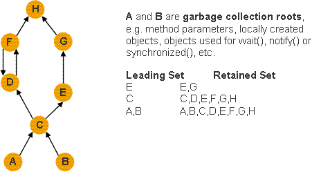

-   The [dominator tree](https://help.eclipse.org/2019-03/topic/org.eclipse.mat.ui.help/concepts/dominatortree.html?cp=62_2_2) is a transformation of the graph which creates a spanning tree, removes cycles, and models the keep-alive dependencies.\
    \
    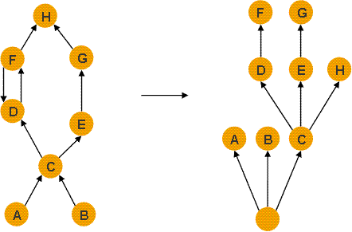

Do not confuse system dumps which are usually named **core\*.dmp** with thread dumps/java dumps which are usually named **javacore\*.txt**. Also note that a system dump sounds like it is a dump of the entire system but actually it is just a dump of a single process (a dump of an entire system is usually called a kernel dump).

## Heap Dump Lab

> Note: You may skip the data collection steps and use example data packaged at /opt/dockerdebug/fedorawasdebug/supplemental/exampledata/liberty/verbosegc\_and\_oom/

1.  Complete the *Garbage Collection Lab* above which will have caused an OutOfMemoryError and produced a heapdump.

2.  Open **/opt/programs/** in the file browser and double click on **MAT**.

1.  Click **File** \> **Open Heap Dump\...**\
    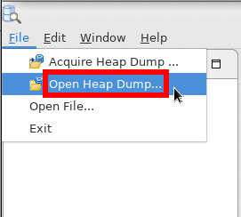

2.  Select the **core.\*.dmp** file produced in the previous garbage collection lab (if learning Liberty: **/opt/ibm/wlp/output/defaultServer/core\*dmp** ; if learning WAS traditional: **/opt/IBM/WebSphere/AppServer/profiles/AppSrv01/core\*dmp**):\
    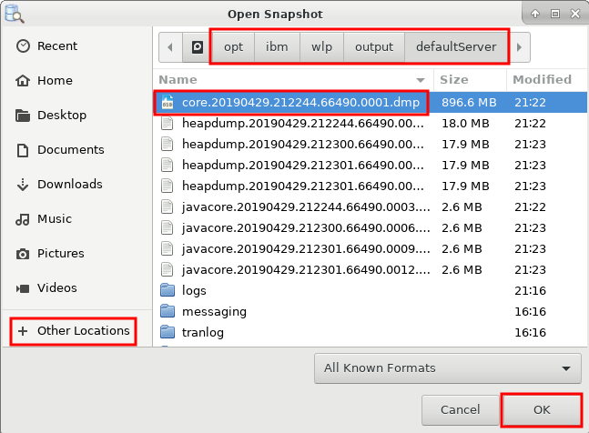

3.  Click on the progress icon in the bottom right corner to get a detailed view of the progress:\
    \
    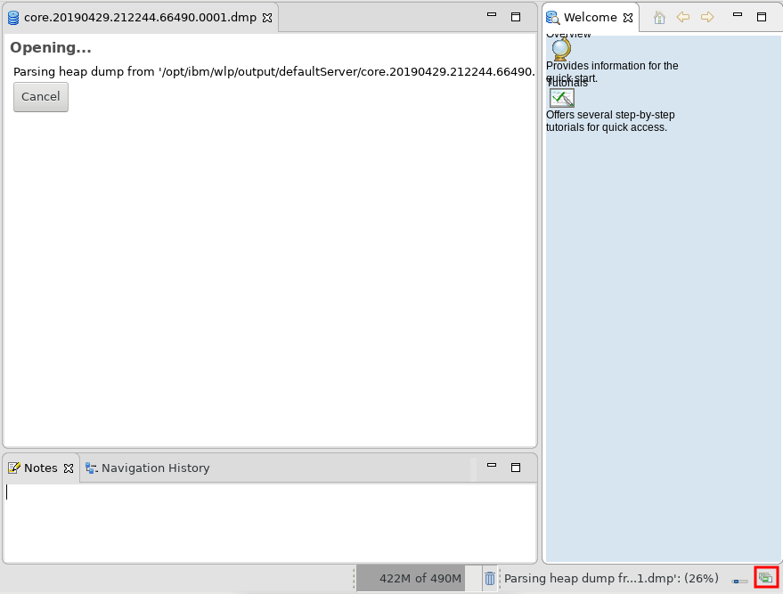

4.  Now the **Progress** view is opened:\
    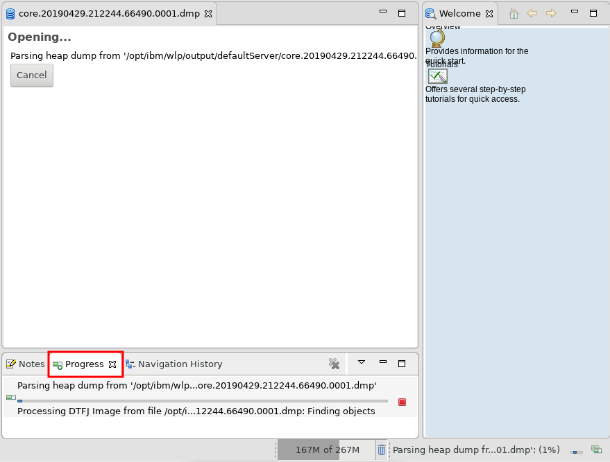

5.  After the dump finishes loading, a pop-up will appear with suggested actions such as running the leak suspect report. Just click **Cancel**:\
    \
    

6.  The first thing to check is to see whether there were any errors processing the dump. Click **Window** \> **Error Log**:\
    \
    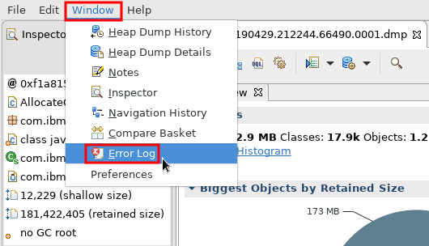

7.  Review the list and check for any warnings or errors:\
    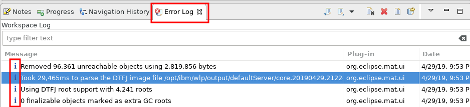

    1.  It is possible to have a few warnings without too many problems. If you believe the warnings are limiting your analysis, consider opening an IBM Support case to investigate the issue with the IBM Java support team.

8.  The overview tab shows the total live Java heap usage and the number of live classes, classloaders, and objects:\
    \
    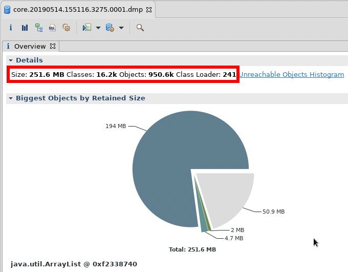

    1.  By default, MAT performs a full "garbage collection" when it loads the dump so everything you see is only pertaining to live Java objects. You can click on the **Unreachable Objects Histogram** link to see a histogram of any objects that are trash.

9.  The pie chart on the **Overview** tab shows the largest dominator objects so it's a subset of the **Dominator Tree** button:\
    \
    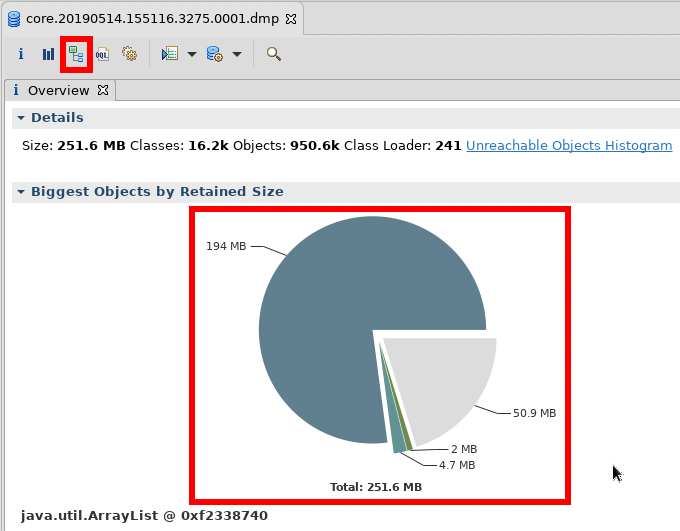

10. You may left click on a pie slice and select **List objects** \> **with outgoing references** to review the object graph of the large dominator:\
    \
    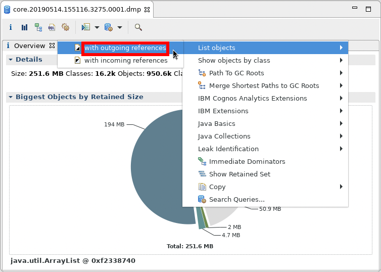

11. Expand the outgoing references tree and walk down the path with the largest **Retained Heap** values; in this example, there is an ArrayList that retains 194MB. Continue walking down the tree and you will find an Object array with hundreds of elements, each of about 1MB, which matches what we executed to create the OutOfMemoryError:\
    \
    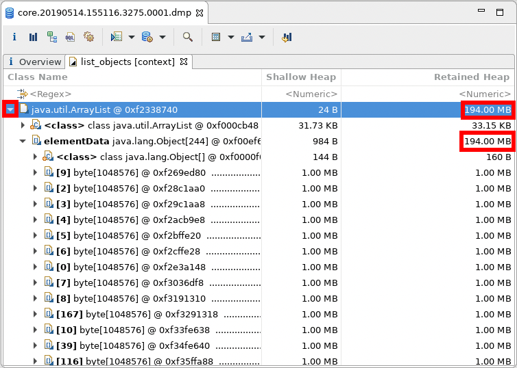

12. In this case, we want to find out what references this ArrayList, so right click on it and select **List objects** \> **with incoming references**:\
    \
    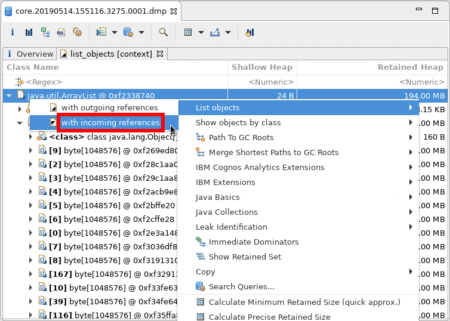

13. This results in the following view:\
    \
    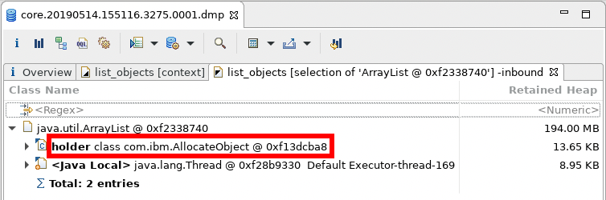

    1.  In this example, there are two references to the ArrayList. The first is that the class com.ibm.AllocateObject has a static field called holder which references the ArrayList. We know it is static because of the word **class** in front of the class name. The second is the thread **Default Executor-thread-169**.

14. From the above analysis, we know there is what appears to be a leak into a static ArrayList and there is a thread that has a reference to it, so naturally we want to see what that thread is doing. Open the **Thread Overview** query:\
    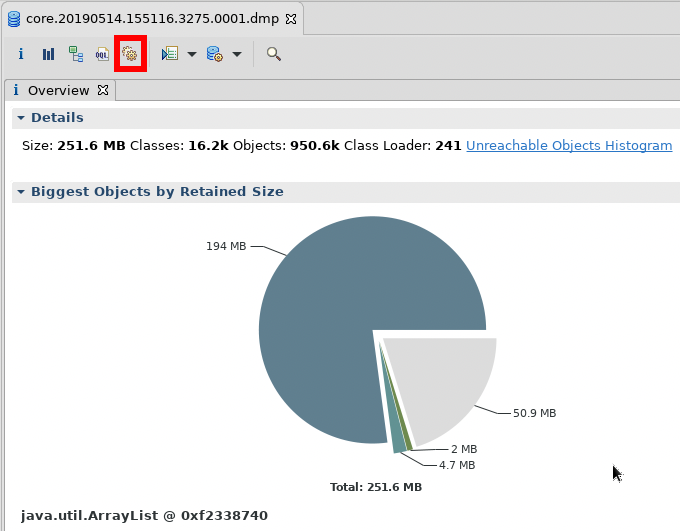

15. This will list every thread, the thread name, the retained heap of the thread, other thread details, and the stack frame along with stack frame locals:\
    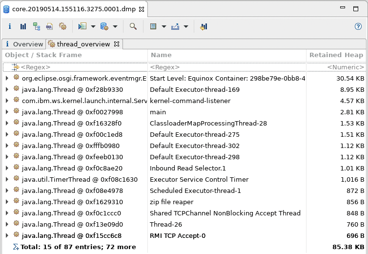

16. We know from above that the thread that references the ArrayList is named **Default Executor-thread-169**. In your case, the thread may be named differently. You may enter this thread name into the **Name** column's **\<Regex\>** input:\
    \
    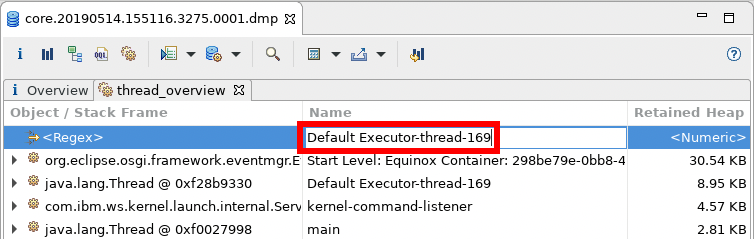

17. Press Enter to filter the results, expand the thread stack and find the servlet that caused the leak:\
    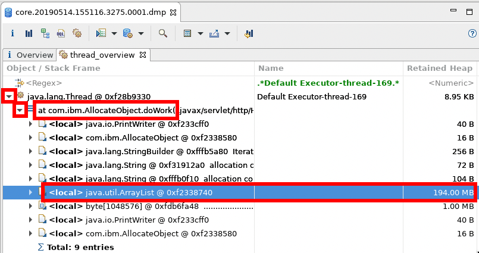

    1.  Note that you can see the actual objects on each stack frame. In this case, we can clearly see the servlet has a reference to the AllocateObject class and the ArrayList which is retaining most of the heap. This stack usually makes it much easier for the application developer to understand what happened. Right click on the thread and select **Thread Details** to get a full thread stack that may be copy-and-pasted:\
        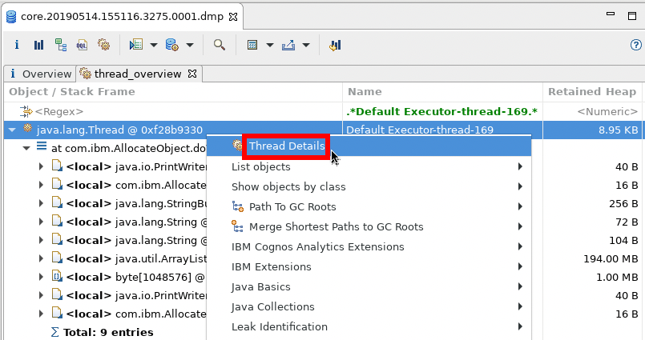

    2.  Scroll down to see the full stack:\
        \
        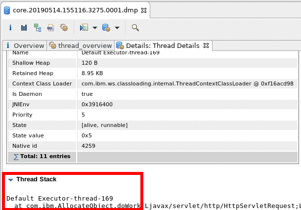

18. Another common view to explore is the **Histogram**:\
    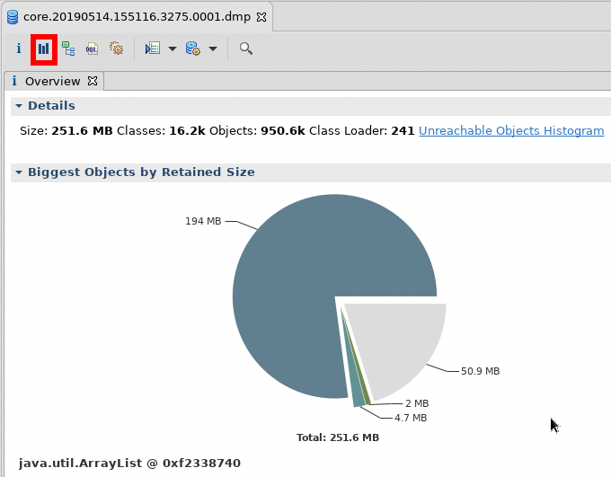

19. Click on the calculator button and select **Calculate Minimum Retained Size (quick approx.)** to populate the **Retained Heap** column for each class:\
    \
    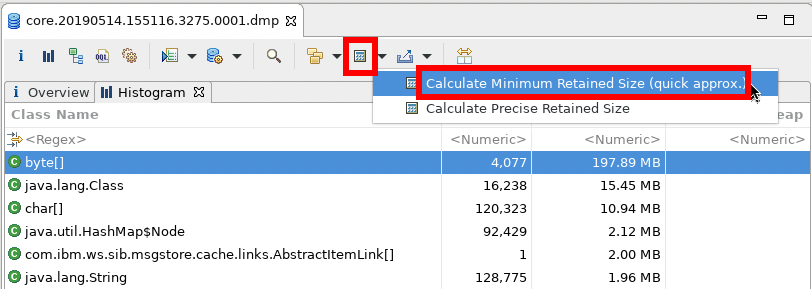

20. This fills in the retained heap column which then you can click to sort descending:\
    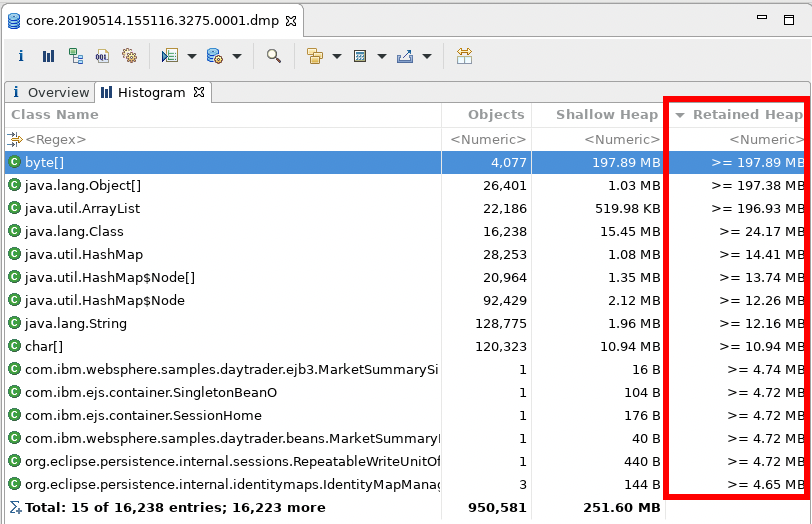

21. You may click on a row with a large retained heap size, right click and select outgoing references. For example:\
    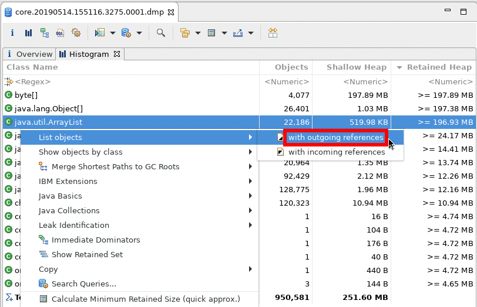

22. Then sort by **Retained Heap** and again you will find the large object:\
    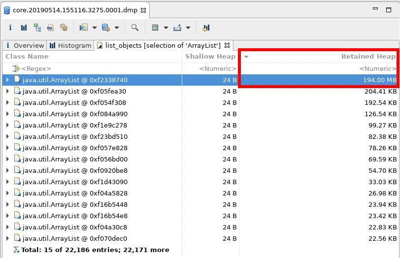

23. The next common view to explore is the **Leak Suspects** view. On the **Overview** tab, scroll down and click on **Leak Suspects**:\
    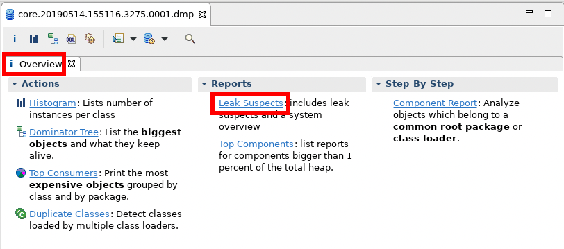

24. The report will list leak suspects in the order of their size. The following example shows the same leaking **Object\[\]** inside the **ArrayList**:\
     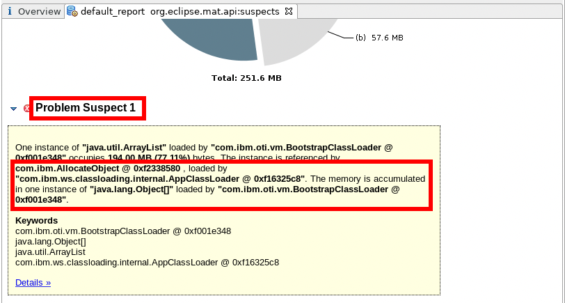

The [IBM Extensions for Memory Analyzer (IEMA)](https://publib.boulder.ibm.com/httpserv/cookbook/Major_Tools-IBM_Memory_Analyzer_Tool.html#Major_Tools-IBM_Memory_Analyzer_Tool_MAT-Installation) provide additional extensions on top of MAT with WAS, Java, and other related queries.

1.  As one example, you can see a list of all HTTP sessions and their attributes with: **Open Query Browser \> IBM Extensions \> WebSphere Application Server \> HTTP Sessions \> HTTP Sessions List**:\
    \
    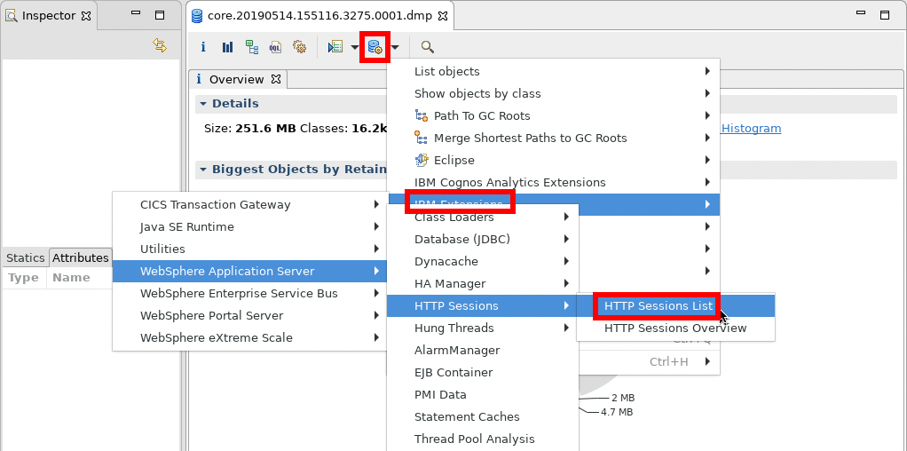

2.  Each HTTP session is listed, as well as how much Java heap it retains, which application it\'s associated with, and other details, including all of the attribute names and values:\
    \
    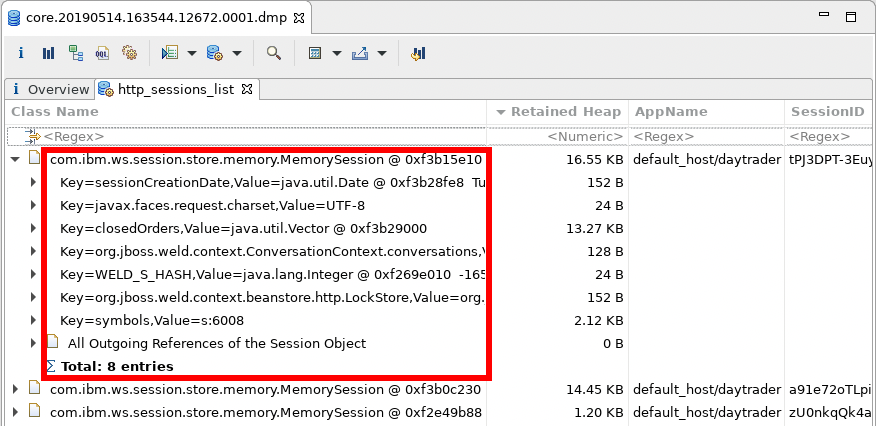

3.  You may explore the other extensions under IBM Extensions. Some only apply to WAS traditional, some only to Liberty, and some to both. Unlike MAT, IEMA is not officially supported but we try to fix and enhance it as time permits.

# Health Center

[IBM Monitoring and Diagnostics for Java - Health Center](https://publib.boulder.ibm.com/httpserv/cookbook/Major_Tools-IBM_Java_Health_Center.html) is free and shipped with IBM Java. Among other things, Health Center includes a statistical CPU profiler that samples Java stacks that are using CPU at a very high rate to determine what Java methods are using CPU. Health Center generally has an overhead of less than 1% and is suitable for production use. In recent versions, it may also be enabled dynamically without restarting the JVM.

This lab will demonstrate how to enable Java Health Center, exercise the sample DayTrader application using Apache JMeter, and review the Health Center file in the IBM Java Health Center Client Tool.

##  Health Center Theory

The Health Center agent gathers sampled CPU profiling data, along with other information:

-   Classes: Information about classes being loaded

-   Environment: Details of the configuration and system of the monitored application

-   Garbage collection: Information about the Java heap and pause times

-   I/O: Information about I/O activities that take place.

-   Locking: Information about contention on inflated locks

-   Memory: Information about the native memory usage

-   Profiling: Provides a sampling profile of Java methods including call paths

The Health Center agent can be enabled in two ways:

1.  At startup by adding **-Xhealthcenter:level=headless** to the JVM arguments

2.  At runtime, by running **\${IBM\_JAVA}/bin/java -jar \${IBM\_JAVA}/jre/lib/ext/healthcenter.jar ID=\${PID} level=headless**

Note: For both items, you may add the following arguments to limit and roll the total file usage of Health Center data:

<pre>
<b>-Dcom.ibm.java.diagnostics.healthcenter.headless.files.max.size=BYTES</b>
<b>-Dcom.ibm.java.diagnostics.healthcenter.headless.files.to.keep=N</b> (N=0 for unlimited)
</pre>

The key to produce the final Health Center HCD file is that the JVM should be gracefully stopped (there are alternatives to this by packaging the temporary files but this isn't generally recommended).

Consider always enabling [HealthCenter in headless mode](https://publib.boulder.ibm.com/httpserv/cookbook/Major_Tools-IBM_Java_Health_Center.html#Major_Tools-IBM_Java_Health_Center-Gathering_Data) for post-mortem debugging of issues.

##  Health Center Lab

> Note: You may skip the data collection steps and use example data packaged at /opt/dockerdebug/fedorawasdebug/supplemental/exampledata/liberty/healthcenter/

1.  [Stop JMeter](#stop-jmeter) if it is started.

2.  Add Health Center arguments to the JVM:

    1.  If learning Liberty, add the following line to **/opt/ibm/wlp/usr/servers/defaultServer/jvm.options**:

        `-Xhealthcenter:level=headless`

    2.  If learning WAS traditional, go to the same place where you entered the maximum heap size and add a space and **-Xhealthcenter:level=headless** to **Generic JVM arguments**:\
        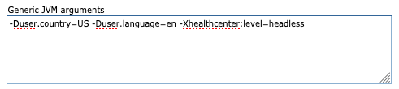

        1.  Then click OK and Save.

3.  Stop the server:

    1.  If learning Liberty:

        `/opt/ibm/wlp/bin/server stop defaultServer`

    2.  If learning WAS traditional:

        `/opt/IBM/WebSphere/AppServer/profiles/AppSrv01/bin/stopServer.sh server1 -username wsadmin -password websphere`

4.  Start the server

    1.  If learning Liberty:

        `/opt/ibm/wlp/bin/server start defaultServer`

    2.  If learning WAS traditional:

        `/opt/IBM/WebSphere/AppServer/profiles/AppSrv01/bin/startServer.sh server1`

5.  [Start JMeter](#start-jmeter) and run it for 5 minutes.

6.  [Stop JMeter](#stop-jmeter)

7.  Stop WAS as in step 2 above.

8.  Open **/opt/programs/** in the file browser and double click on **Health Center**.

9.  Click **File \> Load Data\...** (note that it\'s towards the bottom of the **File** menu; **Open File** does not work):\
    \
    

10. Select the **healthcenter\*.hcd** file from (Liberty: **/opt/ibm/wlp/output/defaultServer** ; WAS traditional: **/opt/IBM/WebSphere/AppServer/profiles/AppSrv01/**):\
    

11. Wait for the data to complete loading:\
    \
    

12. Click on CPU:\
    

13. Review the overall system and Java application CPU usage:\
    

14. Right click anywhere in the graph and change the **X-axis** to **date** (which changes all other views to **date** as well):\
    

    1.  For large Health Center captures, this may take significant time to change and there is no obvious indication when it's complete. The best way to know is when the CPU usage of Health Center drops to a low amount.

15. Click **Data \> Crop data\...**\
    \
    

16. Change the **Start time** and **End time** to match the period of interest. For example, usually you want to exclude the start-up time of the process and only focus on user activity:\
    

17. Click **Window \> Preferences**:\
    

18. Check the **Show package names** box under **Health Center \> Profiling** and press **OK** so that we can see more details in the profiling view:\
    

19. Click on **Method profiling** to review the CPU sampling data:\
    

20. The **Method profiling** view will show CPU samples by method:\
    

21. The **Self (%)** column reports the percent of samples where a method was at the top of the stack. The **Tree (%)** column reports the percent of samples where a method was somewhere else in the stack. Make sure to check that the **Samples** column is at least in the hundreds or thousands; otherwise, the CPU usage is likely not that high or a problem did not occur. The **Self** and **Tree** percentages are a percent of samples, not of total CPU.

22. Any methods over \~1% are worthy of considering how to optimize or to avoid. For example, \~2% of samples were in method 0x2273c68 (for various reasons, some methods may not resolve but you can usually figure things out from the invocation paths). Selecting that row and switching to the **Invocation Paths** view shows the percent of samples leading to those calls:\
    

    1.  In the above example, 63.11% of samples (i.e. of 2.9% of total samples) were invoked by org.apache.derby.impl.sql.conn.GenericLanguageConnectionContext.doCommit.

23. If you sort by **Tree %**, skip the framework methods from Java and WAS, and find the first application method. In this example, about 32% of total samples was consumed by com.ibm.websphere.samples.daytrader.web.TradeAppServlet.performTask and all of the methods it called. The **Called Methods** view may be further reviewed to investigate the details of this usage; in this example, doPortfolio drove most of the CPU samples.\
    \
    

# Crashes

Crashes are operating system events that destroy the Java process. By default, IBM Java and OpenJ9 capture most crash signals from the operating system and produce helpful diagnostics before the process terminates.

##  Crashes Theory

Unlike Java exceptions like OutOfMemoryErrors, crashes are events that, in general, cannot be recovered. Crashes occur at a native code level either inside the JVM itself, inside JNI libraries, or inside operating system libraries.

##  Crash Lab

> Note: You may skip the data collection steps and use example data packaged at /opt/dockerdebug/fedorawasdebug/supplemental/exampledata/liberty/crash/

1.  Open a browser to <http://localhost:9082/jni_web_hello_world/jniwrapper?str=test>

2.  This will cause a crash of the Liberty \"test\" server process.

3.  The first place to look for a potential crash is in the stderr of the process. For this Liberty server, the stdout and stderr are written to **/opt/ibm/wlp/usr/servers/test/logs/console.log**. Open this file in **Mousepad** or the terminal and find the output starting with **Unhandled exception**. For example:

        Unhandled exception
        Type=Segmentation error vmState=0x00040000
        J9Generic_Signal_Number=00000004 Signal_Number=0000000b Error_Value=00000000 Signal_Code=00000001
        Handler1=00007F1731B16B00 Handler2=00007F17313FCFB0 InaccessibleAddress=0000000000000000
        RDI=00007F16A8079848 RSI=00007F172762B023 RAX=0000000000000000 RBX=0000000000000018
        RCX=00000000FFD9FFF0 RDX=0000000000000000 R8=0000000000000000 R9=00007F1715552700
        R10=00007F173344D170 R11=00007F1733171E40 R12=0000000000000000 R13=00007F1731BE39CC
        R14=00007F171554F810 R15=0000000000000000
        RIP=00007F172762A1CD GS=0000 FS=0000 RSP=00007F171554F510
        EFlags=0000000000010246 CS=0033 RBP=00007F171554F540 ERR=0000000000000004
        TRAPNO=000000000000000E OLDMASK=0000000000000000 CR2=0000000000000000
        xmm0 ffffffff00000000 (f: 0.000000, d: -nan)
        xmm1 7257650074736574 (f: 1953719680.000000, d: 6.239805e+242)
        xmm2 ff00000000ff0000 (f: 16711680.000000, d: -5.486124e+303)
        xmm3 0000000000000000 (f: 0.000000, d: 0.000000e+00)
        xmm4 00000000000000ff (f: 255.000000, d: 1.259867e-321)
        xmm5 bcca000000000000 (f: 0.000000, d: -7.216450e-16)
        xmm6 bc1c000000000000 (f: 0.000000, d: -3.794708e-19)
        xmm7 0000000000000000 (f: 0.000000, d: 0.000000e+00)
        xmm8 0074736574000a64 (f: 1946159744.000000, d: 1.820179e-306)
        xmm9 0000000000000000 (f: 0.000000, d: 0.000000e+00)
        xmm10 3fd4618bc21c5ec2 (f: 3256639232.000000, d: 3.184537e-01)
        xmm11 4120a4d2906fa32a (f: 2423235328.000000, d: 5.453853e+05)
        xmm12 000000003e23f24e (f: 1042543168.000000, d: 5.150848e-315)
        xmm13 00000000467332ce (f: 1181954816.000000, d: 5.839632e-315)
        xmm14 0000000000000000 (f: 0.000000, d: 0.000000e+00)
        xmm15 3fc8a1142284508a (f: 579096704.000000, d: 1.924157e-01)
        Module=/opt/jni_web_hello_world/target/libNativeWrapper.so
        Module_base_address=00007F1727629000 Symbol=Java_com_example_NativeWrapper_testNativeMethod
        Symbol_address=00007F172762A139
        Target=2_90_20190306_411656 (Linux 4.9.125-linuxkit)
        CPU=amd64 (4 logical CPUs) (0x2ed95f000 RAM)
        ----------- Stack Backtrace -----------
        Java_com_example_NativeWrapper_testNativeMethod+0x94 (0x00007F172762A1CD [libNativeWrapper.so+0x11cd])
        (0x00007F1731BB62C4 [libj9vm29.so+0x13e2c4])
        (0x00007F1731BB3A51 [libj9vm29.so+0x13ba51])
        (0x00007F1731AA439E [libj9vm29.so+0x2c39e])
        (0x00007F1731A91090 [libj9vm29.so+0x19090])
        (0x00007F1731B50DA2 [libj9vm29.so+0xd8da2])
        ---------------------------------------
        JVMDUMP039I Processing dump event "gpf", detail "" at 2019/05/15 16:25:37 - please wait.
        JVMDUMP032I JVM requested System dump using '/opt/ibm/wlp/usr/servers/test/core.20190515.162537.202.0001.dmp' in response to an event
        JVMDUMP010I System dump written to /opt/ibm/wlp/usr/servers/test/core.20190515.162537.202.0001.dmp
        JVMDUMP032I JVM requested Java dump using '/opt/ibm/wlp/usr/servers/test/javacore.20190515.162537.202.0002.txt' in response to an event
        JVMDUMP010I Java dump written to /opt/ibm/wlp/usr/servers/test/javacore.20190515.162537.202.0002.txt
        JVMDUMP032I JVM requested Snap dump using '/opt/ibm/wlp/usr/servers/test/Snap.20190515.162537.202.0003.trc' in response to an event
        JVMDUMP010I Snap dump written to /opt/ibm/wlp/usr/servers/test/Snap.20190515.162537.202.0003.trc
        JVMDUMP007I JVM Requesting JIT dump using '/opt/ibm/wlp/usr/servers/test/jitdump.20190515.162537.202.0004.dmp'
        JVMDUMP010I JIT dump written to /opt/ibm/wlp/usr/servers/test/jitdump.20190515.162537.202.0004.dmp
        JVMDUMP013I Processed dump event "gpf", detail "".

4.  There are a few things to point out in the above output:

    1.  **Type=Segmentation error**: This shows the human readable cause of the crash.

    1.  **Signal\_Number=0000000b**: This shows the crash signal (which is what the human readable cause comes from). From the Linux terminal, run the "kill -l" command to list all signals and convert **Signal\_Number** from hexadecimal to decimal; in this example, 0xb = 11 = SIGSEGV:

            $ kill -l
            1) SIGHUP	   2) SIGINT	         3) SIGQUIT	         4) SIGILL	        5) SIGTRAP
            6) SIGABRT	   7) SIGBUS	         8) SIGFPE	         9) SIGKILL	       10) SIGUSR1
            11) SIGSEGV	  12) SIGUSR2	        13) SIGPIPE	        14) SIGALRM	       15) SIGTERM
            16) SIGSTKFLT	  17) SIGCHLD	        18) SIGCONT	        19) SIGSTOP	       20) SIGTSTP
            21) SIGTTIN	  22) SIGTTOU	        23) SIGURG	        24) SIGXCPU	       25) SIGXFSZ
            26) SIGVTALRM	  27) SIGPROF	        28) SIGWINCH	        29) SIGIO	       30) SIGPWR
            31) SIGSYS	  34) SIGRTMIN	        35) SIGRTMIN+1	        36) SIGRTMIN+2	       37) SIGRTMIN+3
            38) SIGRTMIN+4	  39) SIGRTMIN+5	40) SIGRTMIN+6	        41) SIGRTMIN+7         42) SIGRTMIN+8
            43) SIGRTMIN+9	  44) SIGRTMIN+10	45) SIGRTMIN+11	        46) SIGRTMIN+12	       47) SIGRTMIN+13
            48) SIGRTMIN+14   49) SIGRTMIN+15	50) SIGRTMAX-14	        51) SIGRTMAX-13	       52) SIGRTMAX-12
            53) SIGRTMAX-11   54) SIGRTMAX-10	55) SIGRTMAX-9	        56) SIGRTMAX-8	       57) SIGRTMAX-7
            58) SIGRTMAX-6	  59) SIGRTMAX-5	60) SIGRTMAX-4	        61) SIGRTMAX-3	       62) SIGRTMAX-2
            63) SIGRTMAX-1	  64) SIGRTMAX	

    1.  **Module=/opt/jni\_web\_hello\_world/target/libNativeWrapper.so**: This tells you the failing shared library. This quickly shows the main suspect. In this case, we can see the crash is in a [third party native library](https://github.com/kgibm/jni_web_hello_world) and not the JVM.

    1.  **Symbol=Java\_com\_example\_NativeWrapper\_testNativeMethod**: If the crash occurred in JNI code, this shows the native JNI method the crash occurred in. This can be helpful for the developer of the module or for quick internet searches.

    1.  **JVMDUMP039I Processing dump event \"gpf\", detail \"\" at 2019/05/15 16:25:37 - please wait.**: This message shows that the JVM captured the crash (gpf = general protection fault; in other words, segmentation fault) and created various diagnostics.

5.  The first thing to do is to open the javacore\*txt file that the crash produced:

    1.  **1TISIGINFO Dump Event \"gpf\" (00002000) received**: This shows that a crash was handled.

    1.  **1XHEXCPCODE Signal\_Number: 0000000B**: This shows the hexadecimal signal number.

    1.  **1XHEXCPMODULE Module: /opt/jni\_web\_hello\_world/target/libNativeWrapper.so**: This shows the crashing module.

    1.  **1XHEXCPMODULE Symbol: Java\_com\_example\_NativeWrapper\_testNativeMethod**: This shows the crashing JNI method.

    1.  Search the file for **Current thread** to find the crashing thread stack:

            1XMCURTHDINFO  Current thread
            3XMTHREADINFO      "Default Executor-thread-56" J9VMThread:0x0000000001B07B00, omrthread_t:0x00007F169C00C5E8, java/lang/Thread:0x00000000FF7804E0, state:R, prio=5
            3XMJAVALTHREAD            (java/lang/Thread getId:0x6C, isDaemon:true)
            3XMTHREADINFO1            (native thread ID:0x54D, native priority:0x5, native policy:UNKNOWN, vmstate:R, vm thread flags:0x00000020)
            3XMTHREADINFO2            (native stack address range from:0x00007F1715513000, to:0x00007F1715553000, size:0x40000)
            3XMCPUTIME               CPU usage total: 0.268345952 secs, current category="Application"
            3XMHEAPALLOC             Heap bytes allocated since last GC cycle=6634184 (0x653AC8)
            3XMTHREADINFO3           Java callstack:
            4XESTACKTRACE                at com/example/NativeWrapper.testNativeMethod(Native Method)
            4XESTACKTRACE                at com/example/JNIWrapper.service(JNIWrapper.java:33)
            4XESTACKTRACE                at javax/servlet/http/HttpServlet.service(HttpServlet.java:791)
            4XESTACKTRACE                at com/ibm/ws/webcontainer/servlet/ServletWrapper.service(ServletWrapper.java:1255)
            4XESTACKTRACE                at com/ibm/ws/webcontainer/servlet/ServletWrapper.handleRequest(ServletWrapper.java:743)
            4XESTACKTRACE                at com/ibm/ws/webcontainer/servlet/ServletWrapper.handleRequest(ServletWrapper.java:440)
            4XESTACKTRACE                at com/ibm/ws/webcontainer/filter/WebAppFilterChain.invokeTarget(WebAppFilterChain.java:182)
            4XESTACKTRACE                at com/ibm/ws/webcontainer/filter/WebAppFilterChain.doFilter(WebAppFilterChain.java:93)
            4XESTACKTRACE                at com/ibm/ws/security/jaspi/JaspiServletFilter.doFilter(JaspiServletFilter.java:56)
            4XESTACKTRACE                at com/ibm/ws/webcontainer/filter/FilterInstanceWrapper.doFilter(FilterInstanceWrapper.java:201)
            4XESTACKTRACE                at com/ibm/ws/webcontainer/filter/WebAppFilterChain.doFilter(WebAppFilterChain.java:90)
            4XESTACKTRACE                at com/ibm/ws/webcontainer/filter/WebAppFilterManager.doFilter(WebAppFilterManager.java:996)
            4XESTACKTRACE                at com/ibm/ws/webcontainer/filter/WebAppFilterManager.invokeFilters(WebAppFilterManager.java:1134)
            4XESTACKTRACE                at com/ibm/ws/webcontainer/webapp/WebApp.handleRequest(WebApp.java:4968)
            4XESTACKTRACE                at com/ibm/ws/webcontainer/osgi/DynamicVirtualHost$2.handleRequest(DynamicVirtualHost.java:314)
            4XESTACKTRACE                at com/ibm/ws/webcontainer/WebContainer.handleRequest(WebContainer.java:992)
            4XESTACKTRACE                at com/ibm/ws/webcontainer/osgi/DynamicVirtualHost$2.run(DynamicVirtualHost.java:279)
            4XESTACKTRACE                at com/ibm/ws/http/dispatcher/internal/channel/HttpDispatcherLink$TaskWrapper.run(HttpDispatcherLink.java:1061)
            4XESTACKTRACE                at com/ibm/ws/http/dispatcher/internal/channel/HttpDispatcherLink.wrapHandlerAndExecute(HttpDispatcherLink.java:417)
            4XESTACKTRACE                at com/ibm/ws/http/dispatcher/internal/channel/HttpDispatcherLink.ready(HttpDispatcherLink.java:376)
            4XESTACKTRACE                at com/ibm/ws/http/channel/internal/inbound/HttpInboundLink.handleDiscrimination(HttpInboundLink.java:532)
            4XESTACKTRACE                at com/ibm/ws/http/channel/internal/inbound/HttpInboundLink.handleNewRequest(HttpInboundLink.java:466)
            4XESTACKTRACE                at com/ibm/ws/http/channel/internal/inbound/HttpInboundLink.processRequest(HttpInboundLink.java:331)
            4XESTACKTRACE                at com/ibm/ws/http/channel/internal/inbound/HttpInboundLink.ready(HttpInboundLink.java:302)
            4XESTACKTRACE                at com/ibm/ws/tcpchannel/internal/NewConnectionInitialReadCallback.sendToDiscriminators(NewConnectionInitialReadCallback.java:165)
            4XESTACKTRACE                at com/ibm/ws/tcpchannel/internal/NewConnectionInitialReadCallback.complete(NewConnectionInitialReadCallback.java:74)
            4XESTACKTRACE                at com/ibm/ws/tcpchannel/internal/WorkQueueManager.requestComplete(WorkQueueManager.java:503)
            4XESTACKTRACE                at com/ibm/ws/tcpchannel/internal/WorkQueueManager.attemptIO(WorkQueueManager.java:573)
            4XESTACKTRACE                at com/ibm/ws/tcpchannel/internal/WorkQueueManager.workerRun(WorkQueueManager.java:954)
            4XESTACKTRACE                at com/ibm/ws/tcpchannel/internal/WorkQueueManager$Worker.run(WorkQueueManager.java:1043)
            4XESTACKTRACE                at com/ibm/ws/threading/internal/ExecutorServiceImpl$RunnableWrapper.run(ExecutorServiceImpl.java:239)
            4XESTACKTRACE                at java/util/concurrent/ThreadPoolExecutor.runWorker(ThreadPoolExecutor.java:1160(Compiled Code))
            4XESTACKTRACE                at java/util/concurrent/ThreadPoolExecutor$Worker.run(ThreadPoolExecutor.java:635)
            4XESTACKTRACE                at java/lang/Thread.run(Thread.java:812)
            3XMTHREADINFO3           Native callstack:
            4XENATIVESTACK               (0x00007F173142A702 [libj9prt29.so+0x4e702])
            4XENATIVESTACK               (0x00007F17313FDEC8 [libj9prt29.so+0x21ec8])
            4XENATIVESTACK               (0x00007F173142A77E [libj9prt29.so+0x4e77e])
            4XENATIVESTACK               (0x00007F173142A874 [libj9prt29.so+0x4e874])
            4XENATIVESTACK               (0x00007F17313FDEC8 [libj9prt29.so+0x21ec8])
            4XENATIVESTACK               (0x00007F173142A5DB [libj9prt29.so+0x4e5db])
            4XENATIVESTACK               (0x00007F1731426C62 [libj9prt29.so+0x4ac62])
            4XENATIVESTACK               (0x00007F1731427A04 [libj9prt29.so+0x4ba04])
            4XENATIVESTACK               (0x00007F17313FDEC8 [libj9prt29.so+0x21ec8])
            4XENATIVESTACK               (0x00007F1730CBE406 [libj9dmp29.so+0x1a406])
            4XENATIVESTACK               (0x00007F1730CBE59D [libj9dmp29.so+0x1a59d])
            4XENATIVESTACK               (0x00007F17313FDEC8 [libj9prt29.so+0x21ec8])
            4XENATIVESTACK               (0x00007F1730CBACED [libj9dmp29.so+0x16ced])
            4XENATIVESTACK               (0x00007F1730CB627D [libj9dmp29.so+0x1227d])
            4XENATIVESTACK               (0x00007F17313FDEC8 [libj9prt29.so+0x21ec8])
            4XENATIVESTACK               (0x00007F1730CB75E0 [libj9dmp29.so+0x135e0])
            4XENATIVESTACK               (0x00007F1730CC093C [libj9dmp29.so+0x1c93c])
            4XENATIVESTACK               (0x00007F1730CA8D4D [libj9dmp29.so+0x4d4d])
            4XENATIVESTACK               (0x00007F1730CA8365 [libj9dmp29.so+0x4365])
            4XENATIVESTACK               (0x00007F17313FDEC8 [libj9prt29.so+0x21ec8])
            4XENATIVESTACK               (0x00007F1730CAB96B [libj9dmp29.so+0x796b])
            4XENATIVESTACK               (0x00007F1730CABAEC [libj9dmp29.so+0x7aec])
            4XENATIVESTACK               (0x00007F1730CC255B [libj9dmp29.so+0x1e55b])
            4XENATIVESTACK               (0x00007F1731B166F2 [libj9vm29.so+0x9e6f2])
            4XENATIVESTACK               (0x00007F17313FDEC8 [libj9prt29.so+0x21ec8])
            4XENATIVESTACK               (0x00007F1731B168E6 [libj9vm29.so+0x9e8e6])
            4XENATIVESTACK               (0x00007F17313FD14F [libj9prt29.so+0x2114f])
            4XENATIVESTACK               (0x00007F173340B070 [libpthread.so.0+0x13070])
            4XENATIVESTACK               Java_com_example_NativeWrapper_testNativeMethod+0x94 (0x00007F172762A1CD [libNativeWrapper.so+0x11cd])
            4XENATIVESTACK               (0x00007F1731BB62C4 [libj9vm29.so+0x13e2c4])
            4XENATIVESTACK               (0x00007F1731BB3A51 [libj9vm29.so+0x13ba51])
            4XENATIVESTACK               (0x00007F1731AA439E [libj9vm29.so+0x2c39e])
            4XENATIVESTACK               (0x00007F1731A91090 [libj9vm29.so+0x19090])

    1.  This shows both the Java stack and the native stack which is very useful to understand what's driving the crash.

6.  Next, we'll want to look at the system dump in the Java dump viewer.

    1.  Execute **jdmpview**, passing the system dump from the messages above. For example:

            $ jdmpview -core /opt/ibm/wlp/usr/servers/test/core.20190515.162537.202.0001.dmp
            DTFJView version 4.29.5, using DTFJ version 1.12.29003
            Loading image from DTFJ...

            For a list of commands, type "help"; for how to use "help", type "help help"
            Available contexts (* = currently selected context) : 

            Source : file:///opt/ibm/wlp/usr/servers/test/core.20190515.162537.202.0001.dmp
              *0 : PID: 1576 : JRE 1.8.0 Linux amd64-64 (build 8.0.5.31 - pxa6480sr5fp31-20190311_03(SR5 FP31))

    1.  Next, if you know it's a crash, run the **!gpinfo** command to get similar information to what we saw in **stderr**:

            > !gpinfo
            Failing Thread: !j9vmthread 0x1b07b00
            Failing Thread ID: 0x54d (1357)
            gpInfo:
            J9Generic_Signal_Number=00000004 Signal_Number=0000000b Error_Value=00000000 Signal_Code=00000001
            Handler1=00007F1731B16B00 Handler2=00007F17313FCFB0 InaccessibleAddress=0000000000000000
            RDI=00007F16A8079848 RSI=00007F172762B023 RAX=0000000000000000 RBX=0000000000000018
            RCX=00000000FFD9FFF0 RDX=0000000000000000 R8=0000000000000000 R9=00007F1715552700
            R10=00007F173344D170 R11=00007F1733171E40 R12=0000000000000000 R13=00007F1731BE39CC
            R14=00007F171554F810 R15=0000000000000000
            RIP=00007F172762A1CD GS=0000 FS=0000 RSP=00007F171554F510
            EFlags=0000000000010246 CS=0033 RBP=00007F171554F540 ERR=0000000000000004
            TRAPNO=000000000000000E OLDMASK=0000000000000000 CR2=0000000000000000
            xmm0 ffffffff00000000 (f: 0.000000, d: -nan)
            xmm1 7257650074736574 (f: 1953719680.000000, d: 6.239805e+242)
            xmm2 ff00000000ff0000 (f: 16711680.000000, d: -5.486124e+303)
            xmm3 0000000000000000 (f: 0.000000, d: 0.000000e+00)
            xmm4 00000000000000ff (f: 255.000000, d: 1.259867e-321)
            xmm5 bcca000000000000 (f: 0.000000, d: -7.216450e-16)
            xmm6 bc1c000000000000 (f: 0.000000, d: -3.794708e-19)
            xmm7 0000000000000000 (f: 0.000000, d: 0.000000e+00)
            xmm8 0074736574000a64 (f: 1946159744.000000, d: 1.820179e-306)
            xmm9 0000000000000000 (f: 0.000000, d: 0.000000e+00)
            xmm10 3fd4618bc21c5ec2 (f: 3256639232.000000, d: 3.184537e-01)
            xmm11 4120a4d2906fa32a (f: 2423235328.000000, d: 5.453853e+05)
            xmm12 000000003e23f24e (f: 1042543168.000000, d: 5.150848e-315)
            xmm13 00000000467332ce (f: 1181954816.000000, d: 5.839632e-315)
            xmm14 0000000000000000 (f: 0.000000, d: 0.000000e+00)
            xmm15 3fc8a1142284508a (f: 579096704.000000, d: 1.924157e-01)
            Module=/opt/jni_web_hello_world/target/libNativeWrapper.so
            Module_base_address=00007F1727629000 Symbol=Java_com_example_NativeWrapper_testNativeMethod
            Symbol_address=00007F172762A139

    1.  Finally, run **info thread** to see the crashing thread's Java stack and related stack frame locals:

            > info thread
            process id: 202

              thread id: 1357
              registers:
              native stack sections:
              native stack frames:
              properties:
              associated Java thread: 
                name:          Default Executor-thread-56
                Thread object: java/lang/Thread @ 0xff7804e0
                Daemon:        true
                ID:            108 (0x6c)
                Priority:      5
                Thread.State:  RUNNABLE 
                JVMTI state:   ALIVE RUNNABLE 
                Java stack frames: 
                bp: 0x00000000024b5b40  method: String com/example/NativeWrapper.testNativeMethod(String)  (Native Method)
                  objects: 0xfe125fb0
                bp: 0x00000000024b5b88  method: void com/example/JNIWrapper.service(javax.servlet.http.HttpServletRequest, javax.servlet.http.HttpServletResponse)  source: JNIWrapper.java:33
                  objects: 0xfe1128e0 0xfe112cc8 [...]

7.  Next, we'll want to look at the system dump in the operating system debugger. All we usually need is the native stack trace details which are provided to the module owner to review, although sometimes they also need the full system dump.

    1.  Load the Linux debugger, passing the executable that crashed and the path to the system dump from the messages above. For example:

            $ gdb /opt/ibm/java/bin/java /opt/ibm/wlp/usr/servers/test/core.20190515.162537.202.0001.dmp
            [...]
            Program terminated with signal SIGSEGV, Segmentation fault.
            #0  __pthread_kill (threadid=<optimized out>, signo=11)
                at ../sysdeps/unix/sysv/linux/pthread_kill.c:56
            56	  return (INTERNAL_SYSCALL_ERROR_P (val, err)
            Missing separate debuginfos, use: dnf debuginfo-install libgcc-8.3.1-2.fc29.x86_64 sssd-client-2.0.0-5.fc29.x86_64

    1.  Next, type the **bt** command and prese enter, and continue to press enter until the full stack is printed:

            (gdb) bt
            #0  __pthread_kill (threadid=<optimized out>, signo=11)
                at ../sysdeps/unix/sysv/linux/pthread_kill.c:56
            #1  0x00007f173142aeed in omrdump_create ()
              from /opt/ibm/java/jre/lib/amd64/compressedrefs/libj9prt29.so
            #2  0x00007f1730cac4e2 in doSystemDump ()
              from /opt/ibm/java/jre/lib/amd64/compressedrefs/libj9dmp29.so
            #3  0x00007f1730ca8365 in protectedDumpFunction ()
              from /opt/ibm/java/jre/lib/amd64/compressedrefs/libj9dmp29.so
            #4  0x00007f17313fdec8 in omrsig_protect ()
              from /opt/ibm/java/jre/lib/amd64/compressedrefs/libj9prt29.so
            #5  0x00007f1730cab96b in runDumpFunction ()
              from /opt/ibm/java/jre/lib/amd64/compressedrefs/libj9dmp29.so
            #6  0x00007f1730cabaec in runDumpAgent ()
              from /opt/ibm/java/jre/lib/amd64/compressedrefs/libj9dmp29.so
            #7  0x00007f1730cc255b in triggerDumpAgents ()
              from /opt/ibm/java/jre/lib/amd64/compressedrefs/libj9dmp29.so
            #8  0x00007f1731b166f2 in generateDiagnosticFiles ()
              from /opt/ibm/java/jre/lib/amd64/compressedrefs/libj9vm29.so
            #9  0x00007f17313fdec8 in omrsig_protect ()
              from /opt/ibm/java/jre/lib/amd64/compressedrefs/libj9prt29.so
            #10 0x00007f1731b168e6 in vmSignalHandler ()
              from /opt/ibm/java/jre/lib/amd64/compressedrefs/libj9vm29.so
            #11 0x00007f17313fd14f in masterSynchSignalHandler ()
              from /opt/ibm/java/jre/lib/amd64/compressedrefs/libj9prt29.so
            #12 <signal handler called>
            #13 0x00007f172762a1cd in Java_com_example_NativeWrapper_testNativeMethod (env=0x1b07b00, 
                c=0x19d7230, s=0x24b5b40) at com_example_NativeWrapper.c:12
            #14 0x00007f1731bb62c4 in ffi_call_unix64 ()
              from /opt/ibm/java/jre/lib/amd64/compressedrefs/libj9vm29.so
            #15 0x00007f1731bb3a51 in ffi_call () from /opt/ibm/java/jre/lib/amd64/compressedrefs/libj9vm29.so
            #16 0x00007f1731aa439e in VM_BytecodeInterpreter::run(J9VMThread*) ()
              from /opt/ibm/java/jre/lib/amd64/compressedrefs/libj9vm29.so
            --Type <RET> for more, q to quit, c to continue without paging--c
            #17 0x00007f1731a91090 in bytecodeLoop () from /opt/ibm/java/jre/lib/amd64/compressedrefs/libj9vm29.so
            #18 0x00007f1731b50da2 in c_cInterpreter () from /opt/ibm/java/jre/lib/amd64/compressedrefs/libj9vm29.so
            #19 0x00007f1731b0055a in runJavaThread () from /opt/ibm/java/jre/lib/amd64/compressedrefs/libj9vm29.so
            #20 0x00007f1731b5072f in javaProtectedThreadProc () from /opt/ibm/java/jre/lib/amd64/compressedrefs/libj9vm29.so
            #21 0x00007f17313fdec8 in omrsig_protect () from /opt/ibm/java/jre/lib/amd64/compressedrefs/libj9prt29.so
            #22 0x00007f1731b4cb8a in javaThreadProc () from /opt/ibm/java/jre/lib/amd64/compressedrefs/libj9vm29.so
            #23 0x00007f173186b2c6 in thread_wrapper () from /opt/ibm/java/jre/lib/amd64/compressedrefs/libj9thr29.so
            #24 0x00007f173340058e in start_thread (arg=<optimized out>) at pthread_create.c:486
            #25 0x00007f1733112683 in clone () at ../sysdeps/unix/sysv/linux/x86_64/clone.S:95

    1.  The above stack should be sent to the developer of the module for them to investigate the crash.

        1.  If you're curious, you can further investigate the crash if you can guess where to look. In the above example, we know the code is crashing in our JNI library and we can see the top method of that library is in frame \#13, so switch to that frame:

                (gdb) frame 13
                #13 0x00007f172762a1cd in Java_com_example_NativeWrapper_testNativeMethod (env=0x1b07b00, 
                    c=0x19d7230, s=0x24b5b40) at com_example_NativeWrapper.c:12
                12	    printf("Printing nonsense value: %d", *p);

          1. If the module is compiled with symbols (as it [always should be on most operating systems](https://publib.boulder.ibm.com/httpserv/cookbook/Troubleshooting-Troubleshooting_Operating_Systems-Troubleshooting_Linux.html#Troubleshooting-Troubleshooting_Linux-Debug_Symbols)), then you'll see the actual code that crashed.

          1. In this example, we can further display the value of the pointer that's likely causing the crash:

                  (gdb) print p
                  $1 = (int *) 0x0

          1. This shows the code tried to dereference a NULL pointer causing the SIGSEGV.

# Native Memory Leaks

Native memory leaks and native OutOfMemoryErrors (NOOMs) are one of the more complicated problem determination topics. This lab will simulate a native memory leak and show how to diagnose it.

##  Native Memory Theory

A Java process is a native operating system process. The operating system provides each process a virtual address space depending on the processor architecture. For most 32-bit processes and CPUs, this is 0 -- 4GB, and for most 64-bit processes and CPUs, this is 0 -- 16EB (practically, 0 -- 256TB). As a program runs, process virtual memory usage is converted to physical memory addresses in RAM.

Out of this virtual address space, Java carves out a chunk for the Java heap with a maximum size specified by -Xmx. However, Java also has various other native data structures outside of the Java heap that support the Java program, the JIT compiler, etc. In addition, any third party native libraries or OS libraries may consume additional native memory. In particular, each class and classloader has a corresponding native structure in the Java process virtual address space that is outside the Java heap. Each thread is also backed by native memory.

By default, 64-bit Java uses a performance optimization called compressed references. This requires that all classloader, thread, and monitor native backing data structures are allocated in the 0-4GB virtual address space range. Therefore, if there is a leak of classes, classloaders, threads, and/or monitors, if there is no available space in this range (e.g. due to the volume of those structures or other native libraries allocating into that space \[e.g. DirectByteBuffers\]), then a native OutOfMemoryError will be thrown. It is possible to disable compressed references (often at a large performance cost); however, if the NOOM is caused by a leak, then ultimately this will not resolve the issue because at some point the address space usage will exhaust physical RAM and paging will cause a similar problem as the NOOM.

##  Native Memory Leak Lab

This lab will leak classloaders which use native memory outside the Java heap and this will cause a NOOM. This will show to diagnose and analyze the native leak.

> Note: You may skip the data collection steps and use example data packaged at /opt/dockerdebug/fedorawasdebug/supplemental/exampledata/liberty/nativememoryleak/

1.  Ensure that the Liberty **test** server is started.

        $ /opt/ibm/wlp/bin/server status test
        Server test is running [...]

2.  If the Liberty **test** server is not started, then start it:

        $ /opt/ibm/wlp/bin/server start test

3.  Open a browser to <http://localhost:9082/jni_web_hello_world/jniwrapper?str=nativemem>

    1.  This simply [consumes a large chunk of memory below 4GB](https://github.com/kgibm/jni_web_hello_world/blob/7b1de65a9669e6edaedace3f5ad886f3a922b790/src/main/c/com_example_NativeWrapper.c#L18) to simulate the issue faster.

4.  Use the **ab** program (Apache Bench; a utility that's part of the httpd package) to execute multiple calls to a servlet running in Liberty which will leak a classloader/thread each time:

        $ ab -n 1000000 -c 4 http://localhost:9082/swat/ClassloaderLeak

5.  In a separate tab, you can run the following command to watch the native memory of the process increasing:

        $ watch ps -o vsz,rss,command -p $(pgrep -f test)

6.  After about 5 minutes, the virtual address space below 4GB will become exhausted and a native OutOfMemoryError is thrown. You will see this in **/opt/ibm/wlp/usr/servers/test/logs/console.log**. For example:

        JVMDUMP039I Processing dump event "systhrow", detail "java/lang/OutOfMemoryError" at 2019/05/20 20:29:03 - please wait.
        JVMDUMP010I System dump written to /opt/ibm/wlp/usr/servers/test/core.20190520.202903.172.0001.dmp
        JVMDUMP010I Java dump written to /opt/ibm/wlp/usr/servers/test/javacore.20190520.202903.172.0003.txt

7.  After the javacore has been written, you can dump some final information and then kill the JVM:

        $ cat /proc/$(pgrep -f test)/smaps > smaps_$(hostname)_$(date +"%Y%m%d_%H%M%S_%N").txt
        $ pkill -9 -f test

8.  The first step is to open the **javacore\*txt** file:

    1.  Review the **1TISIGINFO** line. Note that, unlike the previous Java OutOfMemoryError exercise above, this time the detail of the OOM shows "**native memory exhausted**":

        <pre>
        1TISIGINFO     Dump Event "systhrow" (00040000) Detail "<b>java/lang/OutOfMemoryError</b>" "<b>native memory exhausted</b>" received
        </pre>

    1.  Review the "Object Memory" section which shows where the parts of the Java heap are placed in virtual memory:

        <pre>
        1STHEAPTYPE    Object Memory
        NULL           id                 <b>start              end               </b> size               space/region
        1STHEAPSPACE   0x00007FC5800B9DF0         --                 --                 --         Generational 
        1STHEAPREGION  0x00007FC5800BA630 <b>0x0000000080000000 0x00000000EDA00000</b> 0x000000006DA00000 Generational/Tenured Region 
        1STHEAPREGION  0x00007FC5800BA280 <b>0x00000000EDA00000 0x00000000FCF10000</b> 0x000000000F510000 Generational/Nursery Region 
        1STHEAPREGION  0x00007FC5800B9ED0 <b>0x00000000FCF10000 0x0000000100000000</b> 0x00000000030F0000 Generational/Nursery Region
        </pre>

        1.  In this case, the Java heap (2GB) is completely within the 0-4GB virtual address space so it will compete for the 0-4GB space with class/thread/monitor native memory allocations. Place the Java heap below 4GB is a performance optimization for small Java heaps. If necessary, you may place the Java heap above 4GB with the option **-Xgc:preferredHeapBase=0x100000000** which places the Java heap to start at 4GB, although this will reduce the performance of the JVM by a few %. If the Java heap is large, the JVM automatically places it above 4GB.

    1.  Review the NATIVEMEMINFO section which lists the native memory allocations that the JVM is aware of (this does not include all native memory allocations in the process). The most common drivers of NOOMs are highlighted:

        <pre>
        0SECTION       <b>NATIVEMEMINFO</b> subcomponent dump routine
        NULL           =================================
        0MEMUSER
        1MEMUSER       JRE: 4,317,991,208 bytes / 4120179 allocations
        1MEMUSER       |
        2MEMUSER       +--VM: 3,539,467,856 bytes / 2092694 allocations
        2MEMUSER       |  |
        <b>3MEMUSER       |  +--Classes: 1,315,543,360 bytes / 2088812 allocations</b>
        3MEMUSER       |  |  |
        4MEMUSER       |  |  +--Shared Class Cache: 16,777,312 bytes / 2 allocations
        3MEMUSER       |  |  |
        4MEMUSER       |  |  +--Other: 1,298,766,048 bytes / 2088810 allocations
        2MEMUSER       |  |
        3MEMUSER       |  +--Memory Manager (GC): 2,193,055,024 bytes / 886 allocations
        3MEMUSER       |  |  |
        4MEMUSER       |  |  +--Java Heap: 2,147,545,088 bytes / 1 allocation
        3MEMUSER       |  |  |
        4MEMUSER       |  |  +--Other: 45,509,936 bytes / 885 allocations
        2MEMUSER       |  |
        <b>3MEMUSER       |  +--Threads: 20,283,360 bytes / 350 allocations</b>
        3MEMUSER       |  |  |
        4MEMUSER       |  |  +--Java Stack: 911,232 bytes / 47 allocations
        3MEMUSER       |  |  |
        4MEMUSER       |  |  +--Native Stack: 18,743,296 bytes / 48 allocations
        3MEMUSER       |  |  |
        4MEMUSER       |  |  +--Other: 628,832 bytes / 255 allocations
        2MEMUSER       |  |
        3MEMUSER       |  +--Trace: 614,744 bytes / 388 allocations
        2MEMUSER       |  |
        3MEMUSER       |  +--JVMTI: 54,776 bytes / 47 allocations
        3MEMUSER       |  |  |
        4MEMUSER       |  |  +--JVMTI Allocate(): 176 bytes / 1 allocation
        3MEMUSER       |  |  |
        4MEMUSER       |  |  +--Other: 54,600 bytes / 46 allocations
        2MEMUSER       |  |
        <b>3MEMUSER       |  +--JNI: 495,432 bytes / 1365 allocations</b>
        3MEMUSER       |  +--Port Library: 7,967,616 bytes / 195 allocations
        3MEMUSER       |  |  |
        4MEMUSER       |  |  +--Unused &lt;32bit allocation regions: 7,945,960 bytes / 37 allocations
        3MEMUSER       |  |  |
        4MEMUSER       |  |  +--Other: 21,656 bytes / 158 allocations
        2MEMUSER       |  |
        3MEMUSER       |  +--Other: 1,453,544 bytes / 651 allocations
        1MEMUSER       |
        <b>2MEMUSER       +--JIT: 368,481,472 bytes / 1702 allocations</b>
        2MEMUSER       |  |
        3MEMUSER       |  +--JIT Code Cache: 268,435,456 bytes / 1 allocation
        2MEMUSER       |  |
        3MEMUSER       |  +--JIT Data Cache: 6,291,648 bytes / 3 allocations
        2MEMUSER       |  |
        3MEMUSER       |  +--Other: 93,754,368 bytes / 1698 allocations
        1MEMUSER       |
        2MEMUSER       +--Class Libraries: 10,283,480 bytes / 66183 allocations
        2MEMUSER       |  |
        3MEMUSER       |  +--Harmony Class Libraries: 2,000 bytes / 1 allocation
        2MEMUSER       |  |
        3MEMUSER       |  +--VM Class Libraries: 10,281,480 bytes / 66182 allocations
        3MEMUSER       |  |  |
        4MEMUSER       |  |  +--sun.misc.Unsafe: 615,232 bytes / 41 allocations
        4MEMUSER       |  |  |  |
        <b>5MEMUSER       |  |  |  +--Direct Byte Buffers: 99,808 bytes / 27 allocations</b>
        4MEMUSER       |  |  |  |
        5MEMUSER       |  |  |  +--Other: 515,424 bytes / 14 allocations
        3MEMUSER       |  |  |
        4MEMUSER       |  |  +--Other: 9,666,248 bytes / 66141 allocations
        1MEMUSER       |
        2MEMUSER       +--Unknown: 399,758,400 bytes / 1959600 allocations
        </pre>

    1.  In this example, about 1.2GB of native memory (outside the Java heap) is consumed by classes and classloaders. This is the primary suspect for this NOOM.

9.  Given that the primary suspects are classes/classloaders, next we'll analyze the heap dump. Open the Memory Analyzer Tool at **/opt/programs/MAT** and load the **core\*dmp** file. This may take 20-30 minutes so while it's loading you can review the additional details in the next steps and return once the loading is complete.

    1.  When you first load the system dump, you'll see that there is no large dominator so there are no large pie pieces:\
        \
        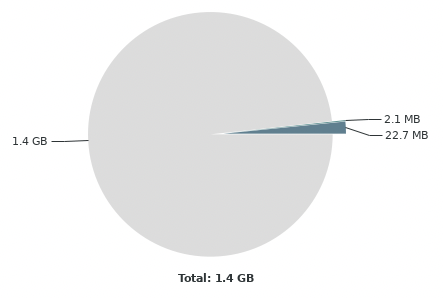

    1.  As in the Java OOM exercise, open the **Histogram**, click on the **Calculator**, select **Calculate minimum retained size (quick approx.)** and sort by **Retained Heap** descending. The top few items show a large number of **URLClassLoaders** retaining about 1GB (of Java heap):\
        \
        

    1.  Right click on URLClassLoader and select **Merge Shortest Paths to GC Roots** \> **excluding all phantom/weak/soft etc. references**. Expand the path all the way down until you find the place where the classloaders are leaked. This shows that the **com.ibm.ClassloaderLeak** class has a static **leaked** ArrayList which is leaking the classloaders.\
        \
        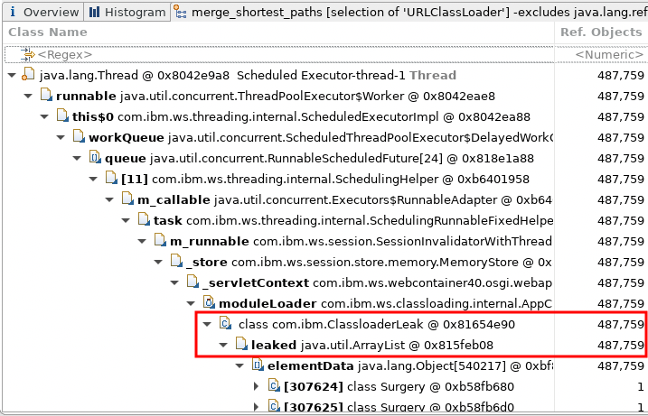

# WebSphere Liberty

WebSphere Liberty has many built-in troubleshooting and performance features, including:

-   Admin Center
-   Request Timing
-   HTTP NCSA access log
-   MXBean Monitoring
-   Server Dumps
-   Event Logging
-   Diagnostic trace
-   Binary logging
-   Timed operations

##  Liberty Bikes

For the following Liberty exercises, we will use the open source [Liberty Bikes sample application](https://github.com/OpenLiberty/liberty-bikes):

1.  Open a terminal and change directory to \~/liberty-bikes:

        cd ~/liberty-bikes/

1.  Your terminal might have LOG_DIR set due to Docker configuration. If so, this will cause all four JVMs to write to the same log and cause errors, so make sure that's not set:

        export LOG_DIR=""

1.  Start the four Liberty servers:

        ./gradlew start -DsingleParty=true

1.  This will take a few minutes to start. When the servers are ready, you will see the end display similar to:

        Application externally available at: http://...:12000
        BUILD SUCCESSFUL in 1m 18s

1.  Open http://localhost:12000/

There are four Liberty servers that comprise the liberty-bikes application: frontendServer, auth-service, player-service, and game-service:

    $ ls -l ~/liberty-bikes/build/wlp/usr/servers/
    total 16
    drwxr-x--- 8 was root 4096 Jun  4 20:50 auth-service
    drwxr-x--- 7 was root 4096 Jun  4 20:51 frontendServer
    drwxr-x--- 8 was root 4096 Jun  4 20:50 game-service
    drwxr-x--- 8 was root 4096 Jun  4 20:50 player-service

##  Server Configuration (server.xml)

In general, most Liberty configuration for a server is contained in its **server.xml** file and any [configDropins](https://www.ibm.com/support/knowledgecenter/SSD28V_9.0.0/com.ibm.websphere.wlp.core.doc/ae/twlp_setup_dropins.html) XML files. By default, when you save changes to these files, a running Liberty server will periodically check for updates and reload any detected changes if possible.

For example, below is the server configuration of the frontendServer:

    $ cat ~/liberty-bikes/build/wlp/usr/servers/frontendServer/server.xml
    <server>
        <featureManager>
            <feature>servlet-4.0</feature>
        </featureManager>

        <httpEndpoint id="defaultHttpEndpoint" host="*" httpPort="${httpPort}" httpsPort="${httpsPort}" />
                      
        <applicationManager autoExpand="true"/>

        <webApplication location="${application.name}" contextRoot="/" >
        </webApplication>
    </server>

##  Java Arguments

It is a common requirement to modify Java arguments for the Liberty process. These are most commonly modified in the **jvm.options** file. Updates to these files require a restart.

##  Liberty Log Files

If you are having problems, one of the first things to do is to check the Liberty server log files. The log files are located under the server\'s logs directory. For example, for the frontendServer:

    $ ls -l ~/liberty-bikes/build/wlp/usr/servers/frontendServer/logs/
    total 16
    -rw-r----- 1 was root  666 Jun  4 20:51 console.log
    -rw-r----- 1 was root 3563 Jun  4 20:51 messages.log
    drwxr-x--- 2 was root 4096 Jun  4 20:51 state
    -rw-r----- 1 was root  483 Jun  4 20:51 stop.log

There are two main log files: messages.log and console.log. The two files share a lot of the same output (System.out & System.err), with a large difference being that messages.log has timestamps and console.log does not. In addition, console.log has stdout & stderr such as JVM messages. In general, you only need to look at messages.log; however, there are cases where console.log has additional information.

##  Admin Center

The Admin Center is a web-based administration and monitoring tool for Liberty servers.

1.  Open the **\~/liberty-bikes/build/wlp/usr/servers/frontendServer/server.xml** file from the terminal or in Mousepad.

2.  Add the following to the **featureManager** section:

        <feature>adminCenter-1.0</feature>

3.  Add the following lines anywhere within the **\<server\>** section:

        <quickStartSecurity userName="wsadmin" userPassword="wsadmin" />

4.  Save the server.xml file.

5.  Wait about 5 seconds for the updates to take effect.

6.  Open a browser to https://localhost:12005/adminCenter/

7.  Login with user **wsadmin** and password **wsadmin**

8.  Click on the **Explore** button:\
    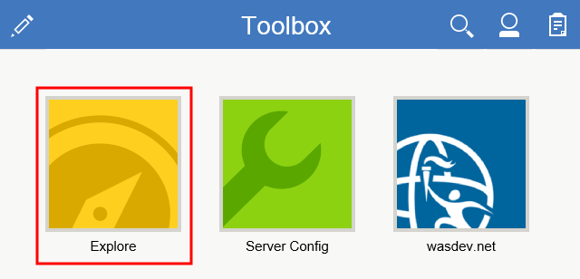

9.  Click on the \"Monitor\" button:\
    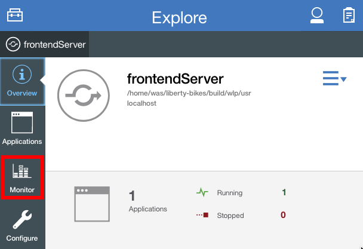

10. You will see graphs of various statistics for this server. As you configure additional monitoring (which we will do in subsequent sections), the edit button in the top right will show additional metrics.\
    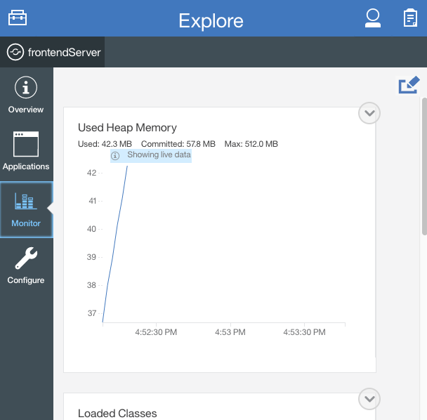

##  Request Timing

Slow & Hung Request Detection is optionally enabled with the [requestTiming-1.0](http://www.ibm.com/support/knowledgecenter/en//SSAW57_liberty/com.ibm.websphere.wlp.core.doc/ae/rwlp_feature_requestTiming-1.0.html) feature.

The slow request detection part of the feature monitors for HTTP requests that exceed a configured threshold and prints a tree of events breaking down the components of the slow request.

### requestTiming Lab

1.  Modify **\~/liberty-bikes/build/wlp/usr/servers/frontendServer/server.xml** to add:

        <featureManager>
          <feature>requestTiming-1.0</feature>
        </featureManager>

2.  Execute a request that takes more than one minute by opening a browser to http://localhost:12000/swat/Sleep?duration=65000

3.  After about a minute and the request completes, review the requestTiming warning in **\~/liberty-bikes/build/wlp/usr/servers/frontendServer/logs/messages.log** -- for example:

        [6/10/19 7:13:30:493 UTC] 000002c2 com.ibm.ws.request.timing.manager.SlowRequestManager         W TRAS0112W: Request AAAAXVL5xKX_AAAAAAAAAAA has been running on thread 00000275 for at least 60001.614ms. The following stack trace shows what this thread is currently running.

          at java.lang.Thread.sleep(Native Method)
          at java.lang.Thread.sleep(Thread.java:942)
          at com.ibm.Sleep.doSleep(Sleep.java:35)
          at com.ibm.Sleep.doWork(Sleep.java:18)
          at com.ibm.BaseServlet.service(BaseServlet.java:73)
          at javax.servlet.http.HttpServlet.service(HttpServlet.java:791) [...]

        The following table shows the events that have run during this request.

        Duration      Operation
        5             websphere.sql             | SELECT * FROM ...
        60007.665ms + websphere.servlet.service | swat | Sleep?duration=65000

    1.  The warning shows a stack at the time requestTiming notices the threshold is breached and it's followed be a tree of components of the request. The plus sign (+) indicates that an operation is still in progress. The indentation level indicates which events requested which other events.

4.  Execute a request that takes about three minutes by opening a browser to http://localhost:12000/swat/Sleep?duration=185000

5.  After about three minutes and the request completes, review the requestTiming warning in **\~/liberty-bikes/build/wlp/usr/servers/frontendServer/logs/messages.log** -- in addition to the previous warning, multiple thread dumps are produced:

    `[6/10/19 7:27:52:950 UTC] 0000052d com.ibm.ws.kernel.launch.internal.FrameworkManager           A CWWKE0067I: Java dump request received.`\
    `[6/10/19 7:28:52:950 UTC] 00000556 com.ibm.ws.kernel.launch.internal.FrameworkManager           A CWWKE0067I: Java dump request received.`\
    `[6/10/19 7:29:52:950 UTC] 00000584 com.ibm.ws.kernel.launch.internal.FrameworkManager           A CWWKE0067I: Java dump request received.`

    1.  Three thread dumps [will be captured](https://www.ibm.com/support/knowledgecenter/en/SSAW57_liberty/com.ibm.websphere.wlp.nd.multiplatform.doc/ae/rwlp_requesttiming.html), one minute apart, after the threshold is breached.

When the requestTiming feature is enabled, the server dump command will include a snapshot of all the event trees for all requests thus giving a very nice and lightweight way to see active requests in the system at a detailed level (including URI, etc.), in a similar way that thread dumps do the same for thread stacks.

In general, it is a good practice to use requestTiming, even in production. Configure the thresholds to values that are at the upper end of acceptable times for the users and the business. Configure and test the sampleRate to ensure the overhead of requestTiming is acceptable in production.

##  HTTP NCSA Access Log

The Liberty HTTP access log is optionally enabled with the [httpEndpoint accessLogging element](https://www.ibm.com/support/knowledgecenter/SSAW57_liberty/com.ibm.websphere.wlp.core.doc/ae/rwlp_http_accesslogs.html). When enabled, a separate access.log file is produced with an NCSA standardized (i.e. httpd-style) line for each HTTP request, including [items such as the URI and response time](http://www14.software.ibm.com/webapp/wsbroker/redirect?version=phil&product=was-nd-mp&topic=rrun_chain_httpcustom), useful for post-mortem corelation and performance analysis.

### HTTP NCSA Access Log Lab

1.  Modify **\~/liberty-bikes/build/wlp/usr/servers/frontendServer/server.xml** to change:

        <httpEndpoint id="defaultHttpEndpoint" host="*" httpPort="${httpPort}" httpsPort="${httpsPort}" />

2.  To:

        <httpEndpoint id="defaultHttpEndpoint" host="*" httpPort="${httpPort}" httpsPort="${httpsPort}">
          <accessLogging filepath="${server.output.dir}/logs/access.log" maxFileSize="250" maxFiles="2" logFormat="%h %i %u %t &quot;%r&quot; %s %b %D" />
        </httpEndpoint>

3.  Use the **ab** program to execute some calls to the liberty-bikes homepage:

        $ ab -n 100 -c 4 http://localhost:12000/

4.  Review **\~/liberty-bikes/build/wlp/usr/servers/frontendServer/logs/access.log** to see HTTP responses. For example:

        127.0.0.1 - - [10/Jun/2019:07:47:55 +0000] "GET / HTTP/1.0" 200 1034 2070
        127.0.0.1 - - [10/Jun/2019:07:47:55 +0000] "GET / HTTP/1.0" 200 1034 1594
        127.0.0.1 - - [10/Jun/2019:07:47:55 +0000] "GET / HTTP/1.0" 200 1034 1612 [...]

5.  The last number is the response time in microseconds. For example, the first one above took 1.6 ms.

##  MXBean Monitoring

Key performance indicator statistics gathering is optionally enabled with the [monitor-1.0](http://www.ibm.com/support/knowledgecenter/SSAW57_liberty/com.ibm.websphere.wlp.nd.multiplatform.doc/ae/twlp_mon.html) feature. This data may be [exposed with Java standard MXBeans](http://www.ibm.com/support/knowledgecenter/SSAW57_liberty/com.ibm.websphere.wlp.nd.multiplatform.doc/ae/twlp_admin_mbeans.html) through the localConnector-1.0 feature for local machine access, or through the [restConnector-1.0 feature (with ssl-1.0) for remote machine access](http://www.ibm.com/support/knowledgecenter/SSAW57_liberty/com.ibm.websphere.wlp.nd.multiplatform.doc/ae/twlp_admin_jmx.html). MXBeans may be viewed with Java\'s built-in JConsole tool, the Liberty adminCenter, or through any monitoring tool that supports MXBeans.

The following are the minimum recommended MXBeans statistics to monitor:

-   [JvmStats](http://www.ibm.com/support/knowledgecenter/SSAW57_liberty/com.ibm.websphere.wlp.nd.multiplatform.doc/ae/rwlp_mon_jvm.html) (e.g. WebSphere:type=JvmStats)

    -   Heap: Current Heap Size

    -   UsedMemory: Current Heap Usage

    -   ProcessCPU: Average percentage of CPU used over the previous interval by this JVM process

-   [ServletStats](http://www.ibm.com/support/knowledgecenter/SSAW57_liberty/com.ibm.websphere.wlp.nd.multiplatform.doc/ae/rwlp_mon_webapp.html) (e.g. WebSphere:type=ServletStats,name=\...)

    -   RequestCount: The cumulative number of processed requests.

    -   ResponseTime (ns): Average response time of the servlet over the previous interval.

-   [ThreadPoolStats](http://www.ibm.com/support/knowledgecenter/SSAW57_liberty/com.ibm.websphere.wlp.nd.multiplatform.doc/ae/rwlp_mon_threadpool.html) (e.g. WebSphere:type=ThreadPoolStats,name=\...)

    -   ActiveThreads: The number of concurrent threads actively executing application-related work over the previous interval.

    -   PoolSize: The current maximum size of the thread pool.

-   [SessionStats](http://www.ibm.com/support/knowledgecenter/SSAW57_liberty/com.ibm.websphere.wlp.nd.multiplatform.doc/ae/rwlp_mon_sessionstats.html) (e.g. WebSphere:type=SessionStats,name=\...)

    -   LiveCount: Total number of HTTP sessions cached in memory.

    -   ActiveCount: The total number of concurrently active sessions. A session is active if Liberty is processing a request that uses that session.

-   [ConnectionPool](http://www.ibm.com/support/knowledgecenter/SSAW57_liberty/com.ibm.websphere.wlp.nd.multiplatform.doc/ae/rwlp_mon_connectionpools.html) (e.g. WebSphere:type=ConnectionPool,name=\...)

    -   ManagedConnectionCount: The number of ManagedConnection objects that are in use.

    -   ConnectionHandleCount: The number of Connection objects that are in use.

    -   FreeConnectionCount: The number of free connections in the pool.

    -   WaitTime: The average waiting time in milliseconds until a connection is granted.

### MXBean Monitoring Lab

The **monitor-1.0** feature must be installed first:

1.  Modify **\~/liberty-bikes/build/wlp/usr/servers/frontendServer/server.xml** to add:

        <featureManager>
          <feature>monitor-1.0</feature>
        </featureManager>

        <monitor filter="" />

2.  Use the **ab** program to execute some calls to the liberty-bikes servers:

        $ ab -n 1000000000 -c 4 http://localhost:12000/

3.  Run the **jconsole** tool from the terminal:

        $ jconsole

4.  Select the **frontendServer** process and click **Connect**:\
    \
    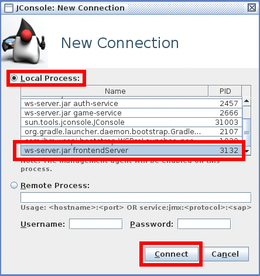

5.  Choose **Insecure connection** when the prompt comes up:\
    \
    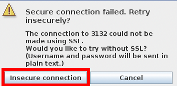

6.  The initial view shows basic information about JVM memory usage and number of threads:\
    \
    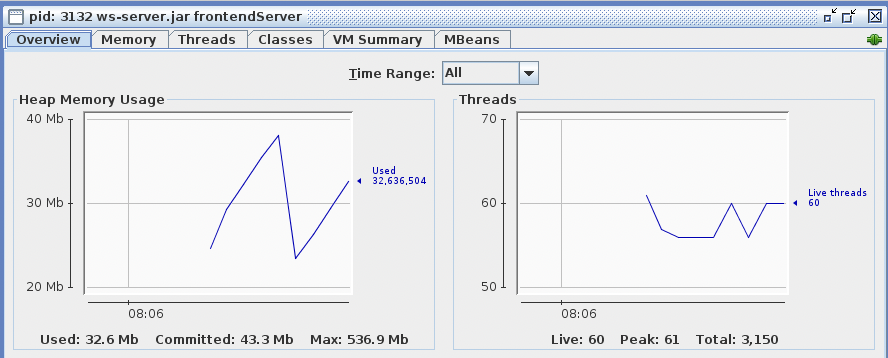

7.  We can look at MXbean attributes or execute operations. For example, click on Mbeans, expand **java.lang** \> **Memory** \> **Operations** and click on **gc** which executes **System.gc()**.\
    \
    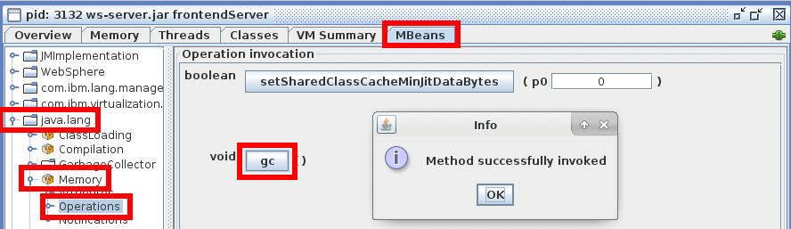

8.  The **adminCenter** monitor page will now show additional available metrics:\
    \
    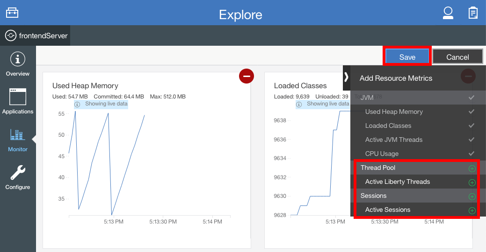

JConsole does have some basic capabilities of writing statistics to a CSV, although this is limited to a handful of JVM statistics from the main JConsole tabs and is not available for the MXBean data.

If all MXBeans are enabled, IBM benchmarks show about a 4% overhead. This may be reduced by limiting the enabled MXBeans; for example:

      <monitor filter="ServletStats,ConnectionPool,..." />

Unlike WAS traditional which has many thread pools, most work in Liberty occurs in a single thread pool named **Default Executor** (apart from application-created threads). All standard JEE services such as Web, EJB, executor, and JCA (with a few rare exceptions) run on a single **Default Executor** thread pool.

The **\<executor /\>** element in server.xml may be used to configure the Default Executor; although, in general, unless there are observed problems with threading, it is not recommended to tune nor even specify this element as it is auto-tuned.

The **coreThreads** attribute specifies the minimum number of threads (although this number of threads is not pre-populated) and it defaults to a value based on the number of logical cores. The **maxThreads** attribute specifies the maximum number of threads and defaults to unlimited and is [auto-tuned](https://developer.ibm.com/wasdev/docs/was-liberty-threading-and-why-you-probably-dont-need-to-tune-it/).

The **maxPoolSize** attribute of a **connectionManager** element specifies the maximum number of physical connections to a pool and defaults to 50. This metric is a key performance variable and must be monitored and tuned.

##  Server Dumps

The [server dump](http://www.ibm.com/support/knowledgecenter/SSAW57_liberty/com.ibm.websphere.wlp.nd.multiplatform.doc/ae/twlp_setup_dump_server.html) command provides some Java- and Liberty-centric state dumps of a running server, such as:

-   State of each OSGi bundle in the server

-   Wiring information for each OSGi bundle in the server

-   Component list that is managed by the Service Component Runtime (SCR) environment

-   Detailed information of each component from SCR

-   Configuration administration data of each OSGi bundle

-   Information about registered OSGi services

-   Runtime environment settings such as Java™ virtual machine (JVM), heap size, operating system, thread information, and network status

You may run this from the **bin** directory. For example:

    $ /home/was/liberty-bikes/build/wlp/bin/server dump frontendServer
    Dumping server frontendServer.
    Server frontendServer dump complete in /home/was/liberty-bikes/build/wlp/usr/servers/frontendServer/frontendServer.dump-19.06.10_08.18.18.zip.
    Server frontendServer dump complete in /home/was/liberty-bikes/build/wlp/usr/servers/frontendServer/frontendServer.dump-19.06.10\_08.18.18.zip.

The dump command works whether the server is started or not. Taking a dump in the latter case gathers less information but is still an easy way to gather up logs, configuration, and other potentially interesting information even if the server is stopped.

The output of the dump command is a great thing to upload when first opening any Liberty support case.

You may also specify a comma-separated list of Java diagnostic artifacts including **heap** for a PHD file, **system** for an operating system core dump, and **thread** for a thread dump. For example:

    $ server dump frontendServer --include=system

##  Event Logging

Event logging is optionally enabled with the [**eventLogging-1.0**](http://www.ibm.com/support/knowledgecenter/SSAW57_liberty/com.ibm.websphere.wlp.nd.multiplatform.doc/ae/rwlp_feature_eventLogging-1.0.html) feature. Event logging is based on the same request probe framework as **requestTiming-1.0** but reports on individual events in an access-log style format.

### Event Logging Lab

The **eventLogging-1.0** feature must be installed first:

1.  This lab require internet connectivity to install the **eventLogging-1.0** feature:

        $ ~/liberty-bikes/build/wlp/bin/installUtility install --acceptLicense eventLogging-1.0
        Establishing a connection to the configured repositories ...
        This process might take several minutes to complete.

        Successfully connected to all configured repositories.

        Preparing assets for installation. This process might take several minutes to complete.
        The --acceptLicense argument was found. This indicates that you have
        accepted the terms of the license agreement.


        Step 1 of 4: Downloading eventLogging-1.0 ...
        Step 2 of 4: Installing eventLogging-1.0 ...
        Step 3 of 4: Validating installed fixes ...
        Step 4 of 4: Cleaning up temporary files ...


        All assets were successfully installed.

        Start product validation...
        Product validation completed successfully.

2.  Restart the **liberty-bikes** servers:

        $ cd ~/liberty-bikes
        $ ./gradlew stop
        $ ./gradlew start -DsingleParty=true

3.  Modify **\~/liberty-bikes/build/wlp/usr/servers/frontendServer/server.xml** to add:

        <featureManager>
          <feature>eventLogging-1.0</feature>
        </featureManager>

        <eventLogging eventTypes="websphere.servlet.service" minDuration="1000ms" logMode="exit" sampleRate="1" />

4.  Execute a request that takes about 5 seconds by opening a browser to http://localhost:12000/swat/Sleep?duration=5000

5.  Example output from a triggering request in messages.log:

        [6/10/19 8:36:04:967 UTC] 0000008b EventLogging                                                 I END requestID=AAABeJT6iZj_AAAAAAAAAKI # eventType=websphere.servlet.service # contextInfo=swat | Sleep?duration=5000 # duration=5006.924ms

This is an easier way to see individual component response times exceeding some threshold. Ideally, it is best to enable both requestTiming and event logging with the proper threshold and sample rate.

For the reason why you want to enable both, consider the following case: You\'ve set the requestTiming threshold to 10 seconds which will print a tree of events for any request taking more than 10 seconds. However, what if a request occurs which has three database queries of 1 second, 2 seconds, and 6 seconds. In this case, the total response time is 9 seconds, but the one query that took 6 seconds is presumably concerning, so event logging can granularly monitor for such events.

##  Diagnostic Trace

Diagnostic trace is normally used by IBM support to investigate product defects. You may pre-populate the diagnostic trace log configuration in case it is ever needed. Set the level to \*=info so that the trace.log is not actually created until a more detailed trace is set. The benefit of this is that administrators save time in looking up the exact format of how to enable trace, and also ensures that a well-sized number and size of historical files is configured up-front:

    <logging traceSpecification="*=info" maxFileSize="250" maxFiles="4" />

##  Binary Logging

Binary logging is optionally enabled by modifying [bootstrap.properties](http://www.ibm.com/support/knowledgecenter/SSAW57_liberty/com.ibm.websphere.wlp.nd.multiplatform.doc/ae/twlp_confHPEL.html) and requires a server restart. Binary logging is particularly useful to significantly reduce the performance overhead of diagnostic tracing by a large amount when investigating product issues.

When Liberty binary logging is enabled, the binary log contains all logs, trace, System.out and System.err content.

1.  Modify **\~/liberty-bikes/build/wlp/usr/servers/frontendServer/bootstrap.properties** to add:

        websphere.log.provider=binaryLogging-1.0

2.  Modify **\~/liberty-bikes/build/wlp/usr/servers/frontendServer/server.xml** to add or change the **\<logging /\>** element. In this example, log content is set to expire after 96 hours and the trace content is set to retain a maximum of 1024MB:

        <logging>
          <binaryLog purgeMinTime="96" />
          <binaryTrace purgeMaxSize="1024" />
        </logging>

3.  Restart the **liberty-bikes** servers:

        $ cd ~/liberty-bikes
        $ ./gradlew stop
        $ ./gradlew start -DsingleParty=true

4.  Use the [**binaryLog** command](https://www.ibm.com/support/knowledgecenter/SSAW57_liberty/com.ibm.websphere.wlp.core.doc/ae/rwlp_logviewer.html) to print the contents of the log:

        $ ~/liberty-bikes/build/wlp/bin/binaryLog view frontendServer –monitor
        [...]

Use the **binaryLog** command to view messages; however, the console.log, which is not part of binary logging, will still have stdout, stderr, WAS messages (except trace) \>= INFO, System.out and System.err just like the traditional messages.log (which will have become binary).

##  Liberty Timed Operations

The **timedOperations-1.0** feature tracks JDBC requests and prints diagnostics if response times are greater than a few standard deviations over a rolling window. Timed operations was introduced before requestTiming and is largely superseded by requestTiming, although requestTiming only uses simple thresholds. Unless the more complex response time triggering is interesting, use requestTiming instead.

##  MicroServices

Traditionally, Java Enterprise Edition (JEE) code would be packaged into a \"Monolith\" unit where all aspects of the business functionality are grouped into a single application made of interdependent components deployed as a single unit.

A MicroService is an alternative architectural style consisting of a collection of loosely-coupled services, each representing one unique business function which allows for a more modular approach and makes the application easier to develop, especially by small, autonomous teams that may develop, deploy, and scale their respective services independently.

[Eclipse MicroProfile](https://microprofile.io/) is a vendor-neutral MicroServices programming model, designed in the open at the Eclipse foundation. WebSphere Liberty is one implementor of the MicroProfile specifications.

The base of MicroProfile are three Java EE technologies: CDI, JAX-RS, and JSON-P. Additional MicroServices technologies layered on top are:

-   [MicroProfile Config](https://microprofile.io/project/eclipse/microprofile-config): Standardized configuration mechanisms.

-   [MicroProfile RestClient](https://microprofile.io/project/eclipse/microprofile-rest-client): Type-safe JAX-RS client.

-   [MicroProfile OpenTracing](https://microprofile.io/project/eclipse/microprofile-opentracing): Standardized way to trace JAX-RS requests and responses.

-   [MicroProfile Metrics](https://microprofile.io/project/eclipse/microprofile-metrics): Standardized way to expose telemetry data.

-   [MicroProfile OpenAPI](https://microprofile.io/project/eclipse/microprofile-open-api): Standardized way to expose API documentation.

-   [MicroProfile Fault Tolerance](https://microprofile.io/project/eclipse/microprofile-fault-tolerance): Standardized methods for fault tolerance.

-   [MicroProfile Health](https://microprofile.io/project/eclipse/microprofile-health): Standardized application health check endpoint.

OpenLiberty [publishes example guides](https://openliberty.io/guides/) on how to use each MicroProfile technology.

# WAS traditional

## Diagnostic Plans

tWAS [diagnostic plans](https://www.ibm.com/support/knowledgecenter/en/SSAW57_9.0.5/com.ibm.websphere.nd.multiplatform.doc/ae/ttrb_diagplan.html) allows you to [automatically perform certain actions](https://www.ibm.com/support/knowledgecenter/SSAW57_9.0.5/com.ibm.websphere.nd.multiplatform.doc/ae/rtrb_diagplan.html) such as thread dumps, heapdumps, or system dumps, or set, restore, or dump diagnostic trace when certain strings are printed in logs, trace, and/or FFDC, or at particular times in the day.

In this lab, we will demonstrate a simple diagnostic plan which watches for the application System.out message of `Invoking com.ibm.Sleep*30000` and reacts by sleeping for 5 seconds, requesting a thread dump, enabling WebContainer diagnostic trace, sleeping for 30 seconds, and resetting diagnostic trace.

1. From a terminal, start wsadmin:

    `/opt/IBM/WebSphere/AppServer/profiles/AppSrv01/bin/wsadmin.sh -lang jython -username wsadmin -password websphere`

1. Run the following command (the `*` in the MATCH TRACE is a wildcard, although it is not required either at the beginning nor at the end if you are doing a simple substring match; in this example, we want to match a particular duration):

    `AdminControl.invoke_jmx(AdminControl.makeObjectName(AdminControl.queryNames("WebSphere:type=DiagPlanManager,process=server1,*")), "setDiagPlan", ["MATCH=TRACE:Invoking com.ibm.Sleep*30000,DELAY=5,JAVACORE,SET_TRACESPEC=*=info:com.ibm.ws.webcontainer*=all:com.ibm.wsspi.webcontainer*=all:HTTPChannel=all:GenericBNF=all,DELAY=30,RESTORE_TRACESPEC"], ["java.lang.String"])`

1. List the diagnostic plan by running the following command:

    `print AdminControl.invoke_jmx(AdminControl.makeObjectName(AdminControl.queryNames("WebSphere:type=DiagPlanManager,process=server1,*")), "getDiagPlan",[],[])`

1. Open your browser to http://localhost:9081/swat/Sleep?duration=30000

1. tWAS logs should show output similar to the following:

        [12/17/19 21:54:52:727 UTC] 000000cd SystemOut     O swat.ear: Invoking com.ibm.Sleep by anonymous (172.17.0.1)... [duration=30000]
        [12/17/19 21:54:58:733 UTC] 000000d8 DumpJavaCoreA I   TRAS1107I: JAVACORE action completed. The generated java core file is at /opt/IBM/WebSphere/AppServer/profiles/AppSrv01/./javacore.20191217.215457.1469.0001.txt.
        [12/17/19 21:54:58:776 UTC] 000000d8 ManagerAdmin  I   TRAS0018I: The trace state has changed. The new trace state is *=info:com.ibm.ws.webcontainer*=all:com.ibm.wsspi.webcontainer*=all:HTTPChannel=all:GenericBNF=all.
        [12/17/19 21:55:22:747 UTC] 000000cd SystemOut     O SWAT EAR: Done com.ibm.Sleep
        [12/17/19 21:55:28:791 UTC] 000000d8 ManagerAdmin  I   TRAS0018I: The trace state has changed. The new trace state is *=info.

1. Clear the diagnostic plan by running:

    `AdminControl.invoke_jmx(AdminControl.makeObjectName(AdminControl.queryNames("WebSphere:type=DiagPlanManager,process=server1,*")), "clearDiagPlan",[],[])`

1. For additional options, see the [DiagPlanManager MBean API](https://www.ibm.com/support/knowledgecenter/SSAW57_9.0.5/com.ibm.websphere.javadoc.doc/web/mbeanDocs/DiagPlanManager.html).

# IBM HTTP Server

IBM HTTP Server is a reverse proxy HTTP server in this image which proxies to WAS traditional. It is installed at **/opt/IBM/HTTPServer** and may be accessed at http://localhost:9083/.

# Appendix

## Stopping the container

The `docker run` commands in this lab do not use the `-d` (daemon) flag which means that they run in the foreground. To stop such a container, use one of the following methods:

1. Hold down the `Control/Ctrl` key on your keyboard and press `C` in the terminal window where `docker run` is running.
1. In a separate terminal window, find the container ID with `docker ps` and then run `docker stop $ID`.

If you add `-d` to `docker run`, then to view the std logs, find the container ID with `docker ps` and then run `docker logs $ID`. To stop, use `docker stop $ID`.

## Remote terminal into the container

The container supports `ssh` into the container, but it's more common to simply use Docker commands. In a separate terminal window, find the container ID with `docker ps` and then run `docker exec -u was -it $ID sh`.

##  Windows Remote Desktop Client

Windows requires [extra steps to configure remote desktop to connect to a container](https://social.msdn.microsoft.com/Forums/en-US/872129e4-07a5-48c3-86f7-996854e7a920/how-to-connect-via-rdp-to-container?forum=windowscontainers):

1.  Open **PowerShell** as Administrator:\
    \
    

2.  Run **ipconfig** and copy the **IPv4** address of the **DockerNAT** adapter. For example:\
    \
    

3.  Run the following command in **PowerShell**:

    `New-NetFirewallRule -Name \"myRDP\" -DisplayName \"Remote Desktop Protocol\" -Protocol TCP -LocalPort @(3389) -Action Allow`

4.  Run the following command in **PowerShell**:

    `New-NetFirewallRule -Name \"myContainerRDP\" -DisplayName \"RDP Port for connecting to Container\" -Protocol TCP -LocalPort @(3390) -Action Allow`

5.  Run **Remote Desktop**\
    \
    

6.  Enter the DockerNAT IP address (for example, 10.0.75.1) followed by :3390 as **Computer** and click **Connect**:\
    \
    

7.  You\'ll see a certificate warning because of the name mismatch. Click **Yes** to connect:\
    \
    

8.  Type username = **was** and password = **websphere**\
    \
    

9.  You should now be remote desktop'ed into the container:\
    \
    

10. Note: In some cases, only the **Remote Desktop Connection** application worked, and [**not** **Remote Desktop**](https://docs.microsoft.com/en-us/windows-server/remote/remote-desktop-services/clients/remote-desktop-app-compare):\
    \
    

11. Also note: Microsoft [requires](https://social.msdn.microsoft.com/Forums/en-US/872129e4-07a5-48c3-86f7-996854e7a920/how-to-connect-via-rdp-to-container?forum=windowscontainers) the above steps and the use of port 3390 instead of directly connecting to 3389.

##  Manually accessing/testing Liberty and tWAS

1.  Test Liberty by going to http://localhost:9080/daytrader/ in your host browser or the remote desktop/VNC browser.

    User = wsadmin, Password = websphere

2.  Test WAS traditional by going to http://localhost:9081/daytrader/ in your host browser or in the remote desktop/VNC browser.

    User = wsadmin, Password = websphere

3.  Test the WAS traditional Administrative Console by going to https://localhost:9043/ibm/console in your client browser or in the remote desktop/VNC browser.

    User = wsadmin, Password = websphere

4.  Test IBM HTTP Server and WAS traditional by going to http://localhost:9083/daytrader/ in your host browser or in the remote desktop/VNC browser.

    User = wsadmin, Password = websphere

##  Sharing Files Between Host and Container

By default, the Docker container does not have access to the host filesystem and vice versa. To share files between the two:

* Linux: Add `-v /:/host/` to the `docker run` command. For example:
  ```
  docker run ... -v /:/host/ -it kgibm/fedorawasdebug
  ```
* Windows: Add `-v //c/:/host/` to the docker run command. For example:
  ```
  docker run ... -v //c/:/host/ -it kgibm/fedorawasdebug
  ```
* macOS: Add `-v /tmp/:/hosttmp/` to the `docker run` command. Enable non-standard folders with [File Sharing](https://docs.docker.com/docker-for-mac/#preferences). For example:
  ```
  docker run ... -v /tmp/:/hosttmp/ -it kgibm/fedorawasdebug
  ```

##  Saving State

Saving state of a Docker container would be useful for situations such as multi-day labs that cannot leave computers running overnight. Unfortunately, Docker does not currently have an easy way to do this. Here are a few ideas:

1.  Hibernate the computer. This should save and restore the full in-memory state of everything.

2.  Sleep the computer. This should only be done if the computers are plugged into power sources.

3.  Use Docker to commit the filesystem state to a new image and then launch a new container with that state (note that no processes will be running in the new container so everything will need to be re-launched, including Liberty, tWAS, etc.):

    1.  Find the container ID with **docker ps**:

            $ docker ps -a
            CONTAINER ID        IMAGE                  COMMAND             CREATED             STATUS              PORTS           NAMES
            0a041815fbc2        kgibm/fedorawasdebug   "/entrypoint.sh"    9 seconds ago       Up 7 seconds        0.0.0.0:22...   nostalgic_zhukovsky

    1.  Commit the container:

            $ docker commit 0a041815fbc2 fedorawasdebug:saved
            sha256:c8ff7d9946cca20531f70c89b99f9148841dc4bdf074413f810eeb82e2bd6f77

    1.  Then, when you want to \"restore\" the container, perform the same **docker run** but with the new image you created above:

        `docker run --cap-add SYS_PTRACE --cap-add NET_ADMIN --ulimit core=-1 --ulimit memlock=-1 --ulimit stack=-1 --shm-size="256m" --rm -p 9080:9080 -p 9443:9443 -p 9043:9043 -p 9081:9081 -p 9444:9444 -p 5901:5901 -p 5902:5902 -p 3390:3389 -p 22:22 -p 9082:9082 -p 9083:9083 -p 9445:9445 -p 8080:8080 -p 8081:8081 -p 8082:8082 -p 12000:12000 -p 12005:12005 -it fedorawasdebug:saved`

    1.  The VNC server will need to be manually restarted. Find the running container ID:

            $ docker ps -a
            CONTAINER ID        IMAGE                     COMMAND             CREATED             STATUS              PORTS                     NAMES
            b54e4412f98b        fedorawasdebug:20190819   "/entrypoint.sh"    2 minutes ago       Up 2 minutes        0.0.0.0:22...             inspiring_kirch

    1.  Shell into the container, replacing **b54e4412f98b** below with the container ID from the output of your command above:

            $ docker exec -it b54e4412f98b bash

    1.  Remove temporary X-related files:

            $ rm -rf /tmp/.X*

    1.  Restart the VNC servers (use password **websphere**):

            # supervisorctl 
            Server requires authentication
            Username:root
            Password:

            debugsupervisord                 EXITED    Aug 19 03:44 PM
            finished                         EXITED    Aug 19 03:46 PM
            liberty                          RUNNING   pid 20, uptime 0:04:54
            liberty2                         EXITED    Aug 19 03:44 PM
            mysql                            RUNNING   pid 16, uptime 0:04:54
            rsyslog                          FATAL     Exited too quickly (process log may have details)
            ssh                              RUNNING   pid 19, uptime 0:04:54
            twas                             RUNNING   pid 21, uptime 0:04:54
            vncserver1                       FATAL     Exited too quickly (process log may have details)
            vncserver2                       FATAL     Exited too quickly (process log may have details)
            xrdp                             RUNNING   pid 15, uptime 0:04:54
            xrdp-sesman                      RUNNING   pid 17, uptime 0:04:54
            supervisor> start vncserver1
            vncserver1: started
            supervisor> start vncserver2
            vncserver2: started
            supervisor> exit

    1.  Use the image as normal.

##  Changing Java

There are many different versions and types of Java in the image. To list them, run:

    $ alternatives --display java | grep "^/"
    /usr/lib/jvm/java-1.8.0-openjdk-1.8.0.222.b10-0.fc30.x86_64/jre/bin/java - family java-1.8.0-openjdk.x86_64 priority 1800222
    /opt/ibm/java/bin/java - family ibmjava priority 99999999
    /opt/openjdk8_openj9/jdk/bin/java - family openjdk priority 89999999
    /opt/openjdk8_hotspot/jdk/bin/java - family openjdk priority 89999999
    /opt/openjdk11_openj9/jdk/bin/java - family openjdk priority 89999999
    /opt/openjdk11_hotspot/jdk/bin/java - family openjdk priority 89999999
    /opt/openjdk14_openj9/jdk/bin/java - family openjdk priority 89999999
    /opt/openjdk14_hotspot/jdk/bin/java - family openjdk priority 89999999

To change the Java that is on the path, run the following command and enter the number of the Java that you wish to change to and press Enter. The directory name tells you the type of Java; for example, OpenJ9 or HotSpot. The directory name also tells you the version of Java (for example, openjdk13 is Java 13).

    $ sudo alternatives --config java

    There are 10 programs which provide 'java'.

      Selection    Command
    -----------------------------------------------
      1           java-1.8.0-openjdk.x86_64 (/usr/lib/jvm/java-1.8.0-openjdk-1.8.0.222.b10-0.fc30.x86_64/jre/bin/java)
    *+2           ibmjava (/opt/ibm/java/bin/java)
      3           openjdk (/opt/openjdk8_openj9/jdk/bin/java)
      4           openjdk (/opt/openjdk8_hotspot/jdk/bin/java)
      5           openjdk (/opt/openjdk11_openj9/jdk/bin/java)
      6           openjdk (/opt/openjdk11_hotspot/jdk/bin/java)
      7           openjdk (/opt/openjdk14_openj9/jdk/bin/java)
      8           openjdk (/opt/openjdk14_hotspot/jdk/bin/java)

    Enter to keep the current selection[+], or type selection number:

The alternatives command has the concept of groups of commands so when you change Java using the method above, other commands like **jar**, **javac**, etc. also change.

Show the Java version to verify the change (in this case, I chose option 7 and this confirms that Java 13 on OpenJ9 is being used):

    $ java -version
    openjdk version "13.0.1" 2019-10-15
    OpenJDK Runtime Environment AdoptOpenJDK (build 13.0.1+9)
    Eclipse OpenJ9 VM AdoptOpenJDK (build openj9-0.17.0, JRE 13 Linux amd64-64-Bit Compressed References 20191021_96 (JIT enabled, AOT enabled)
    OpenJ9   - 77c1cf708
    OMR      - 20db4fbc
    JCL      - 74a8738189 based on jdk-13.0.1+9)

Any currently running Java programs will need to be restarted if you want them to use the different version of Java (WAS traditional is an exception because it uses a bundled version of Java).

##  Version History

* V17 (February 16, 2022):
    * Upgrade to Liberty 21.0.0.12
    * Add IBM Semeru runtimes
* V16 (April 13, 2021):
    * Upgrade to Liberty 21.0.0.3
    * Update to TMDA 4.6.9
    * Add AdoptOpenJDK Java 16 (J9 and HotSpot)
    * Change Health Center to use Eclipse 2020-03 because Luna is no longer available. The known StackOverflowError on 2020-03 doesn't always happen.
    * Upgrade Request Metrics Analyzer to 2.0.20210111
    * Increase Eclipse 2020-03 max heap to 4g
* V15 (February 15, 2021):
    * Fix [issue 2](https://github.com/kgibm/dockerdebug/issues/2) by upgrading to Liberty 21.0.0.1
    * Upgrade to tWAS 9.0.5.6
* V14 (January 12, 2021): Fix issue tailing tWAS logs
* V13 (January 11, 2021): Refresh software:
    * Upgrade to Fedora 33
    * Upgrade to Liberty 20.0.0.12
    * Upgrade PTT to V1.0.20200908
    * Update to TMDA 4.6.8
* V12 (August 3, 2020): Refresh software:
    * Upgrade to Fedora 32
    * Upgrade to Liberty 20.0.0.8
    * Upgrade to tWAS 9.0.5.3
    * Upgrade to Eclipse 2020-03
    * Add OpenJDK 14
    * Upgrade to PTT V1.0.20200728
    * Upgrade Apache Ant
    * Upgrade Apache JMeter
    * Upgrade Gradle
    * Upgrade Eclipse MAT
    * Upgrade to TMDA 4.6.7
    * Increase HealthCenter -Xmx
    * Upgrade Eclipse SWT
    * Add libertymon
    * Upgrade Request Analyzer Next
    * Upgrade WebSphere Application Server Configuration Comparison Tool
    * Add PostgreSQL
    * Add -Xnoloa to tWAS as temporary workaround for crash issue
* V11 (December 16, 2019): Add Performance Tuning Toolkit and required 32-bit libraries and XULRunner. Fix intermittent issue where screen lock gets wrong timeout value. Upgrade Request Metrics Analyzer.
* V10 (November 27, 2019): Add tWAS SIBExplorer and SIBPerf tools. Disable Xfce desktop tooltips. Resolve rare VNC deadlock issue. Upgrade TMDA. Add IBM Channel Framework Analyzer. Add IBM Web Server Plug-in Analyzer for WebSphere Application Server (WSPA). Add Connection and Configuration Verification Tool for SSL/TLS. Add WebSphere Application Server Configuration Visualizer. Add Problem Diagnostics Lab Toolkit. Add Eclipse SWT.
* V9 (November 12, 2019): Fix being unable to unlock screensaver after idling 10 minutes. Change screensaver lock time to 30 minutes. Add Totem video player and VP9/webm codec.
* V8 (November 6, 2019): Fix errors re-launching Eclipse. Add example lab data.
* V7 (November 6, 2019): Minor fix for the crash lab test if the server is restarted in an unexpected way.
* V6 (November 5, 2019): Enable tWAS and Liberty Application Security for DayTrader to use local OpenLDAP. Increase recommended Docker disk space to \>100GB. Enable OpenLDAP logging. Change DayTrader7 to runtimeMode=1 to avoid WebSocket security issues calling EJBs with application security enabled. Remove OpenJDK12. Upgrade to Fedora 31. Send tWAS traffic through IHS.
* V5 (October 23, 2019): Add OpenLDAP and integrate it into tWAS. Update the lab instructions to include tWAS. Add VS Code. Add JDKs to alternatives. Update Eclipse to 2019-06. Add OpenJ9 source. Add IHS connected to tWAS.
* V4 (August 14, 2019): Add tWAS DayTrader7.
* V3 (July 2, 2019): Updates based on customer feedback.
* V2 (May 20, 2019): Convert to Docker and modernize.
* V1 (December 14, 2016): First version on VMWare.

Tip: to compare between tags; for example: [https://github.com/kgibm/dockerdebug/compare/V11...V12](https://github.com/kgibm/dockerdebug/compare/V11...V12)

##  Acknowledgments

Thank you to those that helped build and test this lab:

-   Hiroko Takamiya
-   Andrea Pichler
-   Kazuma Tanabe
-   Shinichi Kako
